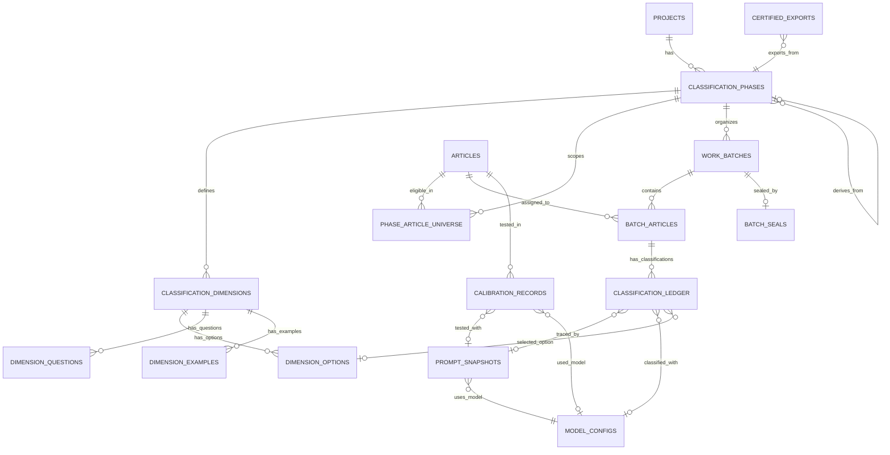

# 📊 Arquitectura de Base de Datos: Sistema de Preclasificación

## 🎯 Contexto de Creación

Este documento mapea la **relación completa entre Artículos, Dimensiones, Fases y Lotes** en el sistema de preclasificación de SUSTRATO.AI. El sistema fue construido de forma **iterativa según necesidades emergentes**, y ahora requiere refactorización para partir desde una arquitectura bien fundamentada.

---

## 🗂️ Jerarquía Conceptual

```
PROJECT (Proyecto de Investigación)
    │
    ├─── PRECLASSIFICATION_PHASES (Fases de Preclasificación)
    │       │
    │       ├─── PHASE_ELIGIBLE_ARTICLES (Universo de Artículos Elegibles)
    │       │       └─── Relación: phase_id → articles
    │       │
    │       ├─── PRECLASS_DIMENSIONS (Dimensiones de Clasificación)
    │       │       ├─── PRECLASS_DIMENSION_OPTIONS (Opciones para dimensiones 'finite')
    │       │       ├─── PRECLASS_DIMENSION_QUESTIONS (Preguntas guía)
    │       │       └─── PRECLASS_DIMENSION_EXAMPLES (Ejemplos de clasificación)
    │       │
    │       └─── ARTICLE_BATCHES (Lotes de Trabajo)
    │               │
    │               └─── ARTICLE_BATCH_ITEMS (Artículos dentro del lote)
    │                       │
    │                       └─── ARTICLE_DIMENSION_REVIEWS (Clasificaciones por dimensión)
    │
    └─── ARTICLES (Artículos Académicos)
            ├─── ARTICLE_TRANSLATIONS (Traducciones)
            ├─── ARTICLE_NOTES (Notas del investigador)
            └─── ARTICLE_GROUPS (Agrupaciones temáticas)
```

---

## 📋 Tablas Principales y sus Relaciones

### 1️⃣ **`preclassification_phases`** - Fases de Preclasificación

**Propósito**: Organizar el trabajo de preclasificación en etapas independientes con sus propios universos de artículos y dimensiones.

**Campos Clave**:

```sql
id UUID PRIMARY KEY
project_id UUID → projects.id
name TEXT
phase_number INTEGER
status preclassification_phase_status ('active', 'inactive', 'completed', 'annulled')
universe_type TEXT (ej: 'filtered', 'full', 'derived')
universe_name TEXT
applied_filters JSONB
total_articles INTEGER
source_phase_id UUID → preclassification_phases.id (para fases derivadas)
```

**Reglas de Negocio**:

- Solo **una fase activa** por proyecto a la vez
- No se puede completar una fase si tiene lotes en progreso
- No se puede eliminar si tiene dimensiones o lotes asociados

---

### 2️⃣ **`phase_eligible_articles`** - Universo de Artículos por Fase

**Propósito**: Define qué artículos son elegibles para ser procesados en cada fase.

**Campos Clave**:

```sql
id UUID PRIMARY KEY
phase_id UUID → preclassification_phases.id
article_id UUID → articles.id
created_at TIMESTAMP
```

**Relaciones**:

- **1 Fase → N Artículos** (universo de la fase)
- **1 Artículo → N Fases** (puede participar en múltiples fases)

**Uso**:

- Determina el "universo" sobre el cual se crean los lotes
- Permite fases con diferentes subconjuntos de artículos
- Facilita análisis multinivel (Fase 1: todos, Fase 2: solo validados, etc.)

---

### 3️⃣ **`preclass_dimensions`** - Dimensiones de Clasificación

**Propósito**: Define las categorías/criterios por los cuales se clasifican los artículos en cada fase.

**Campos Clave**:

```sql
id UUID PRIMARY KEY
project_id UUID → projects.id
phase_id UUID → preclassification_phases.id
name TEXT
description TEXT
type dimension_type ('finite', 'open')
icon TEXT (emoji)
ordering INTEGER
status dimension_status ('active', 'archived')
```

**Tipos de Dimensiones**:

- **`finite`**: Opciones predefinidas (ej: "Metodología: Cualitativa, Cuantitativa, Mixta")
- **`open`**: Respuesta libre (ej: "Principales hallazgos")

**Relaciones Hijas**:

- `preclass_dimension_options` - Opciones válidas (solo para tipo 'finite')
- `preclass_dimension_questions` - Preguntas guía para el clasificador
- `preclass_dimension_examples` - Ejemplos de clasificación

**Reglas de Negocio**:

- No se pueden modificar/eliminar si la fase tiene lotes en progreso (estado != inicial)
- Estado inicial: Fase 1 = 'pending', Fase >1 = 'translated'

---

### 4️⃣ **`article_batches`** - Lotes de Trabajo

**Propósito**: Agrupar artículos en unidades manejables de trabajo para asignar a investigadores.

**Campos Clave**:

```sql
id UUID PRIMARY KEY
project_id UUID → projects.id
phase_id UUID → preclassification_phases.id
batch_number INTEGER
name TEXT
assigned_to UUID → users.id
status batch_preclass_status
translation_complete BOOLEAN
started_at TIMESTAMP
completed_at TIMESTAMP
```

**Estados del Lote** (`batch_preclass_status`):

```sql
'pending'                  -- Sin procesar (Fase 1)
'translated'               -- Traducido (Fase >1 o tras traducción)
'review_pending'           -- Esperando revisión humana (iter 1)
'reconciliation_pending'   -- Desacuerdos entre IA y humano (iter 2)
'validated'                -- Aprobado en iter 1
'reconciled'               -- Reconciliado en iter 3
'disputed'                 -- En arbitraje (iter 3)
```

**Relaciones**:

- **1 Fase → N Lotes**
- **1 Lote → N Artículos** (vía `article_batch_items`)

---

### 5️⃣ **`article_batch_items`** - Artículos dentro de un Lote

**Propósito**: Relación entre lotes y artículos individuales, con su propio status de procesamiento.

**Campos Clave**:

```sql
id UUID PRIMARY KEY
batch_id UUID → article_batches.id
article_id UUID → articles.id
status batch_preclass_status
preclassified_at TIMESTAMP
preclassified_by UUID → users.id
requires_adjudication BOOLEAN

-- Campos legacy (obsoletos):
ai_label TEXT
ai_process_opinion TEXT
ai_keywords TEXT[]
human_label TEXT
```

**Lógica de Status**:

- El status del **item** se calcula automáticamente desde sus **dimensiones** (peor estado)
- El status del **lote** se calcula automáticamente desde sus **items** (peor estado)
- Triggers automáticos mantienen sincronización: `dimension → item → batch`

---

### 6️⃣ **`article_dimension_reviews`** - Clasificaciones por Dimensión

**Propósito**: Almacenar las clasificaciones (IA o humanas) de cada artículo en cada dimensión, con soporte para múltiples iteraciones.

**Campos Clave**:

```sql
id UUID PRIMARY KEY
article_batch_item_id UUID → article_batch_items.id
article_id UUID → articles.id
dimension_id UUID → preclass_dimensions.id
option_id UUID → preclass_dimension_options.id (solo para dimensiones 'finite')

reviewer_type TEXT ('ai', 'human')
reviewer_id UUID → users.id
iteration INTEGER (1, 2, 3)

classification_value TEXT
rationale TEXT
confidence_score INTEGER (1=baja, 2=media, 3=alta)

status batch_preclass_status
is_final BOOLEAN (indica si esta clasificación es definitiva)
prevalidated BOOLEAN (campo obsoleto)

created_at TIMESTAMP
```

**Iteraciones**:

- **Iteración 1**: Clasificación inicial de IA
- **Iteración 2**: Revisión humana (puede estar de acuerdo o en desacuerdo)
- **Iteración 3**: Reconciliación de IA ante desacuerdos

**Mapeo Iteración → Status**:
| Iteración | Acción | Status | Color UI |
|-----------|--------|--------|----------|
| 1 | IA clasifica | `review_pending` | neutral |
| 1 | Humano aprueba | `validated` | success (verde) |
| 2 | Humano rechaza | `reconciliation_pending` | warning (amarillo) |
| 3 | IA reconcilia y humano aprueba | `reconciled` | primary (azul) |
| 3 | Humano rechaza reconciliación | `disputed` | danger (rojo) |

**Reglas de Negocio**:

- Para cada `(article_batch_item_id, dimension_id)` puede haber múltiples reviews (diferentes iteraciones)
- La review con `iteration` más alta es la "actual"
- `is_final = true` indica que la dimensión está cerrada (no requiere más iteraciones)

---

## 🔄 Flujo de Datos Completo

### **Fase 1: Configuración**

```
1. Crear FASE → preclassification_phases
2. Definir UNIVERSO → phase_eligible_articles (qué artículos procesar)
3. Definir DIMENSIONES → preclass_dimensions + options/questions/examples
4. Crear LOTES → article_batches + article_batch_items
```

### **Fase 2: Procesamiento**

```
1. IA CLASIFICA (iter 1)
   └─ INSERT article_dimension_reviews (reviewer_type='ai', iteration=1)
   └─ Trigger actualiza article_batch_items.status
   └─ Trigger actualiza article_batches.status

2. HUMANO REVISA (iter 1)
   └─ Si aprueba: UPDATE status='validated'
   └─ Si rechaza: INSERT nueva review (iteration=2, status='reconciliation_pending')

3. IA RECONCILIA (iter 3, solo si hubo desacuerdo)
   └─ INSERT article_dimension_reviews (reviewer_type='ai', iteration=3)
   └─ Humano decide: 'reconciled' o 'disputed'

4. CIERRE
   └─ UPDATE is_final=true cuando dimensión está definitiva
```

### **Fase 3: Cálculo de Status (Automático vía Triggers)**

```sql
-- Trigger 1: Dimensión cambia → Actualiza Item
CREATE TRIGGER trigger_update_article_status
AFTER INSERT OR UPDATE OF status ON article_dimension_reviews
FOR EACH ROW
EXECUTE FUNCTION update_article_status_from_dimensions();

-- Trigger 2: Item cambia → Actualiza Batch
CREATE TRIGGER trigger_update_batch_status
AFTER UPDATE OF status ON article_batch_items
FOR EACH ROW
EXECUTE FUNCTION update_batch_status_from_articles();
```

**Jerarquía de Status** (de más crítico a menos):

```
disputed > reconciliation_pending > review_pending > reconciled > validated > translated > pending
```

---

## 🔍 Consultas Clave del Sistema

### **1. Obtener Lotes de un Usuario con Conteos**

```sql
-- RPC: get_user_batches_with_detailed_counts
SELECT
  ab.id,
  ab.batch_number,
  ab.name,
  ab.status,
  ab.assigned_to,
  jsonb_build_object(
    'pending', COUNT(*) FILTER (WHERE abi.status = 'pending'),
    'translated', COUNT(*) FILTER (WHERE abi.status = 'translated'),
    'pending_review', COUNT(*) FILTER (WHERE abi.status = 'review_pending'),
    'reconciliation_pending', COUNT(*) FILTER (WHERE abi.status = 'reconciliation_pending'),
    'validated', COUNT(*) FILTER (WHERE abi.status = 'validated'),
    'reconciled', COUNT(*) FILTER (WHERE abi.status = 'reconciled'),
    'disputed', COUNT(*) FILTER (WHERE abi.status = 'disputed')
  ) as article_counts
FROM article_batches ab
LEFT JOIN article_batch_items abi ON abi.batch_id = ab.id
WHERE ab.project_id = p_project_id
  AND ab.assigned_to = p_user_id
GROUP BY ab.id
ORDER BY ab.batch_number DESC;
```

### **2. Verificar si un Lote está Cerrado**

```sql
-- RPC: is_batch_closed
-- Un lote está cerrado si TODAS sus dimensiones tienen is_final = true
SELECT
  COUNT(*) as total_dimensions,
  COUNT(*) FILTER (WHERE is_final = true) as finalized_dimensions,
  CASE
    WHEN COUNT(*) = COUNT(*) FILTER (WHERE is_final = true) THEN true
    ELSE false
  END as is_closed
FROM article_dimension_reviews adr
JOIN article_batch_items abi ON abi.id = adr.article_batch_item_id
WHERE abi.batch_id = p_batch_id;
```

### **3. Obtener Clasificaciones de un Artículo por Fase**

```sql
-- Usado en análisis multinivel
SELECT
  phase.name as phase_name,
  phase.phase_number,
  dim.name as dimension_name,
  dim.type as dimension_type,
  adr.classification_value,
  adr.rationale,
  adr.confidence_score,
  adr.iteration,
  adr.reviewer_type,
  adr.status
FROM article_dimension_reviews adr
JOIN article_batch_items abi ON abi.id = adr.article_batch_item_id
JOIN article_batches ab ON ab.id = abi.batch_id
JOIN preclassification_phases phase ON phase.id = ab.phase_id
JOIN preclass_dimensions dim ON dim.id = adr.dimension_id
WHERE adr.article_id = p_article_id
ORDER BY phase.phase_number, dim.ordering, adr.iteration DESC;
```

---

## ⚠️ Problemas Identificados de la Arquitectura Actual

### **1. Campos Obsoletos**

- `article_batch_items.ai_label` - Reemplazado por `article_dimension_reviews`
- `article_batch_items.human_label` - Reemplazado por `article_dimension_reviews`
- `article_dimension_reviews.prevalidated` - Reemplazado por `status`

### **2. Inconsistencias de Nombres**

- `batch_preclass_status` enum usado en 3 tablas diferentes (batches, items, reviews)
- `review_pending` vs `pending_review` (inconsistencia en frontend)

### **3. Complejidad de Triggers**

- Cascada de triggers puede causar problemas de performance
- Difícil debugging cuando status no se actualiza correctamente

### **4. Falta de Constraints**

- No hay constraint que garantice una sola fase activa por proyecto (solo lógica en actions)
- No hay constraint que impida eliminar dimensiones con reviews asociadas

### **5. Duplicación de Datos**

- `preclassification_phases.total_articles` puede desincronizarse con `phase_eligible_articles`
- `article_batches.translation_complete` redundante con status

---

## 🎯 NUEVO MODELO DE DATOS v2 — "Infraestructura de la Humildad Epistémica"

> _"La infraestructura utilizada para revisar la literatura condiciona lo que se visibiliza en ella."_
> — Paper pre-Zenodo v1.8, §6

### **Génesis del Nuevo Modelo**

Este modelo nace de la **convergencia entre el paper pre-Zenodo y la experiencia operativa** del piloto (257 artículos, 3.405 clasificaciones). El paper describe lo que Sustrato.ai ES arquitectónicamente. Este modelo de datos es la codificación SQL de esa descripción.

**Diferencia fundamental con la propuesta anterior**: La propuesta anterior era una refactorización técnica genérica. Esta es la **infraestructura que hace posible la trazabilidad interpretativa** descrita en el paper — donde cada desacuerdo entre humano e IA tiene el mismo peso criptográfico que cada acuerdo.

---

### **Principios Arquitectónicos (Derivados del Paper)**

1. **Append-Only** (§4.3): Las decisiones anteriores NO se sobrescriben ni se eliminan. Cada registro es inmutable.

2. **Verificación Criptográfica** (§4.3): SHA-256 por registro + cadena de hashes por (artículo, dimensión) = integridad verificable.

3. **Trazabilidad del Prompt** (§9, limitación identificada): El modelo, versión, temperatura y prompt EXACTO quedan registrados POR CADA clasificación.

4. **Serendipia como Ciudadana de Primera Clase** (§4.4): No es un "catch-all". Es un campo booleano + texto libre que preserva lo que las categorías predefinidas no anticiparon.

5. **Fricción como Dato** (§5.7): Los desacuerdos no son ruido. La estructura permite calcular tasas de fricción, distribución por dimensión, y evolución temporal.

6. **Delta Temporal** (§8): Nuevos artículos se incorporan al corpus existente bajo las mismas dimensiones = nuevos lotes en la misma fase.

7. **Sellado Permanente** (§4.3): Cuando un lote se finaliza, se sella criptográficamente. No hay vuelta atrás.

8. **Soberanía Post-API** (§4.7): La IA interviene UNA vez. Todo lo demás (filtros, gráficos, cruces) es local, sin costo, sin dependencia.

---

### **Enums del Nuevo Modelo**

```sql
-- Status limpio y específico por nivel
CREATE TYPE phase_status AS ENUM (
  'draft',        -- Configurando fases/dimensiones
  'active',       -- Procesando preclasificaciones
  'completed',    -- Todos los lotes sellados
  'annulled',     -- Fase anulada por error humano (dimensiones mal configuradas, etc.)
  'archived'      -- Fase histórica, solo lectura
);

CREATE TYPE classification_status AS ENUM (
  'pending',                -- Artículo asignado, sin clasificar
  'classified',             -- IA clasificó (iter 1 completada)
  'validated',              -- Humano aprobó en iter 1
  'contested',              -- Humano rechazó en iter 1 (iter 2 registrada)
  'reconciled',             -- IA reconcilió + humano aceptó en iter 3
  'disputed'                -- Humano rechazó reconciliación en iter 3
);

CREATE TYPE classifier_role AS ENUM ('ai', 'human');

CREATE TYPE dimension_type AS ENUM ('finite', 'open');

-- Preparación del artículo antes de clasificar (traducción + resumen)
CREATE TYPE article_prep_status AS ENUM (
  'raw',             -- Sin procesar (idioma original, sin resumen)
  'translated',      -- Traducido al idioma del equipo
  'summarized',      -- Resumen generado
  'ready'            -- Listo para clasificar (traducido + resumido si aplica)
);

-- Status del lote para retroalimentación al investigador
CREATE TYPE batch_work_status AS ENUM (
  'pending',                -- Lote creado, sin comenzar
  'translating',            -- Traduciendo/resumiendo artículos
  'classifying',            -- IA clasificando
  'reviewing',              -- Humano revisando iter 1
  'reconciling',            -- IA reconciliando (iter 3)
  'review_reconciliation',  -- Humano revisando reconciliación
  'completed',              -- Todas las dimensiones finalizadas
  'sealed'                  -- Sellado criptográfico aplicado
);
```

---

### **CAPA 1: CONFIGURACIÓN — El Instrumento de Medición**

#### **1.1 `classification_phases`** — Embudo Lógico

```sql
CREATE TABLE classification_phases (
  id UUID PRIMARY KEY DEFAULT gen_random_uuid(),
  project_id UUID NOT NULL REFERENCES projects(id) ON DELETE RESTRICT,

  name TEXT NOT NULL,
  description TEXT,
  phase_number SMALLINT NOT NULL,
  status phase_status NOT NULL DEFAULT 'draft',

  -- Linaje de fases (§4.4: output de una fase alimenta la siguiente)
  source_phase_id UUID REFERENCES classification_phases(id),
  universe_criteria JSONB,  -- Filtros aplicados para construir el universo

  -- Anulación (error humano al configurar dimensiones, etc.)
  annulment_reason TEXT,     -- Obligatorio si status='annulled'. Justificación del investigador.
  annulled_at TIMESTAMPTZ,   -- Timestamp de anulación
  annulled_by UUID REFERENCES auth.users(id),

  created_by UUID NOT NULL REFERENCES auth.users(id),
  created_at TIMESTAMPTZ NOT NULL DEFAULT now(),

  -- Constraint: una sola fase activa por proyecto
  CONSTRAINT uq_one_active_phase_per_project
    EXCLUDE USING btree (project_id WITH =) WHERE (status = 'active')
);
```

#### **1.2 `classification_dimensions`** — Criterios de Análisis

```sql
CREATE TABLE classification_dimensions (
  id UUID PRIMARY KEY DEFAULT gen_random_uuid(),
  phase_id UUID NOT NULL REFERENCES classification_phases(id) ON DELETE RESTRICT,

  name TEXT NOT NULL,
  description TEXT,
  type dimension_type NOT NULL,
  icon TEXT,
  ordering SMALLINT NOT NULL DEFAULT 0,

  -- Instrucciones para la IA (§4.6: calibración)
  ai_instructions TEXT,  -- Prompt adicional específico para esta dimensión

  created_by UUID NOT NULL REFERENCES auth.users(id),
  created_at TIMESTAMPTZ NOT NULL DEFAULT now(),

  CONSTRAINT uq_dimension_name_per_phase UNIQUE (phase_id, name)
);
```

#### **1.3 `dimension_options`** — Opciones Predefinidas (solo tipo 'finite')

```sql
CREATE TABLE dimension_options (
  id UUID PRIMARY KEY DEFAULT gen_random_uuid(),
  dimension_id UUID NOT NULL REFERENCES classification_dimensions(id) ON DELETE RESTRICT,

  value TEXT NOT NULL,
  description TEXT,             -- Descripción breve visible en UI
  justification TEXT,           -- Justificación detallada: qué significa esta opción,
                                -- cuándo elegirla, criterios de inclusión/exclusión.
                                -- Se incluye en el prompt a la IA y como tooltip al humano.
  emoticon TEXT,
  ordering SMALLINT NOT NULL DEFAULT 0,
  is_serendipity_option BOOLEAN NOT NULL DEFAULT false,  -- §4.4: "Otros (Serendipia)"

  CONSTRAINT uq_option_value_per_dimension UNIQUE (dimension_id, value)
);
```

#### **1.4 `dimension_questions`** + **`dimension_examples`** — Guías de Calibración

```sql
CREATE TABLE dimension_questions (
  id UUID PRIMARY KEY DEFAULT gen_random_uuid(),
  dimension_id UUID NOT NULL REFERENCES classification_dimensions(id) ON DELETE CASCADE,
  question_text TEXT NOT NULL,
  ordering SMALLINT NOT NULL DEFAULT 0
);

CREATE TABLE dimension_examples (
  id UUID PRIMARY KEY DEFAULT gen_random_uuid(),
  dimension_id UUID NOT NULL REFERENCES classification_dimensions(id) ON DELETE CASCADE,
  example_input TEXT NOT NULL,
  expected_output TEXT NOT NULL,
  explanation TEXT,
  ordering SMALLINT NOT NULL DEFAULT 0
);
```

---

### **CAPA 2: UNIVERSOS — El Embudo de Artículos**

#### **2.1 `phase_article_universe`** — Qué Artículos Procesar

```sql
CREATE TABLE phase_article_universe (
  id UUID PRIMARY KEY DEFAULT gen_random_uuid(),
  phase_id UUID NOT NULL REFERENCES classification_phases(id) ON DELETE RESTRICT,
  article_id UUID NOT NULL REFERENCES articles(id) ON DELETE RESTRICT,

  -- Trazabilidad: por qué está en este universo
  inclusion_reason TEXT,  -- 'initial_import', 'filter_passed', 'manual_add', 'delta_temporal'

  created_at TIMESTAMPTZ NOT NULL DEFAULT now(),

  CONSTRAINT uq_article_per_phase UNIQUE (phase_id, article_id)
);
```

---

### **CAPA 3: ASIGNACIÓN — Organización del Trabajo**

#### **3.1 `work_batches`** — Lotes de Trabajo

```sql
CREATE TABLE work_batches (
  id UUID PRIMARY KEY DEFAULT gen_random_uuid(),
  phase_id UUID NOT NULL REFERENCES classification_phases(id) ON DELETE RESTRICT,

  batch_number SMALLINT NOT NULL,
  name TEXT,
  assigned_to UUID REFERENCES auth.users(id),

  -- Status para retroalimentación al investigador
  -- Se actualiza por trigger o función al cambiar el estado del ledger
  status batch_work_status NOT NULL DEFAULT 'pending',
  status_updated_at TIMESTAMPTZ,

  created_by UUID NOT NULL REFERENCES auth.users(id),
  created_at TIMESTAMPTZ NOT NULL DEFAULT now(),

  CONSTRAINT uq_batch_number_per_phase UNIQUE (phase_id, batch_number)
);
```

#### **3.2 `batch_articles`** — Artículos dentro del Lote

```sql
CREATE TABLE batch_articles (
  id UUID PRIMARY KEY DEFAULT gen_random_uuid(),
  batch_id UUID NOT NULL REFERENCES work_batches(id) ON DELETE RESTRICT,
  article_id UUID NOT NULL REFERENCES articles(id) ON DELETE RESTRICT,

  position SMALLINT,  -- Orden dentro del lote

  -- Preparación lingüística (equipos no angloparlantes)
  prep_status article_prep_status NOT NULL DEFAULT 'raw',
  translated_title TEXT,       -- Título traducido al idioma del equipo
  translated_abstract TEXT,    -- Abstract traducido
  summary TEXT,                -- Resumen generado (independiente del idioma)
  original_language TEXT,      -- Código ISO 639-1 detectado (ej: 'en', 'pt', 'de')

  created_at TIMESTAMPTZ NOT NULL DEFAULT now(),

  CONSTRAINT uq_article_per_batch UNIQUE (batch_id, article_id)
);
```

---

### **CAPA 4: EL LEDGER APPEND-ONLY — Corazón de la Trazabilidad**

> _"Cada clasificación se almacena en una estructura de solo adición. Las decisiones anteriores no se sobrescriben ni se eliminan."_ — §4.3

#### **4.1 `classification_ledger`** — Registro Inmutable de Clasificaciones

```sql
CREATE TABLE classification_ledger (
  id UUID PRIMARY KEY DEFAULT gen_random_uuid(),

  -- ═══════════════════════════════════════════
  -- CLAVES DE CONTEXTO
  -- ═══════════════════════════════════════════
  batch_article_id UUID NOT NULL REFERENCES batch_articles(id) ON DELETE RESTRICT,
  article_id UUID NOT NULL REFERENCES articles(id) ON DELETE RESTRICT,
  dimension_id UUID NOT NULL REFERENCES classification_dimensions(id) ON DELETE RESTRICT,
  option_id UUID REFERENCES dimension_options(id),  -- Solo para 'finite'

  -- ═══════════════════════════════════════════
  -- ITERACIÓN Y ROL (§4.2: Diálogo de 3 iteraciones)
  -- ═══════════════════════════════════════════
  iteration SMALLINT NOT NULL CHECK (iteration BETWEEN 1 AND 3),
  classifier_role classifier_role NOT NULL,
  classifier_id UUID REFERENCES auth.users(id),  -- NULL para AI

  -- ═══════════════════════════════════════════
  -- DATOS DE CLASIFICACIÓN
  -- ═══════════════════════════════════════════
  classification_value TEXT NOT NULL,
  rationale TEXT,
  confidence_level SMALLINT CHECK (confidence_level BETWEEN 1 AND 3),
  is_serendipity BOOLEAN NOT NULL DEFAULT false,  -- §4.4

  -- ═══════════════════════════════════════════
  -- STATUS Y FINALIZACIÓN
  -- ═══════════════════════════════════════════
  status classification_status NOT NULL DEFAULT 'pending',
  is_final BOOLEAN NOT NULL DEFAULT false,

  -- ═══════════════════════════════════════════
  -- TRAZABILIDAD DEL PROMPT (§9: mejora identificada)
  -- ═══════════════════════════════════════════
  prompt_snapshot_id UUID REFERENCES prompt_snapshots(id),
  model_config_id UUID REFERENCES model_configs(id),
  api_cost_usd NUMERIC(10,8),  -- Costo real de esta llamada API
  api_latency_ms INTEGER,      -- Tiempo de respuesta

  -- ═══════════════════════════════════════════
  -- INTEGRIDAD CRIPTOGRÁFICA (§4.3)
  -- ═══════════════════════════════════════════
  record_hash TEXT NOT NULL,     -- SHA-256 de este registro
  previous_hash TEXT,            -- Hash del registro anterior en la cadena (article_id, dimension_id)
  -- Cadena: iter1.hash → iter2.previous_hash → iter3.previous_hash

  -- ═══════════════════════════════════════════
  -- TIMESTAMP INMUTABLE
  -- ═══════════════════════════════════════════
  created_at TIMESTAMPTZ NOT NULL DEFAULT now()

  -- ⚠️ NO EXISTE updated_at — APPEND-ONLY
  -- ⚠️ NO EXISTE deleted_at — APPEND-ONLY
);

-- ═══════════════════════════════════════════
-- POLÍTICAS RLS: SOLO INSERT + SELECT
-- ═══════════════════════════════════════════
ALTER TABLE classification_ledger ENABLE ROW LEVEL SECURITY;

CREATE POLICY "Ledger: Solo lectura para autenticados"
  ON classification_ledger FOR SELECT
  USING (auth.role() = 'authenticated');

CREATE POLICY "Ledger: Solo inserción para autenticados"
  ON classification_ledger FOR INSERT
  WITH CHECK (auth.role() = 'authenticated');

-- ⛔ NO HAY POLICY PARA UPDATE
-- ⛔ NO HAY POLICY PARA DELETE

-- ═══════════════════════════════════════════
-- TRIGGER: Bloquear UPDATE y DELETE a nivel de función
-- ═══════════════════════════════════════════
CREATE OR REPLACE FUNCTION prevent_ledger_mutation()
RETURNS TRIGGER AS $$
BEGIN
  RAISE EXCEPTION 'classification_ledger es APPEND-ONLY. No se permiten UPDATE ni DELETE.';
  RETURN NULL;
END;
$$ LANGUAGE plpgsql;

CREATE TRIGGER enforce_append_only_no_update
  BEFORE UPDATE ON classification_ledger
  FOR EACH ROW EXECUTE FUNCTION prevent_ledger_mutation();

CREATE TRIGGER enforce_append_only_no_delete
  BEFORE DELETE ON classification_ledger
  FOR EACH ROW EXECUTE FUNCTION prevent_ledger_mutation();

-- ═══════════════════════════════════════════
-- ÍNDICES PARA CONSULTAS ÁGILES
-- ═══════════════════════════════════════════
CREATE INDEX idx_ledger_batch_article ON classification_ledger(batch_article_id);
CREATE INDEX idx_ledger_article_dimension ON classification_ledger(article_id, dimension_id);
CREATE INDEX idx_ledger_iteration ON classification_ledger(iteration);
CREATE INDEX idx_ledger_status ON classification_ledger(status);
CREATE INDEX idx_ledger_serendipity ON classification_ledger(is_serendipity) WHERE is_serendipity = true;
CREATE INDEX idx_ledger_is_final ON classification_ledger(is_final) WHERE is_final = true;
CREATE INDEX idx_ledger_created_at ON classification_ledger(created_at);
```

**Flujo del Ledger — El Diálogo de 3 Iteraciones**:

```
ITER 1 (classifier_role='ai'):
  IA clasifica → INSERT con record_hash=SHA256(datos), previous_hash=NULL
  status='classified'

ITER 1 (classifier_role='human', aprueba):
  Humano aprueba → INSERT con previous_hash=iter1.record_hash
  status='validated', is_final=true

ITER 2 (classifier_role='human', rechaza):
  Humano rechaza → INSERT con valor_alternativo + justificación_propia + confianza_propia
  previous_hash=iter1.record_hash
  status='contested'

ITER 3 (classifier_role='ai'):
  IA reconcilia → INSERT analizando ambas posiciones
  previous_hash=iter2.record_hash
  status='pending' (espera decisión humana final)

ITER 3 (classifier_role='human', acepta reconciliación):
  → INSERT con status='reconciled', is_final=true
  previous_hash=iter3_ai.record_hash

ITER 3 (classifier_role='human', rechaza reconciliación):
  → INSERT con status='disputed', is_final=true
  previous_hash=iter3_ai.record_hash
  -- AMBAS posiciones preservadas para revisión cualitativa futura (§5.7)
```

#### **4.2 Dos Capas de Estado — "Dedos Torpes" vs Decisiones Explícitas**

> **Regla fundamental**: El toggle visual (verde/no-verde) en el frontend es **estado local de UI**. NO se graba al ledger. Solo cuando el investigador hace clic en "Guardar" o "Enviar a IA" se inscribe en el ledger.

**Capa 1: Estado local del frontend (efímero)**

- El investigador navega, pone verde, quita verde, se va a comer, vuelve, cambia de opinión
- Todo esto es estado de React en memoria + persistido en localStorage para sobrevivir refresh
- **NO genera registros en el ledger**. Es "borrador" visual.
- Cero costo de BD, cero hash, cero ruido en la trazabilidad.

**Capa 2: Decisiones explícitas al ledger (permanentes)**

- El investigador hace clic en **"Confirmar revisión"** (botón explícito)
- EN ESE MOMENTO se insertan al ledger todas las decisiones del lote:
  - Aprobadas → INSERT con status='validated'
  - Rechazadas con desacuerdo → INSERT con status='contested' + rationale
- Cada INSERT tiene hash, previous_hash, timestamp. Trazabilidad completa.
- Igual que en V1: los desacuerdos se acumulan y se envían juntos.

```
ESCENARIO: Investigador trabaja sobre un lote

Fase 1 — Borrador (solo frontend, localStorage):
  Toggle verde dim1 ✅ → estado local
  Toggle verde dim2 ✅ → estado local
  Se va a comer...
  Vuelve, quita verde dim2 ❌ → estado local
  Pone verde dim2 otra vez ✅ → estado local
  → CERO registros en el ledger. Solo estado visual.

Fase 2 — Confirmación explícita:
  Clic en "Confirmar revisión" →
  INSERT ledger: dim1 status='validated', is_final=false, record_hash='abc123'
  INSERT ledger: dim2 status='validated', is_final=false, record_hash='def456'
  → 2 registros en el ledger. Limpios. Significativos.

Fase 3 — El investigador cambia de opinión DESPUÉS de confirmar:
  Quiere revertir dim2 → Clic en "Revertir" (acción explícita)
  INSERT ledger: dim2 status='classified', is_final=false, record_hash='ghi789'
  → 1 registro nuevo. La reversión post-confirmación SÍ se registra.
```

**¿Por qué dos capas?**

- Los "dedos torpes" (toggle visual) no ensucian el ledger con ruido
- Solo las decisiones explícitas (confirmar/enviar) generan datos trazables
- El refresh del navegador se resuelve con localStorage, no con BD
- La reversión POST-confirmación sí queda registrada (es una decisión real, no un dedo torpe)
- Antes del sellado: libertad total para confirmar/revertir. Después del sellado: inmutable

**Vista para estado actual** (usada por el frontend en tiempo real):

```sql
-- Vista REGULAR (no materializada) para UI en tiempo real
-- Se usa para el estado actual de cada artículo/dimensión
CREATE VIEW v_current_classifications AS
SELECT DISTINCT ON (cl.batch_article_id, cl.dimension_id)
  cl.id as ledger_entry_id,
  cl.batch_article_id,
  cl.article_id,
  cl.dimension_id,
  cl.option_id,
  ba.batch_id,
  wb.phase_id,
  cl.iteration,
  cl.classifier_role,
  cl.classification_value,
  cl.rationale,
  cl.confidence_level,
  cl.status,
  cl.is_final,
  cl.is_serendipity,
  cl.record_hash,
  cl.created_at
FROM classification_ledger cl
JOIN batch_articles ba ON ba.id = cl.batch_article_id
JOIN work_batches wb ON wb.id = ba.batch_id
ORDER BY cl.batch_article_id, cl.dimension_id, cl.created_at DESC;

-- Funciones helper para el frontend

-- Status calculado de un artículo en un lote
CREATE OR REPLACE FUNCTION get_batch_article_status(p_batch_article_id UUID)
RETURNS classification_status AS $$
  SELECT COALESCE(
    (SELECT status FROM v_current_classifications
     WHERE batch_article_id = p_batch_article_id
     ORDER BY
       CASE status
         WHEN 'disputed' THEN 1
         WHEN 'contested' THEN 2
         WHEN 'pending' THEN 3
         WHEN 'classified' THEN 4
         WHEN 'reconciled' THEN 5
         WHEN 'validated' THEN 6
       END
     LIMIT 1),
    'pending'::classification_status
  );
$$ LANGUAGE sql STABLE;

-- Status calculado de un lote completo
CREATE OR REPLACE FUNCTION get_batch_status_summary(p_batch_id UUID)
RETURNS JSONB AS $$
  SELECT jsonb_build_object(
    'total_articles', COUNT(DISTINCT ba.article_id),
    'total_dimensions', COUNT(*),
    'by_prep_status', jsonb_build_object(
      'raw', COUNT(DISTINCT ba.article_id) FILTER (WHERE ba.prep_status = 'raw'),
      'translated', COUNT(DISTINCT ba.article_id) FILTER (WHERE ba.prep_status = 'translated'),
      'summarized', COUNT(DISTINCT ba.article_id) FILTER (WHERE ba.prep_status = 'summarized'),
      'ready', COUNT(DISTINCT ba.article_id) FILTER (WHERE ba.prep_status = 'ready')
    ),
    'by_classification_status', jsonb_build_object(
      'pending', COUNT(*) FILTER (WHERE vcc.status = 'pending' OR vcc.status IS NULL),
      'classified', COUNT(*) FILTER (WHERE vcc.status = 'classified'),
      'validated', COUNT(*) FILTER (WHERE vcc.status = 'validated'),
      'contested', COUNT(*) FILTER (WHERE vcc.status = 'contested'),
      'reconciled', COUNT(*) FILTER (WHERE vcc.status = 'reconciled'),
      'disputed', COUNT(*) FILTER (WHERE vcc.status = 'disputed')
    ),
    'is_complete', BOOL_AND(COALESCE(vcc.is_final, false)),
    'is_sealed', EXISTS (SELECT 1 FROM batch_seals bs WHERE bs.batch_id = p_batch_id)
  )
  FROM batch_articles ba
  LEFT JOIN v_current_classifications vcc ON vcc.batch_article_id = ba.id
  WHERE ba.batch_id = p_batch_id;
$$ LANGUAGE sql STABLE;

-- Función para recalcular el status del lote basándose en el estado real
CREATE OR REPLACE FUNCTION refresh_batch_work_status(p_batch_id UUID)
RETURNS batch_work_status AS $$
DECLARE
  v_summary JSONB;
  v_new_status batch_work_status;
BEGIN
  v_summary := get_batch_status_summary(p_batch_id);

  -- Prioridad de estados (de más avanzado a menos)
  IF (v_summary->>'is_sealed')::boolean THEN
    v_new_status := 'sealed';
  ELSIF (v_summary->>'is_complete')::boolean THEN
    v_new_status := 'completed';
  ELSIF (v_summary->'by_classification_status'->>'reconciled')::int > 0
     OR (v_summary->'by_classification_status'->>'disputed')::int > 0 THEN
    v_new_status := 'review_reconciliation';
  ELSIF (v_summary->'by_classification_status'->>'contested')::int > 0 THEN
    v_new_status := 'reconciling';
  ELSIF (v_summary->'by_classification_status'->>'validated')::int > 0
     OR (v_summary->'by_classification_status'->>'classified')::int > 0 THEN
    v_new_status := 'reviewing';
  ELSIF (v_summary->'by_prep_status'->>'raw')::int > 0
    AND (v_summary->'by_prep_status'->>'ready')::int > 0 THEN
    v_new_status := 'translating';
  ELSE
    v_new_status := 'pending';
  END IF;

  UPDATE work_batches
  SET status = v_new_status, status_updated_at = now()
  WHERE id = p_batch_id AND status IS DISTINCT FROM v_new_status;

  RETURN v_new_status;
END;
$$ LANGUAGE plpgsql;
```

**Nota sobre vistas regulares vs materializadas**:

- **`v_current_classifications`** (vista regular): Para UI en tiempo real. Se ejecuta al consultar, siempre actualizada. Con los índices del ledger, es rápida para un lote individual.
- **`mv_*`** (vistas materializadas): Para analytics y dashboards. Se refrescan periódicamente o tras sellado. Más rápidas para agregaciones masivas entre fases.

---

### **CAPA 5: TRAZABILIDAD DEL PROMPT Y MODELO**

> _"La plataforma registra el modelo a nivel de configuración de sistema, pero no lo inscribe de forma individual en cada registro del append-only, lo que constituye una mejora pendiente."_ — §9

#### **5.1 `model_configs`** — Registro de Modelos Utilizados

```sql
CREATE TABLE model_configs (
  id UUID PRIMARY KEY DEFAULT gen_random_uuid(),

  provider TEXT NOT NULL,         -- 'deepseek', 'openai', 'anthropic'
  model_name TEXT NOT NULL,       -- 'deepseek-chat', 'gpt-4o-mini'
  model_version TEXT,             -- Versión específica si disponible
  temperature NUMERIC(3,2),       -- 0.20
  max_tokens INTEGER,
  additional_params JSONB,        -- top_p, frequency_penalty, etc.

  config_hash TEXT NOT NULL,      -- SHA-256 de la configuración completa
  first_used_at TIMESTAMPTZ NOT NULL DEFAULT now(),

  CONSTRAINT uq_model_config_hash UNIQUE (config_hash)
);
```

#### **5.2 `prompt_snapshots`** — Prompts Exactos Enviados

```sql
CREATE TABLE prompt_snapshots (
  id UUID PRIMARY KEY DEFAULT gen_random_uuid(),

  -- Qué se envió
  system_message TEXT,            -- System prompt
  prompt_template TEXT NOT NULL,  -- Template con {placeholders}
  prompt_rendered TEXT NOT NULL,  -- Prompt EXACTO enviado a la API

  -- Contexto
  phase_id UUID NOT NULL REFERENCES classification_phases(id),
  dimension_ids UUID[] NOT NULL,  -- Dimensiones incluidas en este prompt
  article_count SMALLINT NOT NULL,

  -- Modelo usado
  model_config_id UUID NOT NULL REFERENCES model_configs(id),

  -- Integridad
  prompt_hash TEXT NOT NULL,      -- SHA-256 del prompt_rendered
  created_at TIMESTAMPTZ NOT NULL DEFAULT now()
);
```

**Beneficio**: Esto resuelve la limitación del §9 del paper. Ahora cada clasificación en el ledger apunta al prompt EXACTO y al modelo EXACTO que la produjo. Reproducibilidad total.

---

### **CAPA 6: CALIBRACIÓN — Pruebas Pre-Procesamiento**

> _"La herramienta de calibración muestra la clasificación propuesta por la IA, su nivel de confianza y su justificación."_ — §4.6

#### **6.1 `calibration_records`** — Registro de Calibración

```sql
CREATE TABLE calibration_records (
  id UUID PRIMARY KEY DEFAULT gen_random_uuid(),

  phase_id UUID NOT NULL REFERENCES classification_phases(id),
  article_id UUID NOT NULL REFERENCES articles(id),
  dimension_id UUID NOT NULL REFERENCES classification_dimensions(id),

  -- Resultado de la calibración
  classification_value TEXT NOT NULL,
  rationale TEXT,
  confidence_level SMALLINT,

  -- Trazabilidad
  prompt_snapshot_id UUID REFERENCES prompt_snapshots(id),
  model_config_id UUID REFERENCES model_configs(id),

  -- Feedback del investigador
  researcher_notes TEXT,
  led_to_dimension_change BOOLEAN DEFAULT false,
  change_description TEXT,  -- Qué se ajustó en la dimensión

  -- Integridad
  record_hash TEXT NOT NULL,
  created_at TIMESTAMPTZ NOT NULL DEFAULT now()
);
```

**Valor**: La calibración que corrigió el 15.6% de serendipia en "Operadores" (§4.4 nota de campo) ahora queda **documentada como dato**, no como anécdota.

---

### **CAPA 7: SELLADO Y EXPORTACIÓN CERTIFICADA**

> _"El investigador puede finalizarlo, tras lo cual el sistema bloquea permanentemente su edición."_ — §4.3

#### **7.1 `batch_seals`** — Sellado Criptográfico de Lotes

```sql
CREATE TABLE batch_seals (
  id UUID PRIMARY KEY DEFAULT gen_random_uuid(),
  batch_id UUID NOT NULL REFERENCES work_batches(id),

  -- Integridad del sellado
  merkle_root TEXT NOT NULL,       -- Raíz del árbol Merkle de todos los registros del lote
  total_records INTEGER NOT NULL,
  total_articles INTEGER NOT NULL,
  total_dimensions INTEGER NOT NULL,

  -- Estadísticas al momento del sellado
  stats_at_seal JSONB NOT NULL,    -- {validated: N, reconciled: N, disputed: N, serendipity: N}
  friction_rate NUMERIC(5,2),      -- % de artículos que requirieron ≥2 iteraciones

  -- Quién selló
  sealed_by UUID NOT NULL REFERENCES auth.users(id),
  sealed_at TIMESTAMPTZ NOT NULL DEFAULT now(),

  CONSTRAINT uq_one_seal_per_batch UNIQUE (batch_id)
);

-- Trigger: Bloquear inserciones en ledger para lotes sellados
CREATE OR REPLACE FUNCTION prevent_insert_on_sealed_batch()
RETURNS TRIGGER AS $$
BEGIN
  IF EXISTS (
    SELECT 1 FROM batch_seals bs
    JOIN batch_articles ba ON ba.batch_id = bs.batch_id
    WHERE ba.id = NEW.batch_article_id
  ) THEN
    RAISE EXCEPTION 'Este lote está SELLADO. No se permiten nuevas clasificaciones.';
  END IF;
  RETURN NEW;
END;
$$ LANGUAGE plpgsql;

CREATE TRIGGER enforce_sealed_batch
  BEFORE INSERT ON classification_ledger
  FOR EACH ROW EXECUTE FUNCTION prevent_insert_on_sealed_batch();
```

#### **7.2 `certified_exports`** — Exportaciones Verificables

```sql
CREATE TABLE certified_exports (
  id UUID PRIMARY KEY DEFAULT gen_random_uuid(),

  -- Alcance
  phase_id UUID NOT NULL REFERENCES classification_phases(id),
  batch_ids UUID[],               -- Lotes específicos, o NULL para todos
  export_format TEXT NOT NULL CHECK (export_format IN ('json', 'csv', 'svg', 'markdown')),

  -- Conteos
  article_count INTEGER NOT NULL,
  dimension_count INTEGER NOT NULL,
  classification_count INTEGER NOT NULL,

  -- Integridad
  export_hash TEXT NOT NULL,       -- SHA-256 del contenido exportado
  merkle_root TEXT,                -- Raíz Merkle de los registros incluidos
  filename TEXT NOT NULL,          -- Nombre del archivo generado

  -- Metadatos
  exported_by UUID NOT NULL REFERENCES auth.users(id),
  created_at TIMESTAMPTZ NOT NULL DEFAULT now()
);
```

**Valor**: Las exportaciones del piloto (`sustrato_Calibracion_inicial__2026-04-13_8541b2acfb7c.json`) ahora tienen su propia tabla con trazabilidad. El hash en el nombre del archivo se verifica contra `export_hash`.

---

### **CAPA 8: VISTAS MATERIALIZADAS — Consultas Ágiles sin Costo**

> _"El investigador navega, filtra, cruza dimensiones y genera exportaciones certificadas sin costo adicional ni dependencia de servicios externos."_ — §4.7

#### **8.1 `mv_current_classifications`** — Estado Actual por Artículo/Dimensión

```sql
CREATE MATERIALIZED VIEW mv_current_classifications AS
SELECT DISTINCT ON (cl.batch_article_id, cl.dimension_id)
  cl.batch_article_id,
  cl.article_id,
  cl.dimension_id,
  ba.batch_id,
  wb.phase_id,
  cl.iteration,
  cl.classifier_role,
  cl.classification_value,
  cl.confidence_level,
  cl.status,
  cl.is_final,
  cl.is_serendipity,
  cl.record_hash,
  cl.created_at
FROM classification_ledger cl
JOIN batch_articles ba ON ba.id = cl.batch_article_id
JOIN work_batches wb ON wb.id = ba.batch_id
ORDER BY cl.batch_article_id, cl.dimension_id, cl.created_at DESC;

CREATE UNIQUE INDEX idx_mv_current_ba_dim
  ON mv_current_classifications(batch_article_id, dimension_id);
CREATE INDEX idx_mv_current_phase ON mv_current_classifications(phase_id);
CREATE INDEX idx_mv_current_status ON mv_current_classifications(status);
```

#### **8.2 `mv_batch_progress`** — Progreso por Lote

```sql
CREATE MATERIALIZED VIEW mv_batch_progress AS
SELECT
  wb.id as batch_id,
  wb.phase_id,
  wb.batch_number,
  wb.assigned_to,
  COUNT(DISTINCT ba.article_id) as total_articles,
  jsonb_build_object(
    'pending', COUNT(*) FILTER (WHERE mcc.status = 'pending'),
    'classified', COUNT(*) FILTER (WHERE mcc.status = 'classified'),
    'validated', COUNT(*) FILTER (WHERE mcc.status = 'validated'),
    'contested', COUNT(*) FILTER (WHERE mcc.status = 'contested'),
    'reconciled', COUNT(*) FILTER (WHERE mcc.status = 'reconciled'),
    'disputed', COUNT(*) FILTER (WHERE mcc.status = 'disputed')
  ) as status_counts,
  BOOL_AND(mcc.is_final) as is_complete,
  EXISTS (SELECT 1 FROM batch_seals bs WHERE bs.batch_id = wb.id) as is_sealed
FROM work_batches wb
JOIN batch_articles ba ON ba.batch_id = wb.id
LEFT JOIN mv_current_classifications mcc ON mcc.batch_article_id = ba.id
GROUP BY wb.id, wb.phase_id, wb.batch_number, wb.assigned_to;
```

#### **8.3 `mv_friction_metrics`** — Métricas de Fricción (§5.7)

```sql
CREATE MATERIALIZED VIEW mv_friction_metrics AS
SELECT
  wb.phase_id,
  cl.dimension_id,
  cd.name as dimension_name,
  COUNT(DISTINCT cl.article_id) as total_classified,
  COUNT(DISTINCT cl.article_id) FILTER (
    WHERE cl.iteration >= 2
  ) as with_disagreement,
  COUNT(DISTINCT cl.article_id) FILTER (
    WHERE cl.iteration = 3
  ) as required_reconciliation,
  COUNT(DISTINCT cl.article_id) FILTER (
    WHERE EXISTS (
      SELECT 1 FROM classification_ledger cl2
      WHERE cl2.article_id = cl.article_id
        AND cl2.dimension_id = cl.dimension_id
        AND cl2.status = 'disputed'
    )
  ) as disputed_count,
  ROUND(100.0 *
    COUNT(DISTINCT cl.article_id) FILTER (WHERE cl.iteration >= 2) /
    NULLIF(COUNT(DISTINCT cl.article_id), 0), 1
  ) as friction_rate_pct
FROM classification_ledger cl
JOIN batch_articles ba ON ba.id = cl.batch_article_id
JOIN work_batches wb ON wb.id = ba.batch_id
JOIN classification_dimensions cd ON cd.id = cl.dimension_id
WHERE cl.iteration = 1  -- Contar artículos únicos desde iter 1
GROUP BY wb.phase_id, cl.dimension_id, cd.name;
```

#### **8.4 `mv_serendipity_analysis`** — Análisis de Serendipia (§5.8)

```sql
CREATE MATERIALIZED VIEW mv_serendipity_analysis AS
SELECT
  wb.phase_id,
  cp.name as phase_name,
  cl.dimension_id,
  cd.name as dimension_name,
  cl.classification_value,
  COUNT(*) as occurrence_count,
  ROUND(100.0 * COUNT(*) /
    NULLIF(SUM(COUNT(*)) OVER (PARTITION BY wb.phase_id, cl.dimension_id), 0), 1
  ) as serendipity_rate_pct,
  ARRAY_AGG(DISTINCT cl.article_id) as article_ids
FROM classification_ledger cl
JOIN batch_articles ba ON ba.id = cl.batch_article_id
JOIN work_batches wb ON wb.id = ba.batch_id
JOIN classification_phases cp ON cp.id = wb.phase_id
JOIN classification_dimensions cd ON cd.id = cl.dimension_id
WHERE cl.is_serendipity = true
  AND cl.is_final = true
GROUP BY wb.phase_id, cp.name, cl.dimension_id, cd.name, cl.classification_value;
```

#### **8.5 `mv_cost_tracking`** — Economía de la Investigación (§4.7)

```sql
CREATE MATERIALIZED VIEW mv_cost_tracking AS
SELECT
  wb.phase_id,
  cp.name as phase_name,
  mc.provider,
  mc.model_name,
  COUNT(*) as total_api_calls,
  SUM(cl.api_cost_usd) as total_cost_usd,
  AVG(cl.api_latency_ms) as avg_latency_ms,
  MIN(cl.created_at) as first_call,
  MAX(cl.created_at) as last_call
FROM classification_ledger cl
JOIN batch_articles ba ON ba.id = cl.batch_article_id
JOIN work_batches wb ON wb.id = ba.batch_id
JOIN classification_phases cp ON cp.id = wb.phase_id
LEFT JOIN model_configs mc ON mc.id = cl.model_config_id
WHERE cl.classifier_role = 'ai'
GROUP BY wb.phase_id, cp.name, mc.provider, mc.model_name;
```

**Función para refrescar todas las vistas**:

```sql
CREATE OR REPLACE FUNCTION refresh_all_materialized_views()
RETURNS void AS $$
BEGIN
  REFRESH MATERIALIZED VIEW CONCURRENTLY mv_current_classifications;
  REFRESH MATERIALIZED VIEW mv_batch_progress;
  REFRESH MATERIALIZED VIEW mv_friction_metrics;
  REFRESH MATERIALIZED VIEW mv_serendipity_analysis;
  REFRESH MATERIALIZED VIEW mv_cost_tracking;
END;
$$ LANGUAGE plpgsql;
```

---

### **CAPA 9: FUNCIONES AUXILIARES — Cálculo de Hashes**

```sql
-- Generar SHA-256 de un registro del ledger
CREATE OR REPLACE FUNCTION generate_ledger_hash(
  p_batch_article_id UUID,
  p_article_id UUID,
  p_dimension_id UUID,
  p_iteration SMALLINT,
  p_classifier_role classifier_role,
  p_classification_value TEXT,
  p_rationale TEXT,
  p_confidence_level SMALLINT,
  p_created_at TIMESTAMPTZ
) RETURNS TEXT AS $$
BEGIN
  RETURN encode(
    sha256(
      convert_to(
        COALESCE(p_batch_article_id::text, '') || '|' ||
        COALESCE(p_article_id::text, '') || '|' ||
        COALESCE(p_dimension_id::text, '') || '|' ||
        COALESCE(p_iteration::text, '') || '|' ||
        COALESCE(p_classifier_role::text, '') || '|' ||
        COALESCE(p_classification_value, '') || '|' ||
        COALESCE(p_rationale, '') || '|' ||
        COALESCE(p_confidence_level::text, '') || '|' ||
        COALESCE(p_created_at::text, ''),
        'UTF8'
      )
    ),
    'hex'
  );
END;
$$ LANGUAGE plpgsql IMMUTABLE;

-- Obtener el hash anterior en la cadena (article_id, dimension_id)
CREATE OR REPLACE FUNCTION get_previous_hash(
  p_article_id UUID,
  p_dimension_id UUID
) RETURNS TEXT AS $$
BEGIN
  RETURN (
    SELECT record_hash
    FROM classification_ledger
    WHERE article_id = p_article_id
      AND dimension_id = p_dimension_id
    ORDER BY created_at DESC
    LIMIT 1
  );
END;
$$ LANGUAGE plpgsql STABLE;

-- Generar Merkle root para un lote completo (usado en sellado)
CREATE OR REPLACE FUNCTION generate_batch_merkle_root(p_batch_id UUID)
RETURNS TEXT AS $$
DECLARE
  v_hashes TEXT[];
  v_combined TEXT;
BEGIN
  SELECT ARRAY_AGG(record_hash ORDER BY created_at)
  INTO v_hashes
  FROM classification_ledger cl
  JOIN batch_articles ba ON ba.id = cl.batch_article_id
  WHERE ba.batch_id = p_batch_id;

  v_combined := array_to_string(v_hashes, '|');

  RETURN encode(sha256(convert_to(v_combined, 'UTF8')), 'hex');
END;
$$ LANGUAGE plpgsql STABLE;
```

---

## 📊 Diagrama de Relaciones — Nuevo Modelo v2



---

## 🔄 Comparación: Modelo Actual vs Modelo v2

| Aspecto                | Modelo Actual                         | Modelo v2                                       |
| ---------------------- | ------------------------------------- | ----------------------------------------------- |
| **Inmutabilidad**      | UPDATE + DELETE permitidos en reviews | Ledger APPEND-ONLY con triggers de bloqueo      |
| **Hash criptográfico** | No existe                             | SHA-256 por registro + cadena de hashes         |
| **Prompt trazable**    | No se almacena                        | `prompt_snapshots` con prompt exacto            |
| **Modelo registrado**  | Configuración global                  | `model_configs` vinculado a cada clasificación  |
| **Serendipia**         | Campo "Otros" en opciones             | `is_serendipity` booleano + análisis dedicado   |
| **Sellado**            | `is_final` por dimensión              | `batch_seals` con Merkle root                   |
| **Status de lote**     | Campo mutable + triggers cascada      | Vista materializada calculada                   |
| **Métricas fricción**  | Se calculan ad-hoc en frontend        | `mv_friction_metrics` precalculada              |
| **Costo API**          | No se rastrea                         | `api_cost_usd` + `mv_cost_tracking`             |
| **Calibración**        | Se pierde al terminar                 | `calibration_records` preservados               |
| **Exportaciones**      | Archivo suelto                        | `certified_exports` con hash verificable        |
| **Delta temporal**     | Manual                                | `inclusion_reason='delta_temporal'` en universo |

---

## 📐 Compliance con el Paper por Sección

| Sección Paper | Requisito                 | Tabla/Vista que lo Resuelve                                                        |
| ------------- | ------------------------- | ---------------------------------------------------------------------------------- |
| §4.2          | Diálogo de 3 iteraciones  | `classification_ledger.iteration` + `classifier_role`                              |
| §4.3          | Append-only               | Triggers `prevent_ledger_mutation`                                                 |
| §4.3          | SHA-256 por registro      | `classification_ledger.record_hash`                                                |
| §4.3          | Cadena de hashes          | `classification_ledger.previous_hash`                                              |
| §4.3          | Bloqueo post-finalización | `batch_seals` + trigger `prevent_insert_on_sealed_batch`                           |
| §4.4          | Fases como embudo lógico  | `classification_phases.source_phase_id` + `universe_criteria`                      |
| §4.4          | Serendipia formal         | `dimension_options.is_serendipity_option` + `classification_ledger.is_serendipity` |
| §4.6          | Calibración preservada    | `calibration_records`                                                              |
| §4.7          | Soberanía post-API        | Vistas materializadas = consultas locales sin API                                  |
| §4.7          | Costo < $1 documentado    | `mv_cost_tracking`                                                                 |
| §4.8          | PRISMA-trAIce by design   | `prompt_snapshots` + `model_configs` = todo trazable                               |
| §5.7          | Tasa de fricción          | `mv_friction_metrics.friction_rate_pct`                                            |
| §5.8          | Análisis de serendipia    | `mv_serendipity_analysis`                                                          |
| §8            | Delta temporal            | `phase_article_universe.inclusion_reason`                                          |
| §9            | Modelo por registro       | `classification_ledger.model_config_id`                                            |

---

## 🚀 DISEÑO DE TRANSICIÓN — Estrategia "Universo Paralelo"

> **Filosofía**: V1 es el mock funcional que nos enseñó el camino. V2 nace limpia, sin deuda técnica, con el paper como especificación. Las dos coexisten hasta que V2 demuestre que funciona mejor.

### **Principios de la Transición**

1. **No tocar V1**: Las tablas y rutas actuales siguen funcionando. Cero regresiones.
2. **V2 nace independiente**: Tablas nuevas con nombres nuevos (no prefijos). Actions nuevos. Rutas nuevas.
3. **V1 como mock de referencia**: Cada feature de V2 se valida comparando su output con V1.
4. **Migración de datos al final**: Solo cuando V2 esté probada, se migran los datos históricos.
5. **Cut-over limpio**: Un día V2 reemplaza a V1. Sin convivencia permanente.

---

### **SPRINT 0: Infraestructura SQL (1-2 días)**

**Objetivo**: Crear todas las tablas, enums, funciones, vistas y triggers del modelo v2 en Supabase.

**Migración SQL única**: `20260414_v2_classification_schema.sql`

```
Contenido:
  1. Enums: phase_status, classification_status, classifier_role, dimension_type
  2. Tablas Capa 1: classification_phases, classification_dimensions,
     dimension_options, dimension_questions, dimension_examples
  3. Tablas Capa 2: phase_article_universe
  4. Tablas Capa 3: work_batches, batch_articles
  5. Tablas Capa 4: classification_ledger + triggers append-only + índices
  6. Tablas Capa 5: model_configs, prompt_snapshots
  7. Tablas Capa 6: calibration_records
  8. Tablas Capa 7: batch_seals, certified_exports
  9. Vista regular: v_current_classifications
  10. Funciones: get_batch_article_status, get_batch_status_summary
  11. Funciones hash: generate_ledger_hash, get_previous_hash, generate_batch_merkle_root
  12. Vistas materializadas: mv_* (5 vistas)
  13. RLS policies para todas las tablas
```

**Verificación**: Todas las tablas creadas sin error. Triggers de append-only funcionan.

**Entregable**: Script SQL idempotente ejecutable en Supabase Dashboard.

---

### **SPRINT 1: Tipos TypeScript + Actions Base (2-3 días)**

**Objetivo**: Crear la capa de datos TypeScript que habla con las tablas v2.

#### **1.1 Tipos nuevos**

```
Nuevo archivo: /lib/types/v2-classification-types.ts

Tipos:
  - ClassificationPhase
  - ClassificationDimension
  - DimensionOption
  - WorkBatch
  - BatchArticle
  - LedgerEntry (la fila del classification_ledger)
  - ModelConfig
  - PromptSnapshot
  - CalibrationRecord
  - BatchSeal
  - CertifiedExport
  - CurrentClassification (fila de v_current_classifications)
  - BatchStatusSummary (retorno de get_batch_status_summary)
```

#### **1.2 Actions nuevos (archivos separados, no modificar los actuales)**

```
Nuevos archivos:

/lib/actions/v2/phase-actions.ts
  - createPhase()
  - getPhases()
  - activatePhase()
  - completePhase()

/lib/actions/v2/dimension-actions.ts
  - createDimension()
  - getDimensionsForPhase()
  - createOption()
  - createQuestion()
  - createExample()

/lib/actions/v2/universe-actions.ts
  - addArticlesToUniverse()
  - getUniverseForPhase()
  - addDeltaTemporal()

/lib/actions/v2/batch-actions.ts
  - createBatches()
  - getBatchesForPhase()
  - getBatchStatusSummary()  → llama get_batch_status_summary()

/lib/actions/v2/ledger-actions.ts          ← EL CORAZÓN
  - insertClassification()                  ← INSERT al ledger con hash
  - insertHumanDecision()                   ← Aprobar/Desaprobar/Contestar
  - getCurrentClassifications()             ← Lee v_current_classifications
  - getClassificationHistory()              ← Lee ledger completo para (art, dim)
  - getLedgerForBatch()                     ← Todo el ledger de un lote

/lib/actions/v2/prompt-actions.ts
  - registerModelConfig()
  - createPromptSnapshot()
  - getPromptForClassification()

/lib/actions/v2/seal-actions.ts
  - sealBatch()                             ← Genera Merkle root + INSERT batch_seals
  - isBatchSealed()
  - getSealInfo()

/lib/actions/v2/export-actions.ts
  - createCertifiedExport()
  - verifyCertifiedExport()

/lib/actions/v2/analytics-actions.ts
  - getFrictionMetrics()                    ← Lee mv_friction_metrics
  - getSerendipityAnalysis()                ← Lee mv_serendipity_analysis
  - getCostTracking()                       ← Lee mv_cost_tracking
  - refreshMaterializedViews()
```

**Nota clave sobre `insertHumanDecision()`**: Esta función maneja TODO lo que el humano hace:

- Aprobar (status='validated', is_final=true)
- Desaprobar/revertir (status='classified', is_final=false)
- Contestar/rechazar (status='contested', iter=2)
- Aceptar reconciliación (status='reconciled', is_final=true)
- Rechazar reconciliación (status='disputed', is_final=true)

Cada llamada = un INSERT al ledger con hash calculado. **Nunca un UPDATE.**

#### **1.3 Utilidad de hashing en TypeScript**

```
Nuevo archivo: /lib/utils/crypto-hash.ts

  - generateRecordHash(fields) → SHA-256 hex string
  - getPreviousHash(articleId, dimensionId) → último hash de la cadena
  - verifyHashChain(entries[]) → boolean
```

**Verificación Sprint 1**: Cada action tiene test manual: crear fase, dimensiones, lotes, insertar clasificación, aprobar, desaprobar, verificar que el hash chain es válido.

---

### **SPRINT 2: Rutas API v2 (2-3 días)**

**Objetivo**: Crear endpoints API paralelos que usan los actions v2.

```
Nuevas rutas (NO reemplazan las actuales):

/app/api/v2/phases/route.ts               GET, POST
/app/api/v2/phases/[phaseId]/route.ts      GET, PATCH
/app/api/v2/dimensions/route.ts            GET, POST
/app/api/v2/batches/route.ts               GET, POST
/app/api/v2/batches/[batchId]/status/route.ts    GET (status summary)
/app/api/v2/batches/[batchId]/seal/route.ts      POST
/app/api/v2/ledger/classify/route.ts       POST (IA clasifica)
/app/api/v2/ledger/decide/route.ts         POST (humano decide)
/app/api/v2/ledger/current/route.ts        GET (estado actual)
/app/api/v2/ledger/history/route.ts        GET (cadena completa)
/app/api/v2/analytics/friction/route.ts    GET
/app/api/v2/analytics/serendipity/route.ts GET
/app/api/v2/analytics/cost/route.ts        GET
/app/api/v2/exports/route.ts               POST, GET
```

**Verificación Sprint 2**: Cada endpoint responde correctamente vía Postman/curl. El endpoint `/decide` permite aprobar → desaprobar → aprobar y el `/current` siempre refleja el último estado.

---

### **SPRINT 3: Frontend v2 — Preclasificación (3-5 días)**

**Objetivo**: Crear las páginas de preclasificación usando los actions/rutas v2.

```
Nuevas páginas (ruta paralela):

/app/articulos/preclasificacion-v2/page.tsx              ← Lista de lotes
/app/articulos/preclasificacion-v2/[batchId]/page.tsx    ← Vista de lote
/app/articulos/preclasificacion-v2/[batchId]/components/
  TableLikeView-v2.tsx                                   ← Tabla de clasificación
  LedgerHistory.tsx                                      ← NUEVA: ver cadena de hashes
  BatchSealPanel.tsx                                     ← NUEVA: sellado con Merkle
  FrictionDashboard.tsx                                  ← NUEVA: métricas de fricción

Componentes reutilizados (sin cambios):
  StandardSphere, StandardBadge, StandardPieChart, etc.
```

**Diferencias clave con V1**:

- **Sin triggers de cascada**: El status se lee de `v_current_classifications`, no de campos mutables
- **Botón aprobar/desaprobar**: Ambos hacen INSERT al ledger (no UPDATE)
- **Refresh-proof**: Al recargar, se lee el último registro. Siempre correcto.
- **LedgerHistory**: Nuevo componente que muestra la cadena completa de decisiones por dimensión
- **BatchSealPanel**: Muestra Merkle root, estadísticas, y bloquea edición post-sellado

**Verificación Sprint 3**: El investigador puede:

1. Ver lotes con status calculado ✅
2. Aprobar una dimensión ✅
3. Desaprobar (revertir) ✅
4. Refrescar página → estado correcto ✅
5. Ver historial de cambios ✅
6. Sellar lote → bloqueo permanente ✅

---

### **SPRINT 4: Migración de Datos Históricos (1-2 días)**

**Objetivo**: Convertir los datos existentes de V1 a V2 con hashes retroactivos.

```sql
-- Script: 20260420_migrate_v1_to_v2.sql

-- 1. Migrar fases
INSERT INTO classification_phases (id, project_id, name, phase_number, status, created_by, created_at)
SELECT id, project_id, name, phase_number,
  CASE status
    WHEN 'active' THEN 'active'::phase_status
    WHEN 'completed' THEN 'completed'::phase_status
    ELSE 'draft'::phase_status
  END,
  created_by, created_at
FROM preclassification_phases;

-- 2. Migrar dimensiones (con mapeo de IDs)
INSERT INTO classification_dimensions (...)
SELECT ... FROM preclass_dimensions;

-- 3. Migrar opciones, preguntas, ejemplos
INSERT INTO dimension_options (...)
SELECT ... FROM preclass_dimension_options;

-- 4. Migrar universo
INSERT INTO phase_article_universe (phase_id, article_id, inclusion_reason, created_at)
SELECT phase_id, article_id, 'migrated_from_v1', created_at
FROM phase_eligible_articles;

-- 5. Migrar lotes
INSERT INTO work_batches (id, phase_id, batch_number, name, assigned_to, created_by, created_at)
SELECT id, phase_id, batch_number, name, assigned_to, created_by, created_at
FROM article_batches;

-- 6. Migrar artículos de lotes
INSERT INTO batch_articles (id, batch_id, article_id, position, created_at)
SELECT id, batch_id, article_id, position, created_at
FROM article_batch_items;

-- 7. Migrar reviews → ledger (EL MÁS IMPORTANTE)
INSERT INTO classification_ledger (
  batch_article_id, article_id, dimension_id, option_id,
  iteration, classifier_role, classifier_id,
  classification_value, rationale, confidence_level,
  is_serendipity, status, is_final,
  record_hash, previous_hash, created_at
)
SELECT
  adr.article_batch_item_id,
  adr.article_id,
  adr.dimension_id,
  adr.option_id,
  adr.iteration,
  adr.reviewer_type::classifier_role,
  CASE WHEN adr.reviewer_type = 'human' THEN adr.reviewer_id ELSE NULL END,
  adr.classification_value,
  adr.rationale,
  adr.confidence_score,
  false,  -- is_serendipity (se determinará por post-proceso)
  adr.status::classification_status,
  adr.is_final,
  -- Hash retroactivo
  encode(sha256(convert_to(
    adr.article_batch_item_id::text || '|' ||
    adr.article_id::text || '|' ||
    adr.dimension_id::text || '|' ||
    adr.iteration::text || '|' ||
    adr.reviewer_type || '|' ||
    COALESCE(adr.classification_value, '') || '|' ||
    COALESCE(adr.rationale, '') || '|' ||
    COALESCE(adr.confidence_score::text, '') || '|' ||
    adr.created_at::text,
    'UTF8'
  )), 'hex'),
  NULL,  -- previous_hash (se calcula en post-proceso)
  adr.created_at
FROM article_dimension_reviews adr
ORDER BY adr.created_at;

-- 8. Post-proceso: calcular previous_hash para las cadenas
-- (script PL/pgSQL que recorre cada cadena article_id+dimension_id)
```

**Verificación Sprint 4**: Comparar conteos de V1 vs V2. Los totales deben coincidir exactamente. Los hashes se verifican con `verifyHashChain()`.

---

### **SPRINT 5: Cut-Over y Deprecación (1 día)**

**Objetivo**: V2 reemplaza a V1.

```
Paso 1: Redirigir rutas
  /app/articulos/preclasificacion → redirect a preclasificacion-v2
  (o renombrar preclasificacion-v2 → preclasificacion)

Paso 2: Deprecar imports
  Buscar todos los imports de actions v1 y reemplazar por v2

Paso 3: Renombrar tablas legacy
  ALTER TABLE article_dimension_reviews RENAME TO legacy_article_dimension_reviews;
  ALTER TABLE article_batches RENAME TO legacy_article_batches;
  ALTER TABLE article_batch_items RENAME TO legacy_article_batch_items;

Paso 4: Periodo de gracia (2 semanas)
  Las tablas legacy existen pero no se usan
  Se pueden consultar para verificación

Paso 5: Limpieza final
  DROP TABLE legacy_*
  Eliminar /lib/actions/ v1 que ya no se usan
  Eliminar /app/api/ rutas v1
```

---

### **Mapeo V1 → V2: Tabla de Equivalencias**

| V1 (Actual)                  | V2 (Nuevo)                  | Cambio Clave                                                                                  |
| ---------------------------- | --------------------------- | --------------------------------------------------------------------------------------------- |
| `preclassification_phases`   | `classification_phases`     | + `source_phase_id`, + `universe_criteria`, + constraint fase activa                          |
| `preclass_dimensions`        | `classification_dimensions` | + `ai_instructions`, + constraint nombre único por fase                                       |
| `preclass_dimension_options` | `dimension_options`         | + `is_serendipity_option`                                                                     |
| `phase_eligible_articles`    | `phase_article_universe`    | + `inclusion_reason`                                                                          |
| `article_batches`            | `work_batches`              | **Sin status** (se calcula)                                                                   |
| `article_batch_items`        | `batch_articles`            | **Sin status** (se calcula), **sin ai_label/human_label**                                     |
| `article_dimension_reviews`  | `classification_ledger`     | **APPEND-ONLY**, + hash, + previous_hash, + prompt_snapshot_id, + model_config_id, + api_cost |
| _(no existía)_               | `model_configs`             | Registro de modelos usados                                                                    |
| _(no existía)_               | `prompt_snapshots`          | Prompts exactos enviados                                                                      |
| _(no existía)_               | `calibration_records`       | Pruebas de calibración                                                                        |
| _(no existía)_               | `batch_seals`               | Sellado criptográfico                                                                         |
| _(no existía)_               | `certified_exports`         | Exportaciones verificables                                                                    |
| _(no existía)_               | `v_current_classifications` | Vista de estado actual (reemplaza triggers cascada)                                           |
| _(no existía)_               | `mv_friction_metrics`       | Métricas de fricción precalculadas                                                            |
| _(no existía)_               | `mv_serendipity_analysis`   | Análisis de serendipia                                                                        |
| _(no existía)_               | `mv_cost_tracking`          | Economía de la investigación                                                                  |

---

### **Mapeo V1 → V2: Actions**

| V1 (Actual)                           | V2 (Nuevo)                | Cambio Clave                                         |
| ------------------------------------- | ------------------------- | ---------------------------------------------------- |
| `preclassification-actions.ts`        | `v2/ledger-actions.ts`    | INSERT-only, con hashing                             |
| `batch-actions.ts`                    | `v2/batch-actions.ts`     | Sin status mutable, usa `get_batch_status_summary()` |
| `dimension-actions.ts`                | `v2/dimension-actions.ts` | + `ai_instructions`                                  |
| `preclassification_phases_actions.ts` | `v2/phase-actions.ts`     | + linaje de fases                                    |
| `phase-eligible-articles-actions.ts`  | `v2/universe-actions.ts`  | + `inclusion_reason`                                 |
| _(no existía)_                        | `v2/prompt-actions.ts`    | Registro de prompts y modelos                        |
| _(no existía)_                        | `v2/seal-actions.ts`      | Sellado criptográfico                                |
| _(no existía)_                        | `v2/analytics-actions.ts` | Consultas sobre vistas materializadas                |
| _(no existía)_                        | `v2/export-actions.ts`    | Exportaciones certificadas                           |

---

### **Timeline Estimado**

```
SPRINT 0 (SQL)         ████████░░░░░░░░░░░░░  1-2 días
SPRINT 1 (Types+Actions)  ░░████████████░░░░░░░  2-3 días
SPRINT 2 (API Routes)     ░░░░░░████████████░░░  2-3 días
SPRINT 3 (Frontend)        ░░░░░░░░░░████████████  3-5 días
SPRINT 4 (Migración)      ░░░░░░░░░░░░░░░░████░  1-2 días
SPRINT 5 (Cut-over)       ░░░░░░░░░░░░░░░░░░██  1 día
                                              ─────────
                                              Total: ~10-16 días
```

**El sistema actual sigue funcionando durante TODA la transición.** No hay downtime.

---

## 📝 Nota Final

Este modelo no es "mejores prácticas genéricas de base de datos". Es la **codificación SQL directa** de lo que el paper pre-Zenodo v1.8 describe como arquitectura. Cada tabla, cada constraint, cada trigger existe porque el paper lo requiere.

> _"Sustrato.ai no es una plataforma que 'encontró' sesgos; es una plataforma cuya arquitectura hace visible lo que otras herramientas permiten pasar por alto."_ — §6

El modelo de datos es esa arquitectura. La transición "Universo Paralelo" garantiza que llegamos ahí sin romper nada en el camino.

---

**Documento actualizado**: 2026-04-13
**Versión**: 2.1 — Modelo de datos + Diseño de Transición
**Autor**: Sistema de Documentación SUSTRATO.AI
**Propósito**: Especificación técnica completa para refactorización del módulo de preclasificación
