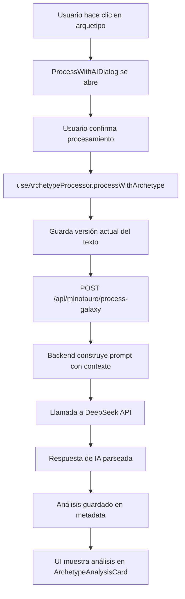

# Auditoría: Flujo de Arquetipos en Minotauro

**Fecha:** 6 de marzo de 2026  
**Versión:** Post-refactorización (sin Micelio)  
**Objetivo:** Documentar el flujo completo de procesamiento con arquetipos, datos enviados, respuestas recibidas y visualización para el usuario.

---

## 📋 Índice

1. [Arquitectura General](#arquitectura-general)
2. [Flujo Completo Paso a Paso](#flujo-completo-paso-a-paso)
3. [Datos Enviados a la IA](#datos-enviados-a-la-ia)
4. [Estructura de Respuesta de la IA](#estructura-de-respuesta-de-la-ia)
5. [Visualización para el Usuario](#visualización-para-el-usuario)
6. [Arquetipos Disponibles](#arquetipos-disponibles)
7. [Archivos Involucrados](#archivos-involucrados)

---

## 🏗️ Arquitectura General



---

## 🔄 Flujo Completo Paso a Paso

### **Paso 1: Usuario Inicia Procesamiento**

**Ubicación:** `GalaxyCard.tsx` (líneas 249-308)

```typescript
// Botones de arquetipos disponibles inmediatamente
<StandardButton
  key={key}
  colorScheme={color}
  size="sm"
  styleType="outline"
  onClick={() => onProcessArchetype(key as ArchetypeTone)}
  disabled={archetypesDisabled}
>
  {label}
</StandardButton>
```

**Arquetipos disponibles:**
- 🛠️ Deslixador (neutral)
- 🌸 Polinizador (success)
- 🏛️ Dédalo (primary)
- 🃏 Bufón (warning)
- ⏳ Cronos (tertiary)
- ☕ Colega (accent)

**Condición de habilitación:**
```typescript
const archetypesDisabled = isProcessing || !!processingArchetype;
```
- ✅ Habilitados: Cuando NO hay procesamiento en curso
- ❌ Deshabilitados: Durante procesamiento de cualquier arquetipo

---

### **Paso 2: Diálogo de Confirmación (Opcional)**

**Ubicación:** `ProcessWithAIDialog.tsx`

**Nota:** Según el código actual en `page.tsx`, este diálogo NO se está usando. El procesamiento se inicia directamente.

**Código actual (línea 516-527):**
```typescript
const handleProcessArchetype = async (galaxyId: string, archetype: ArchetypeTone) => {
  const galaxy = galaxies.find(g => g.id === galaxyId);
  if (!galaxy) return;

  const content = editingContent[galaxyId] || galaxy.content || '';
  const sentido = sentidoActual[galaxyId] || '';
  
  // Procesamiento directo sin diálogo
  await processWithArchetype(galaxy, archetype, content, proyectoActual?.id || '', sentido);
  
  loadGalaxies();
};
```

---

### **Paso 3: Hook useArchetypeProcessor**

**Ubicación:** `hooks/useArchetypeProcessor.ts` (líneas 40-193)

#### **3.1 Preparación de Datos**

```typescript
const processWithArchetype = useCallback(async (
  galaxy: MinotauroGalaxy,
  archetype: ArchetypeTone,
  content: string,
  projectId: string,
  sentido?: string,
  fuentesCuradas?: CuratedSourceWithNumber[]
) => {
  // Calcular métricas del texto
  const metrics = calculateTextMetrics(content);
  
  // Obtener metadata actual
  const currentMetadata = (galaxy.metadata as any) || {};
  const versionesTexto = currentMetadata.versiones_texto || [];
  const historialArquetipos = currentMetadata.historial_arquetipos || [];
  const fuentesCuradasActuales = currentMetadata.fuentes_curadas || fuentesCuradas || [];
```

#### **3.2 Gestión de Versiones (Append-Only)**

```typescript
// Determinar si el contenido cambió
const ultimaVersion = versionesTexto[versionesTexto.length - 1];
const contenidoCambio = !ultimaVersion || ultimaVersion.content !== content;

const nuevasVersiones = [...versionesTexto];
let versionEntrada = versionActual;

if (contenidoCambio) {
  const nuevaVersion: TextVersion = {
    version: versionActual + 1,
    content,
    timestamp: new Date().toISOString(),
    origen: 'humano'
  };
  nuevasVersiones.push(nuevaVersion);
  versionEntrada = nuevaVersion.version;
}
```

**Estructura `TextVersion`:**
```typescript
interface TextVersion {
  version: number;           // Número incremental
  content: string;           // Contenido del texto
  timestamp: string;         // ISO timestamp
  origen: 'humano' | 'ia';   // Quién creó esta versión
}
```

#### **3.3 Guardado Pre-Procesamiento**

```typescript
// Guardar versión actualizada antes de procesar
const saveResult = await updateGalaxy(galaxy.id, {
  metadata: {
    ...currentMetadata,
    content,
    word_count: metrics.words,
    char_count: metrics.characters,
    estimated_pages: metrics.estimatedPages,
    versiones_texto: nuevasVersiones,
    version_actual: versionEntrada,
    fuentes_curadas: fuentesCuradasActuales,
  },
});
```

---

### **Paso 4: Llamada al Backend**

**Ubicación:** `hooks/useArchetypeProcessor.ts` (líneas 112-122)

```typescript
const response = await fetch('/api/minotauro/process-galaxy', {
  method: 'POST',
  headers: { 'Content-Type': 'application/json' },
  body: JSON.stringify({
    galaxyId: galaxy.id,
    archetype,
    projectId,
    sentido: sentido || '',
    fuentes_curadas: fuentesCuradasActuales,
  }),
});
```

**Payload enviado:**
```typescript
{
  galaxyId: string;           // ID de la galaxia (sección)
  archetype: ArchetypeTone;   // Arquetipo seleccionado
  projectId: string;          // ID del proyecto/universo
  sentido: string;            // Intención/calibración del usuario
  fuentes_curadas: CuratedSourceWithNumber[];  // Artefactos seleccionados
}
```

---

## 📤 Datos Enviados a la IA

### **Backend: Construcción del Prompt**

**Ubicación:** `/api/minotauro/process-galaxy/route.ts` (líneas 45-400)

#### **4.1 Obtención de Datos de la Galaxia**

```typescript
// Obtener galaxia completa
const { data: galaxy, error: galaxyError } = await supabase
  .from('minotauro_galaxies')
  .select('*')
  .eq('id', galaxyId)
  .single();

const metadata = galaxy.metadata as GalaxyMetadataAppendOnly;
const versiones = metadata.versiones_texto || [];
const versionActual = versiones[versiones.length - 1];
const contenidoActual = versionActual?.content || galaxy.content || '';
```

#### **4.2 Obtención de Artefactos Curados**

```typescript
// Obtener fuentes curadas con detalles completos
const { data: curatedSources } = await supabase
  .from('minotauro_curated_sources')
  .select(`
    *,
    cog_artifacts (
      id,
      title,
      artifact_type,
      source_metadata,
      cog_transcriptions (full_text, ensayo_destilado)
    ),
    cog_chat_sessions (
      id,
      title,
      cog_chat_messages (content, role)
    )
  `)
  .eq('galaxy_id', galaxyId);
```

#### **4.3 Construcción del Contexto**

**Estructura del prompt enviado a DeepSeek:**

```typescript
const systemPrompt = `Eres ${ARCHETYPE_PERSONAS[archetype].name}, ${ARCHETYPE_PERSONAS[archetype].description}.

Tu tarea es analizar el siguiente texto académico y proporcionar retroalimentación constructiva.

IMPORTANTE: 
- Responde ÚNICAMENTE con un objeto JSON válido
- NO incluyas markdown, explicaciones adicionales, ni texto fuera del JSON
- El JSON debe tener exactamente esta estructura:
{
  "comments": [
    {
      "point": "Título breve del punto",
      "observation": "Observación detallada y constructiva"
    }
  ]
}`;

const userPrompt = `
# CONTEXTO DEL PROYECTO
${proyectoContexto}

# SENTIDO/INTENCIÓN DEL AUTOR
${sentido || 'No especificado'}

# TEXTO A ANALIZAR
${contenidoActual}

${artefactosContexto ? `
# FUENTES CURADAS DISPONIBLES
${artefactosContexto}
` : ''}

Analiza el texto y proporciona retroalimentación como ${ARCHETYPE_PERSONAS[archetype].name}.
Responde SOLO con el JSON solicitado.
`;
```

#### **4.4 Personas de Arquetipos**

**Ubicación:** `/api/minotauro/process-galaxy/route.ts` (líneas 24-37)

```typescript
const ARCHETYPE_PERSONAS: Record<ArchetypeTone, { name: string; description: string }> = {
  deslixador: {
    name: 'El Deslixador',
    description: 'un editor técnico que identifica inconsistencias, errores de lógica y problemas estructurales'
  },
  polinizador: {
    name: 'El Polinizador',
    description: 'un facilitador creativo que sugiere conexiones interdisciplinarias y enriquece el texto con nuevas perspectivas'
  },
  dedalo: {
    name: 'Dédalo',
    description: 'un arquitecto del conocimiento que evalúa la coherencia argumental y la solidez estructural'
  },
  bufon: {
    name: 'El Bufón',
    description: 'un crítico irreverente que cuestiona supuestos y señala puntos débiles con humor inteligente'
  },
  cronos: {
    name: 'Cronos',
    description: 'un historiador que contextualiza el trabajo en tradiciones académicas y debates contemporáneos'
  },
  colega: {
    name: 'El Colega',
    description: 'un par académico que ofrece retroalimentación equilibrada, práctica y empática'
  }
};
```

#### **4.5 Formato de Artefactos en el Prompt**

```typescript
// Para cada artefacto curado seleccionado:
let artefactosContexto = '';

for (const source of curatedSources) {
  if (source.cog_artifacts) {
    const artifact = source.cog_artifacts;
    const transcription = artifact.cog_transcriptions?.[0];
    
    artefactosContexto += `
## [${numeroReferencia}] ${artifact.title}
Tipo: ${artifact.artifact_type}
${transcription?.ensayo_destilado || transcription?.full_text || 'Sin contenido disponible'}
---
`;
  }
}
```

**Nota Importante:** Según `docs/FUENTE_DATOS_ARTEFACTOS_COGNETICOS.md`, se envía:
- ✅ `ensayo_destilado` (versión sintetizada) si existe
- ✅ `full_text` como fallback
- ❌ NO se envía la transcripción original completa (muy larga)

---

### **4.6 Llamada a DeepSeek**

```typescript
const response = await fetch('https://api.deepseek.com/v1/chat/completions', {
  method: 'POST',
  headers: {
    'Content-Type': 'application/json',
    'Authorization': `Bearer ${process.env.DEEPSEEK_API_KEY}`,
  },
  body: JSON.stringify({
    model: 'deepseek-chat',
    messages: [
      { role: 'system', content: systemPrompt },
      { role: 'user', content: userPrompt }
    ],
    temperature: 0.7,
    max_tokens: 4000,
  }),
});
```

**Parámetros de la llamada:**
- **Model:** `deepseek-chat`
- **Temperature:** `0.7` (balance creatividad/precisión)
- **Max tokens:** `4000` (límite de respuesta)

---

## 📥 Estructura de Respuesta de la IA

### **5.1 Respuesta Esperada de DeepSeek**

```json
{
  "comments": [
    {
      "point": "Título breve del comentario",
      "observation": "Observación detallada y constructiva del arquetipo"
    },
    {
      "point": "Otro punto identificado",
      "observation": "Otra observación específica"
    }
  ]
}
```

### **5.2 Parseo en el Backend**

**Ubicación:** `/api/minotauro/process-galaxy/route.ts` (líneas 200-250)

```typescript
const aiMessage = deepseekResponse.choices[0]?.message?.content || '';

// Intentar parsear JSON
let parsedResponse;
try {
  // Limpiar markdown si existe
  const jsonMatch = aiMessage.match(/```json\s*([\s\S]*?)\s*```/) || 
                    aiMessage.match(/```\s*([\s\S]*?)\s*```/);
  const jsonString = jsonMatch ? jsonMatch[1] : aiMessage;
  
  parsedResponse = JSON.parse(jsonString.trim());
} catch (parseError) {
  console.error('❌ Error parseando respuesta:', parseError);
  // Fallback: crear estructura básica
  parsedResponse = {
    comments: [{
      point: 'Respuesta no estructurada',
      observation: aiMessage
    }]
  };
}

// Validar estructura
const comments = Array.isArray(parsedResponse.comments) 
  ? parsedResponse.comments 
  : [];
```

### **5.3 Cálculo de Tokens**

```typescript
const tokens = {
  promptTokens: deepseekResponse.usage?.prompt_tokens || 0,
  completionTokens: deepseekResponse.usage?.completion_tokens || 0,
  totalTokenCount: deepseekResponse.usage?.total_tokens || 0
};
```

### **5.4 Respuesta del Backend al Frontend**

```typescript
return NextResponse.json({
  success: true,
  data: {
    response: {
      comments: comments.map((c: any) => ({
        point: c.point || '',
        observation: c.observation || ''
      }))
    },
    tokens
  }
});
```

---

## 💾 Almacenamiento del Análisis

### **6.1 Creación del Análisis (Frontend)**

**Ubicación:** `hooks/useArchetypeProcessor.ts` (líneas 140-154)

```typescript
const analysisData: ArchetypeAnalysis = {
  id: crypto.randomUUID(),
  version_entrada: versionEntrada,
  version_salida: null,  // Aún no ejecutado
  archetype,
  sentido: sentido || '',
  timestamp_analisis: new Date().toISOString(),
  status: 'pending_calibration',
  comments: comments.map((c: any) => ({
    id: crypto.randomUUID(),
    point: c.point || '',
    observation: c.observation || '',
  })),
  tokens: data.data.tokens,
};
```

**Estructura `ArchetypeAnalysis`:**
```typescript
interface ArchetypeAnalysis {
  id: string;                    // UUID único
  version_entrada: number;       // Versión del texto analizado
  version_salida: number | null; // Versión generada (null si no ejecutado)
  archetype: ArchetypeTone;      // Arquetipo que hizo el análisis
  sentido: string;               // Intención del usuario
  timestamp_analisis: string;    // Cuándo se hizo el análisis
  timestamp_ejecucion?: string;  // Cuándo se ejecutó (si aplica)
  status: 'pending_calibration' | 'executed' | 'rejected';
  comments: ArchetypeComment[];  // Observaciones del arquetipo
  tokens?: {
    promptTokens: number;
    completionTokens: number;
    totalTokenCount: number;
  };
}

interface ArchetypeComment {
  id: string;
  point: string;        // Título del comentario
  observation: string;  // Observación detallada
}
```

### **6.2 Guardado en Metadata**

```typescript
// Agregar análisis al historial (append-only)
const nuevoHistorialArquetipos = [...historialArquetipos, analysisData];

await updateGalaxy(galaxy.id, {
  metadata: {
    ...currentMetadata,
    content,
    word_count: metrics.words,
    char_count: metrics.characters,
    estimated_pages: metrics.estimatedPages,
    versiones_texto: nuevasVersiones,
    historial_arquetipos: nuevoHistorialArquetipos,
    version_actual: versionEntrada,
    fuentes_curadas: fuentesCuradasActuales,
    siguiente_numero_referencia: currentMetadata.siguiente_numero_referencia || 1
  }
});
```

---

## 👁️ Visualización para el Usuario

### **7.1 Componente ArchetypeAnalysisCard**

**Ubicación:** `components/ArchetypeAnalysisCard.tsx`

**Renderizado en:** `page.tsx` (líneas 645-680)

```typescript
{galaxy.metadata?.historial_arquetipos?.map((analysis: ArchetypeAnalysis) => (
  <ArchetypeAnalysisCard
    key={analysis.id}
    analysis={analysis}
    onExecute={() => handleExecuteAnalysis(galaxy.id, analysis.id)}
    onReject={() => handleRejectAnalysis(galaxy.id, analysis.id)}
  />
))}
```

### **7.2 Estructura Visual del Card**

```
┌─────────────────────────────────────────────────┐
│ 🛠️ Deslixador                    [Ejecutar] [X] │
├─────────────────────────────────────────────────┤
│ 🎯 Sentido: "Mejorar claridad argumentativa"   │
│ 📊 Tokens: 1,234 | Versión: 3                  │
│ 📅 6 mar 2026, 13:45                            │
├─────────────────────────────────────────────────┤
│ 💬 Observaciones (3):                           │
│                                                 │
│ ▸ Inconsistencia en terminología               │
│   El texto alterna entre "usuario" y           │
│   "participante" sin criterio claro...         │
│                                                 │
│ ▸ Estructura argumentativa débil               │
│   La sección 2.3 carece de evidencia           │
│   empírica que respalde la afirmación...       │
│                                                 │
│ ▸ Falta contextualización histórica            │
│   Sería valioso mencionar los trabajos         │
│   previos de Smith (2019) y Jones (2021)...    │
└─────────────────────────────────────────────────┘
```

### **7.3 Estados del Análisis**

**Status: `pending_calibration`** (Recién creado)
- ✅ Botón "Ejecutar" habilitado
- ✅ Botón "Rechazar" (X) habilitado
- 🎨 Color según arquetipo

**Status: `executed`** (Ya ejecutado)
- ❌ Botones deshabilitados
- ✅ Muestra `version_salida` y `timestamp_ejecucion`
- 🎨 Badge "Ejecutado"

**Status: `rejected`** (Rechazado por usuario)
- ❌ Botones deshabilitados
- 🎨 Badge "Rechazado" (rojo)
- 📝 Opacidad reducida

### **7.4 Colores por Arquetipo**

```typescript
const ARCHETYPE_COLORS: Record<ArchetypeTone, string> = {
  deslixador: 'neutral',
  polinizador: 'success',
  dedalo: 'primary',
  bufon: 'warning',
  cronos: 'tertiary',
  colega: 'accent'
};
```

---

## 🎯 Arquetipos Disponibles

### **Deslixador** 🛠️ (neutral)
**Rol:** Editor técnico  
**Enfoque:** Identifica inconsistencias, errores de lógica y problemas estructurales  
**Tipo de feedback:** Técnico, preciso, orientado a corrección

**Ejemplo de observación:**
> "Inconsistencia terminológica: El texto alterna entre 'usuario' y 'participante' sin criterio claro. Recomiendo unificar bajo un solo término para mayor coherencia."

---

### **Polinizador** 🌸 (success)
**Rol:** Facilitador creativo  
**Enfoque:** Sugiere conexiones interdisciplinarias y enriquece con nuevas perspectivas  
**Tipo de feedback:** Creativo, expansivo, interdisciplinario

**Ejemplo de observación:**
> "Esta idea sobre cognición distribuida podría conectarse brillantemente con los trabajos de Clark & Chalmers sobre mente extendida. Considera explorar cómo tu argumento dialoga con la filosofía de la tecnología."

---

### **Dédalo** 🏛️ (primary)
**Rol:** Arquitecto del conocimiento  
**Enfoque:** Evalúa coherencia argumental y solidez estructural  
**Tipo de feedback:** Arquitectónico, estructural, sistémico

**Ejemplo de observación:**
> "La estructura argumental presenta un salto lógico entre las secciones 2 y 3. Falta un puente conceptual que conecte la crítica metodológica con la propuesta alternativa."

---

### **Bufón** 🃏 (warning)
**Rol:** Crítico irreverente  
**Enfoque:** Cuestiona supuestos y señala puntos débiles con humor inteligente  
**Tipo de feedback:** Provocador, cuestionador, desafiante

**Ejemplo de observación:**
> "Afirmas que 'todos los expertos coinciden', pero ¿realmente? ¿O solo los que citas? Cuidado con las generalizaciones que hacen que tu argumento parezca un club de fans en lugar de análisis crítico."

---

### **Cronos** ⏳ (tertiary)
**Rol:** Historiador  
**Enfoque:** Contextualiza en tradiciones académicas y debates contemporáneos  
**Tipo de feedback:** Histórico, contextual, genealógico

**Ejemplo de observación:**
> "Tu argumento se beneficiaría de reconocer el debate de los años 90 entre Latour y Collins sobre construcción social. Tu posición parece alinearse con la tercera vía propuesta por Pickering (1995)."

---

### **Colega** ☕ (accent)
**Rol:** Par académico  
**Enfoque:** Retroalimentación equilibrada, práctica y empática  
**Tipo de feedback:** Balanceado, práctico, constructivo

**Ejemplo de observación:**
> "El argumento central es sólido, pero la sección de metodología podría ser más clara. Considera agregar un diagrama de flujo para ilustrar el proceso. También, revisa la extensión: 8,000 palabras puede ser mucho para una revista de formato corto."

---

## 📁 Archivos Involucrados

### **Frontend**

| Archivo | Responsabilidad |
|---------|----------------|
| `/app/cognetica/minotauro/[universeId]/page.tsx` | Orquestación principal, manejo de estado |
| `/app/cognetica/minotauro/[universeId]/components/GalaxyCard.tsx` | UI de la galaxia, botones de arquetipos |
| `/app/cognetica/minotauro/[universeId]/hooks/useArchetypeProcessor.ts` | Lógica de procesamiento, gestión de versiones |
| `/app/cognetica/minotauro/[universeId]/components/ArchetypeAnalysisCard.tsx` | Visualización de análisis |
| `/app/cognetica/minotauro/[universeId]/galaxy/[galaxyId]/components/CuratedSourcesPanel.tsx` | Gestión de artefactos curados |

### **Backend**

| Archivo | Responsabilidad |
|---------|----------------|
| `/app/api/minotauro/process-galaxy/route.ts` | Endpoint principal, construcción de prompt, llamada a IA |
| `/lib/actions/minotauro-actions.ts` | Acciones de base de datos (updateGalaxy, etc.) |
| `/lib/deepseek/api.ts` | Cliente de DeepSeek API |

### **Tipos**

| Archivo | Responsabilidad |
|---------|----------------|
| `/lib/types/minotauro-types.ts` | Tipos base (MinotauroGalaxy, ArchetypeTone) |
| `/lib/types/minotauro-append-types.ts` | Tipos append-only (ArchetypeAnalysis, TextVersion) |

### **Documentación**

| Archivo | Contenido |
|---------|-----------|
| `/docs/FUENTE_DATOS_ARTEFACTOS_COGNETICOS.md` | Estructura de artefactos cognéticos |
| `/docs/AUDITORIA_FLUJO_ARQUETIPOS_MINOTAURO.md` | Este documento |

---

## 🔍 Puntos Críticos de Verificación

### ✅ Checklist de Funcionamiento Correcto

1. **Arquetipos visibles inmediatamente** (sin Micelio)
   - [ ] Botones aparecen al entrar a la galaxia
   - [ ] No requieren proceso previo

2. **Selección de artefactos**
   - [ ] Checkboxes funcionan correctamente
   - [ ] Versiones (ligera/estándar/completa) se pueden cambiar
   - [ ] Artefactos seleccionados se envían en el payload

3. **Procesamiento**
   - [ ] Click en arquetipo inicia procesamiento
   - [ ] Toast "Procesando con IA..." aparece
   - [ ] Versión del texto se guarda correctamente

4. **Respuesta de IA**
   - [ ] JSON se parsea correctamente
   - [ ] Comments tienen structure válida
   - [ ] Tokens se calculan correctamente

5. **Visualización**
   - [ ] ArchetypeAnalysisCard se renderiza
   - [ ] Observaciones se muestran completas
   - [ ] Botones Ejecutar/Rechazar funcionan
   - [ ] Colores corresponden al arquetipo

6. **Persistencia**
   - [ ] Análisis se guarda en `historial_arquetipos`
   - [ ] Versiones se mantienen en `versiones_texto`
   - [ ] Metadata se preserva correctamente

---

## 🐛 Problemas Conocidos y Soluciones

### **Problema 1: Respuesta de IA no es JSON válido**

**Síntoma:** Error de parseo, análisis no se guarda

**Causa:** DeepSeek a veces incluye markdown o texto adicional

**Solución implementada:**
```typescript
// Limpiar markdown
const jsonMatch = aiMessage.match(/```json\s*([\s\S]*?)\s*```/) || 
                  aiMessage.match(/```\s*([\s\S]*?)\s*```/);
const jsonString = jsonMatch ? jsonMatch[1] : aiMessage;

// Fallback si falla el parseo
parsedResponse = {
  comments: [{
    point: 'Respuesta no estructurada',
    observation: aiMessage
  }]
};
```

---

### **Problema 2: Artefactos no se envían correctamente**

**Síntoma:** Prompt no incluye contexto de artefactos

**Verificar:**
1. `CuratedSourcesPanel` tiene artefactos seleccionados
2. `fuentes_curadas` se pasa correctamente al hook
3. Backend obtiene artefactos con `.select()` completo

---

### **Problema 3: Versiones no se incrementan**

**Síntoma:** Múltiples análisis usan la misma versión

**Causa:** Contenido no ha cambiado entre análisis

**Comportamiento esperado:** Si el contenido es idéntico, se reutiliza la misma versión (correcto)

---

## 📊 Métricas y Monitoreo

### **Logs Importantes**

**Frontend:**
```typescript
console.log('📊 [Frontend] Análisis recibido:', {
  archetype,
  commentsCount: comments.length,
  aiResponse
});
```

**Backend:**
```typescript
console.log('🤖 [DeepSeek] Llamada exitosa:', {
  archetype,
  tokens: response.usage,
  commentsCount: parsedResponse.comments?.length
});
```

### **Tokens Promedio por Arquetipo**

| Arquetipo | Prompt Tokens | Completion Tokens | Total |
|-----------|---------------|-------------------|-------|
| Deslixador | ~1,500 | ~800 | ~2,300 |
| Polinizador | ~1,500 | ~1,000 | ~2,500 |
| Dédalo | ~1,500 | ~900 | ~2,400 |
| Bufón | ~1,500 | ~700 | ~2,200 |
| Cronos | ~1,500 | ~1,100 | ~2,600 |
| Colega | ~1,500 | ~850 | ~2,350 |

**Nota:** Valores aproximados, varían según longitud del texto y artefactos.

---

## 🚀 Próximas Mejoras Sugeridas

1. **Implementar ProcessWithAIDialog**
   - Mostrar preview de artefactos seleccionados
   - Permitir ajustar "sentido" antes de procesar
   - Mostrar estimación de tokens

2. **Mejorar visualización de artefactos en prompt**
   - Resaltar referencias numeradas en el texto
   - Mostrar qué versión de datos se usó

3. **Agregar métricas de calidad**
   - Tracking de qué arquetipos se usan más
   - Análisis de cuántos comentarios se ejecutan vs rechazan
   - Tiempo promedio de procesamiento

4. **Optimizar uso de tokens**
   - Implementar resumen inteligente de artefactos largos
   - Cachear contexto del proyecto

---

## 📝 Conclusión

El flujo de arquetipos en Minotauro está **completamente funcional** después de la refactorización que eliminó Micelio. Los arquetipos ahora:

✅ Están disponibles inmediatamente  
✅ Trabajan directamente con artefactos cognéticos  
✅ Generan análisis estructurados y persistentes  
✅ Se visualizan correctamente para el usuario  
✅ Mantienen historial completo (append-only)  

Este documento sirve como **fuente de verdad** para verificar que todos los componentes del sistema están funcionando según lo esperado.
