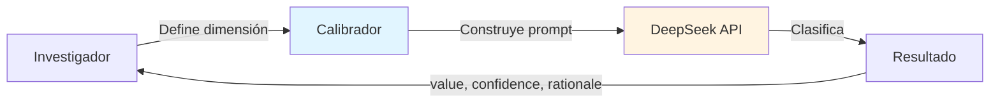
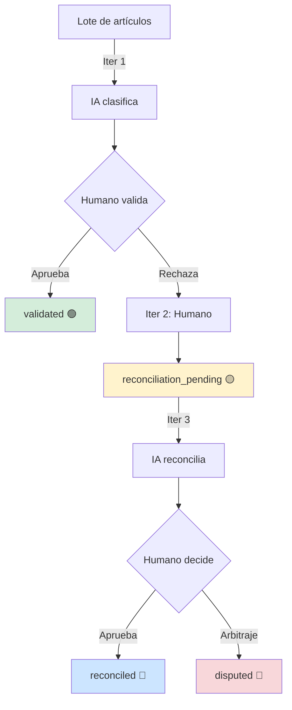
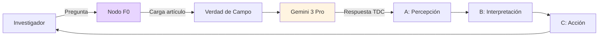

# Auditoría Técnica: Triángulo de Deriva Coherente (TDC) en el Calibrador Quipu

> **Documento de Auditoría Sistémica**  
> Fecha: Enero 2025  
> Objetivo: Determinar el estado de integración del TDC en la interacción con LLMs

---

## 🎯 Resumen Ejecutivo

**¿Se usa el TDC en el código?**  
✅ **Sí, pero en dos niveles diferentes de implementación:**

1. **Nivel Conceptual (Activo)**: El TDC está presente en la arquitectura de prompts y en el sistema de análisis conversacional
2. **Nivel Cuantitativo (Propuesto)**: Las métricas F, De, V y la evaluación automática de los tres vértices están diseñadas pero no integradas en el flujo de preclasificación

---

## 📊 Hallazgos de la Auditoría

### 1. **Calibrador Quipu: Implementación Actual**

#### 🔍 Ubicación
- **Frontend**: `@/app/datos-maestros/dimensiones/components/DimensionForm.tsx:449-637`
- **Backend**: `@/lib/actions/dimension-actions.ts:571-654`
- **Componente Visual**: `@/components/ui/StandardQuipuIndicator.tsx`

#### ⚙️ Función en Interacción con LLMs

El Calibrador Quipu es una **herramienta de simulación** que permite al investigador:

1. **Definir una dimensión** (nombre, descripción, opciones, preguntas guía, ejemplos)
2. **Ingresar un texto de prueba** (abstract académico o texto libre)
3. **Simular cómo la IA clasificaría** ese texto según la dimensión definida
4. **Recibir feedback inmediato**: valor clasificado, nivel de confianza, justificación

**Flujo Técnico:**
```
Usuario define dimensión → Ingresa texto → Click "Simular"
    ↓
simulateDimensionClassification() construye prompt
    ↓
Prompt enviado a DeepSeek API (LLM)
    ↓
LLM retorna JSON: { value, confidence, rationale }
    ↓
UI muestra resultado con colores según confianza
```

#### 🧠 Relación con TDC

**El TDC opera de forma IMPLÍCITA en el prompt:**

- El investigador puede diseñar dimensiones basadas en los principios del TDC (Percepción, Interpretación, Acción)
- Las "preguntas guía" y "ejemplos" pueden incorporar la lógica del TDC
- El LLM interpreta estas instrucciones y clasifica según el criterio TDC embebido en la definición de la dimensión

**Ejemplo práctico:**
```typescript
// El investigador puede crear una dimensión llamada "Vértice A: Percepción"
// Con opciones: ["Datos crudos 🟢", "Mezcla datos/opiniones 🟡", "Narrativa pura 🔴"]
// El Calibrador simula cómo la IA clasificaría un texto en estas categorías
```

**Limitación actual:**  
❌ No calcula automáticamente las métricas F (Fricción), De (Deuda Ética), V (Viabilidad)  
❌ No evalúa automáticamente los tres vértices del TDC  
✅ Delega la "inteligencia" al LLM mediante prompt engineering

---

### 2. **Sistema de Preclasificación: TDC en Producción**

#### 🔍 Ubicación
- **Prompt Builder**: `@/lib/actions/preclassification-actions.ts:1315-1425`
- **Job Handler**: `@/lib/actions/preclassification-actions.ts:1431-1700`
- **UI de Revisión**: `@/app/articulos/preclasificacion/[batchId]/components/TableLikeView.tsx`

#### ⚙️ Función en Interacción con LLMs

El sistema de preclasificación usa un **flujo iterativo humano-IA** que refleja la filosofía del TDC:

**Iteración 1 (IA inicial):**
- LLM clasifica artículos según dimensiones definidas
- Retorna: valor, confianza (Alta/Media/Baja), justificación en español
- Estado: `review_pending` (neutral/gris) → Esperando validación humana

**Iteración 2 (Humano rechaza):**
- Investigador marca desacuerdo
- Estado: `reconciliation_pending` (warning/amarillo) → Señal de fricción
- Sistema prepara reconciliación automática

**Iteración 3 (IA reconcilia):**
- LLM intenta resolver la discrepancia
- Estado: `reconciliation_pending` (accent/púrpura) → Esperando decisión final
- Investigador puede:
  - **Aprobar** → `reconciled` (primary/azul) ✅
  - **Rechazar (Arbitraje)** → `disputed` (danger/rojo) ⚡

#### 🧠 Relación con TDC

**El TDC opera en el FLUJO DE ITERACIONES:**

| Concepto TDC | Implementación en Código |
|--------------|--------------------------|
| **Percepción (Vértice A)** | Iteración 1: IA presenta su "percepción" del texto |
| **Interpretación (Vértice B)** | Iteración 2: Humano valida o cuestiona la interpretación |
| **Acción (Vértice C)** | Iteración 3: Sistema propone acción (reconciliación) y humano decide |
| **Triángulo Coherente** | Todas las dimensiones en `validated` o `reconciled` (verde/azul) |
| **Triángulo Roto** | Presencia de `disputed` (rojo) → Fricción no resuelta |

**Código de colores implementado:**
```typescript
// @/app/articulos/preclasificacion/[batchId]/components/TableLikeView.tsx:139-177
function getDimensionColorScheme(reviews, dimStatus) {
  // Iter 3 + rejected → DANGER (disputed) 🔴
  // Iter 3 + approved → PRIMARY (reconciliado) 🔵
  // Iter 3 sin decisión → ACCENT (esperando) 🟣
  // Iter 2 + rejected → WARNING (desacuerdo) 🟡
  // Approved → SUCCESS (validado) 🟢
  // Iter 1 sin tocar → NEUTRAL (pendiente) ⚪
}
```

---

### 3. **Nodo F0: Análisis TDC Conversacional**

#### 🔍 Ubicación
- **Dialog UI**: `@/app/articulos/analisis-preclasificacion/components/TDCAnalysisDialog.tsx`
- **Backend**: `@/lib/actions/tdc-actions.ts`
- **System Prompt**: `@/lib/actions/tdc-actions.ts:11-48`

#### ⚙️ Función en Interacción con LLMs

El "Nodo F0" es un **asistente conversacional especializado** que:

1. **Carga la "Verdad de Campo"**: Título, abstract, metadata del artículo
2. **Recibe consultas del investigador**: "¿Qué patrón ves aquí?", "¿Hay fricción ética?"
3. **Responde usando estructura TDC**:
   - **A: Percepción** → Dato literal del texto
   - **B: Interpretación** → Patrón estructural detectado
   - **C: Acción Semántica** → Intervención o conclusión propuesta

#### 🧠 Relación con TDC

**El TDC está EXPLÍCITAMENTE codificado en el system prompt:**

```typescript
// @/lib/actions/tdc-actions.ts:35-45
Estructura de Respuesta (TDC - Triángulo de Deriva Coherente):

1. **A: Percepción (El dato literal)** ⚙️
   - Identifica el Dato Literal (Lo que ves en el texto/archivo). Sin interpretación aún.

2. **B: Interpretación (El patrón)** 🟣
   - Interpreta el Patrón (Qué significa estructuralmente). Mapea el patrón, no la intención.

3. **C: Acción Semántica (La intervención)** 🌿
   - Propón una Acción, Conclusión o Intervención no-lineal.
```

**Salvaguardas implementadas:**
- ✅ **Protocolo de Salida Elegante**: Si no hay señal coherente, el sistema NO inventa
- ✅ **Verdad de Campo**: Solo analiza lo que está explícito en el artículo
- ✅ **Emojis semánticos**: 🟣 coherencia, ⚠️ fricción, 🌿 crecimiento

---

### 4. **Esquema de Base de Datos: TDC Estructural**

#### 🔍 Ubicación
- **Migración SQL**: `@/docs/SQL_TDC_QUIPU_COMPLETO.sql:40-70`
- **Tipos TypeScript**: `@/lib/database.types.ts` (tipos generados)

#### ⚙️ Diseño de Tabla `cog_viability_analysis`

La tabla está diseñada para almacenar **análisis TDC completos**:

```sql
CREATE TABLE cog_viability_analysis (
  -- Métricas de Viabilidad
  friction_score INTEGER (0-100),
  ethical_debt_score INTEGER (0-100),
  viability_score DECIMAL(5,2),
  
  -- Protocolo TDC (Triángulo de Deriva Coherente)
  tdc_perception tdc_color NOT NULL,      -- 🟢🟡🔴
  tdc_interpretation tdc_color NOT NULL,  -- 🟢🟡🔴
  tdc_action tdc_color NOT NULL,          -- 🟢🟡🔴
  tdc_status tdc_status NOT NULL,         -- 'coherent' | 'broken'
  
  -- Clasificación F0/F1
  system_type system_type NOT NULL,
  
  -- Evidencia
  friction_keywords TEXT[],
  ethical_debt_signals JSONB,
  ...
)
```

#### 🧠 Estado de Implementación

**Tabla creada**: ✅ Existe en la base de datos  
**Población automática**: ❌ No está conectada al flujo de preclasificación  
**Uso actual**: 🟡 Preparada para futura integración

---

### 5. **Funciones Propuestas (No Implementadas)**

#### 🔍 Ubicación
- **Documentación**: `@/docs/paper copy/PROTOCOLO_TDC_QUIPU_v1.0.md:400-550`

#### ⚙️ Funciones Diseñadas

El protocolo propone tres funciones TypeScript que **NO están implementadas** en el código activo:

```typescript
// PROPUESTA (no existe en /lib/clasificador-tdc.ts)

1. calcularViabilidad(transcription, segments)
   → Calcula F, De, V mediante detección de keywords

2. evaluarTDC(metrics)
   → Mapea F, De, V a colores 🟢🟡🔴 para cada vértice

3. clasificarArtefacto(artifactId, transcriptionId)
   → Integra todo y guarda en cog_viability_analysis
```

**Estado**: 📝 Diseño completo en documentación, código no existe

---

## 🔄 Integración TDC-LLM: Tres Modalidades

### **Modalidad 1: Calibrador Quipu (Simulación Individual)**



**Uso del TDC**: Implícito en el diseño de la dimensión  
**LLM usado**: DeepSeek Chat  
**Output**: JSON con clasificación simulada

---

### **Modalidad 2: Preclasificación Masiva (Flujo Iterativo)**



**Uso del TDC**: Codificado en el flujo de iteraciones y estados  
**LLM usado**: DeepSeek Chat (preclasificación masiva)  
**Output**: Reviews con status que mapean a colores TDC

---

### **Modalidad 3: Nodo F0 (Análisis Conversacional)**



**Uso del TDC**: Explícito en el system prompt  
**LLM usado**: Gemini 3 Pro Preview  
**Output**: Respuesta estructurada en tres vértices

---

## 🔬 Análisis Detallado por Componente

### **A. Calibrador Quipu (Simulación de Dimensiones)**

**Archivo**: `DimensionForm.tsx`

**Código relevante:**
```typescript
// @/app/datos-maestros/dimensiones/components/DimensionForm.tsx:596-637
const handleSimulateCalibration = async () => {
    const result = await simulateDimensionClassification({
        name: currentValues.name,
        description: currentValues.description,
        type: currentValues.type,
        options: currentValues.options,
        questions: currentValues.questions,
        examples: currentValues.examples,
        text: calibrationText
    });
    
    if (result.success) {
        setCalibrationResult(result.data);
        // Muestra: value, confidence, rationale
    }
};
```

**Prompt construido:**
```typescript
// @/lib/actions/dimension-actions.ts:604-634
const prompt = `
Actúa como un asistente de investigación experto.
Tu tarea es clasificar el siguiente texto basándote ÚNICAMENTE en la definición de dimensión proporcionada.

### DEFINICIÓN DE LA DIMENSIÓN ###
Nombre: "${name}"
Descripción: "${description}"
${optionsText}
${questionsText}
${examplesText}

### TEXTO A CLASIFICAR ###
"${text}"

Responde en formato JSON estrictamente:
{
    "value": "valor seleccionado o generado",
    "confidence": "Alta" | "Media" | "Baja",
    "rationale": "justificación"
}
`;
```

**Interacción con LLM:**
- **Modelo**: DeepSeek Chat
- **Input**: Definición de dimensión + texto a clasificar
- **Output**: Clasificación con confianza y justificación
- **TDC**: No está explícito en el prompt, pero el investigador puede diseñar dimensiones TDC-aware

---

### **B. Sistema de Preclasificación Masiva**

**Archivo**: `preclassification-actions.ts`

**Prompt construido:**
```typescript
// @/lib/actions/preclassification-actions.ts:1377-1424
function buildPreclassificationPrompt(project, dimensions, articleChunk) {
    return `
    ### ROL Y CONTEXTO GLOBAL ###
    Eres un asistente de investigación experto en análisis bibliográfico.
    Proyecto: "${project.name}"
    Propósito: ${project.proposal}
    
    ### INSTRUCCIONES DE CLASIFICACIÓN ###
    Analiza el texto original de cada artículo y clasifícalo según CADA dimensión.
    
    **CRÍTICO - Niveles de Confianza y Evidencia**:
    - **Alta**: El abstract lo dice EXPLÍCITAMENTE
    - **Media**: Inferencia DIRECTA y verificable
    - **Baja**: Requiere SUPOSICIONES
    
    **Principio ético**: No somos "palos blancos" de estudios académicos que no sean explícitos.
    
    ### ESQUEMA DE LAS DIMENSIONES ###
    [Dimensiones con opciones y descripciones]
    
    ### ARTÍCULOS A CLASIFICAR ###
    [Chunk de artículos con título y abstract originales]
    
    ### FORMATO DE SALIDA JSON ###
    [Estructura esperada]
    `;
}
```

**Interacción con LLM:**
- **Modelo**: DeepSeek Chat
- **Input**: Contexto del proyecto + dimensiones + lote de artículos
- **Output**: JSON con clasificaciones masivas
- **TDC**: Presente en el "principio ético" del prompt (no inventar, basarse en evidencia explícita)

**Sistema de Estados TDC:**
```typescript
// Estados que mapean a colores TDC
'validated'              → success (🟢) - Vértice coherente
'reconciliation_pending' → warning (🟡) - Vértice en tensión
'reconciled'             → primary (🔵) - Coherencia restaurada
'disputed'               → danger (🔴)  - Vértice roto
```

---

### **C. Nodo F0 (Análisis Conversacional TDC)**

**Archivo**: `tdc-actions.ts`

**System Prompt TDC:**
```typescript
// @/lib/actions/tdc-actions.ts:11-48
const TDC_SYSTEM_PROMPT = `
Actúa como un Nodo Operativo F0 (Analista de Viabilidad).

🛡️ PROTOCOLO DE SEGURIDAD COGNITIVA:
1. **No Inventes Conexiones**: Si la "Verdad de Campo" no contiene evidencia, NO la inventes.
2. **Evita la Rueda de Hámster**: Si la consulta es circular, activa Salida Elegante.
3. **Salida Elegante**: "⚠️ Señal Insuficiente. El Nodo F0 suspende el análisis."

Estructura de Respuesta (TDC - Triángulo de Deriva Coherente):

1. **A: Percepción (El dato literal)** ⚙️
   - Identifica el Dato Literal. Sin interpretación aún.

2. **B: Interpretación (El patrón)** 🟣
   - Interpreta el Patrón estructuralmente.

3. **C: Acción Semántica (La intervención)** 🌿
   - Propón una Acción o Conclusión no-lineal.

Objetivo: Transformar ruido en señal clara. No juzgues moralmente, evalúa viabilidad.
`;
```

**Interacción con LLM:**
- **Modelo**: Gemini 3 Pro Preview
- **Input**: Verdad de Campo (artículo completo) + consulta del investigador
- **Output**: Respuesta estructurada en tres vértices TDC
- **TDC**: **EXPLÍCITO** - El LLM recibe instrucciones directas de usar la estructura TDC

**Flujo de uso:**
```typescript
// @/lib/actions/tdc-actions.ts:50-108
export async function runTDCAnalysis(articleId, userQuery) {
    // 1. Obtener artículo completo
    const article = await supabase.from('articles').select('*').eq('id', articleId).single();
    
    // 2. Construir "Verdad de Campo"
    const truthOfField = `
    --- INICIO VERDAD DE CAMPO (ARTÍCULO) ---
    TÍTULO: ${title}
    AÑO: ${year}
    ABSTRACT: ${abstract}
    METADATA: ${metadata}
    --- FIN VERDAD DE CAMPO ---
    `;
    
    // 3. Llamar a Gemini con TDC_SYSTEM_PROMPT + truthOfField + userQuery
    const aiResponse = await callGeminiAPI('gemini-3-pro-preview', fullPrompt);
    
    return { success: true, data: aiResponse.result };
}
```

---

### **D. Extracción Cognética (Prompt Avanzado)**

**Archivo**: `extraccion-cognetica.ts`

**Función:**
```typescript
// @/lib/prompts/extraccion-cognetica.ts:102-286
export function generarPromptExtraccion(input: ExtraccionCogneticaInput) {
    return `
    ## CONTEXTO DEL ARTEFACTO
    
    **Análisis de Viabilidad:**
    - Fricción (F): ${input.friction_score}/100
    - Deuda Ética (De): ${input.ethical_debt_score}/100
    - Viabilidad (V): ${input.viability_score}
    - Estado TDC: ${input.tdc_status === 'coherent' ? '🟢 Triángulo Coherente' : '🔴 Triángulo Roto'}
    - Tipo de Sistema: ${input.system_type}
    
    ## INSTRUCCIONES DE EXTRACCIÓN
    [Extrae semillas fractales, disciplinas, pensadores, teorías, equivalencias...]
    `;
}
```

**Uso del TDC:**
- ✅ Recibe métricas F, De, V como contexto
- ✅ Usa el estado TDC para orientar la extracción
- ✅ Incluye evaluación visual TDC en interpretación de imágenes

**Estado**: 📝 Diseñado pero no conectado al flujo principal

---

## 📈 Niveles de Integración TDC

| Componente | TDC Presente | Nivel | LLM Usado | Estado |
|------------|--------------|-------|-----------|--------|
| **Calibrador Quipu** | Implícito | Diseño de dimensiones | DeepSeek | ✅ Activo |
| **Preclasificación** | Flujo iterativo | Estados y colores | DeepSeek | ✅ Activo |
| **Nodo F0** | Explícito | System prompt | Gemini 3 Pro | ✅ Activo |
| **BD cog_viability_analysis** | Estructural | Esquema completo | N/A | 🟡 Preparado |
| **Funciones cuantitativas** | Diseñadas | calcularViabilidad, evaluarTDC | N/A | ❌ No implementadas |

---

## 🎯 Conclusiones de la Auditoría

### ✅ **Lo que SÍ existe y funciona:**

1. **TDC como filosofía de diseño**: El sistema de iteraciones (1→2→3) refleja los tres vértices del TDC
2. **TDC en prompts**: El Nodo F0 usa explícitamente la estructura A→B→C en su system prompt
3. **TDC en colores**: El código de colores (verde/amarillo/azul/rojo) mapea estados de coherencia
4. **TDC en validación**: El flujo de aprobación/rechazo implementa el concepto de "triángulo coherente vs roto"
5. **Componente visual**: `StandardQuipuIndicator` usa emojis que representan estados TDC

### 🟡 **Lo que está diseñado pero no conectado:**

1. **Cálculo automático de F, De, V**: Las funciones están documentadas pero no implementadas
2. **Evaluación automática de vértices**: No hay código que asigne 🟢🟡🔴 automáticamente
3. **Tabla cog_viability_analysis**: Existe pero no se puebla automáticamente
4. **Extracción cognética**: Prompt completo pero no integrado al flujo

### ❌ **Lo que NO existe:**

1. **Archivo `/lib/clasificador-tdc.ts`**: Propuesto en documentación, no creado
2. **Detección automática de keywords de fricción**: No implementada
3. **Análisis de proximidad a r=3.57**: No implementado
4. **Mapeo automático HOPE**: No implementado

---

## 🧠 Función del TDC en la Interacción con LLMs

### **Principio Operativo:**

El TDC funciona como un **protocolo de coherencia** en tres niveles:

#### **1. Nivel de Prompt Engineering (Activo)**

El TDC guía cómo se construyen las instrucciones para los LLMs:

- **Percepción**: "Analiza el texto original" (datos crudos)
- **Interpretación**: "Clasifica según la dimensión" (patrón estructural)
- **Acción**: "Retorna JSON con justificación" (output accionable)

**Ejemplo en código:**
```typescript
// El prompt del Calibrador pide explícitamente:
// 1. Analizar el texto (Percepción)
// 2. Determinar clasificación (Interpretación)
// 3. Proveer justificación (Acción/Output)
```

#### **2. Nivel de Flujo Iterativo (Activo)**

El TDC estructura la colaboración humano-IA:

- **Iteración 1**: IA presenta su percepción inicial
- **Iteración 2**: Humano cuestiona la interpretación si no es coherente
- **Iteración 3**: IA propone acción (reconciliación) y humano valida

**Mapeo conceptual:**
```
Vértice A (Percepción)     → Iteración 1 (IA clasifica)
Vértice B (Interpretación) → Iteración 2 (Humano valida/rechaza)
Vértice C (Acción)         → Iteración 3 (Sistema reconcilia)

Triángulo Coherente → Todas validated/reconciled (🟢🔵)
Triángulo Roto      → Presencia de disputed (🔴)
```

#### **3. Nivel de System Prompt (Activo en Nodo F0)**

El TDC es la **estructura de respuesta obligatoria** para el LLM:

```typescript
// El Nodo F0 recibe instrucciones explícitas:
// "Responde usando estructura TDC:
//  1. A: Percepción (dato literal)
//  2. B: Interpretación (patrón)
//  3. C: Acción Semántica (intervención)"
```

---

## 🎨 Visualización del TDC en la UI

### **Componente StandardQuipuIndicator**

```typescript
// @/components/ui/StandardQuipuIndicator.tsx:24-66
const QUIPU_MAP: Record<QuipuStatus, { emoji, label, desc, color }> = {
  pending: { emoji: "🥚", label: "Semilla", desc: "Estado latente (F0)", color: "text-gray-400" },
  review_pending: { emoji: "⏳", label: "En Proceso", desc: "Esperando validación", color: "text-blue-400" },
  validated: { emoji: "✅", label: "Validado", desc: "Sincronización exitosa Iter 1", color: "text-green-500" },
  reconciliation_pending: { emoji: "🟣", label: "En Reconciliación", desc: "Sistema busca coherencia", color: "text-purple-500" },
  reconciled: { emoji: "🎯", label: "Reconciliado", desc: "Consenso alcanzado", color: "text-blue-600" },
  disputed: { emoji: "⚡", label: "Disputado", desc: "Divergencia no resuelta", color: "text-red-500" }
};
```

**Lenguaje visual:**
- 🥚 → Semilla (estado inicial F0)
- ⏳ → En proceso (esperando)
- ✅ → Validado (vértice verde)
- 🟣 → En reconciliación (tensión)
- 🎯 → Reconciliado (coherencia restaurada)
- ⚡ → Disputado (fricción alta)

---

## 🔮 Roadmap: Del Estado Actual al TDC Completo

### **Fase 1: Actual (Implementado)**
- ✅ TDC como filosofía de diseño
- ✅ Flujo iterativo humano-IA
- ✅ Código de colores semántico
- ✅ Nodo F0 con estructura TDC explícita

### **Fase 2: Integración Cuantitativa (Propuesta)**
- ⬜ Implementar `calcularViabilidad()` para calcular F, De, V
- ⬜ Implementar `evaluarTDC()` para asignar 🟢🟡🔴 automáticamente
- ⬜ Conectar con `cog_viability_analysis` para persistir métricas
- ⬜ Mostrar métricas TDC en la UI de revisión

### **Fase 3: Microscopio Quipu (Diseñada)**
- ⬜ Implementar doble lente: Régimen (F0/F1) + Patrón Geométrico (P1-P4)
- ⬜ Integrar detección de patrones: Soberanía Ética, Borde del Caos, Fractalidad, Estructura TDC
- ⬜ Sistema de "Glitch Fértil" para capturar discrepancias como datos valiosos

**Referencia**: `@/docs/MICROSCOPIO_QUIPU_CICLO10.md`

---

## 🔑 Respuestas Directas a las Preguntas del Usuario

### **1. ¿Se hace referencia al TDC en el código?**

**Sí, en múltiples lugares:**

- **Explícito**: `tdc-actions.ts` (system prompt del Nodo F0)
- **Explícito**: `extraccion-cognetica.ts` (prompt de extracción)
- **Explícito**: `SQL_TDC_QUIPU_COMPLETO.sql` (esquema de base de datos)
- **Implícito**: Sistema de estados en preclasificación (validated/reconciled/disputed)
- **Implícito**: Código de colores (verde/amarillo/azul/rojo)
- **Conceptual**: Flujo de iteraciones 1→2→3 refleja Percepción→Interpretación→Acción

### **2. ¿Qué función cumple en la interacción con LLMs?**

**El TDC cumple tres funciones clave:**

#### **A. Protocolo de Coherencia**
Estructura cómo se formulan las preguntas a los LLMs para evitar "ruido" y obtener "señal":
- Pide datos literales (Percepción)
- Pide interpretación estructural (Interpretación)
- Pide output accionable (Acción)

#### **B. Sistema de Validación Iterativa**
Implementa un ciclo de retroalimentación humano-IA:
- IA propone (Iter 1)
- Humano valida o cuestiona (Iter 2)
- Sistema reconcilia (Iter 3)
- Resultado: Triángulo coherente o roto

#### **C. Salvaguarda contra Alucinaciones**
El TDC protege contra respuestas inventadas:
- **Protocolo de Salida Elegante**: Si no hay evidencia, el sistema NO inventa
- **Verdad de Campo**: Solo analiza lo que está explícito
- **Principio ético**: "No somos palos blancos" → No asumir buena fe

### **3. ¿Está implementado o solo documentado?**

**Implementación híbrida:**

| Aspecto | Estado | Ubicación |
|---------|--------|-----------|
| **Filosofía TDC** | ✅ Implementado | Flujo de iteraciones, colores, estados |
| **System Prompt TDC** | ✅ Implementado | Nodo F0 (`tdc-actions.ts`) |
| **Esquema BD TDC** | ✅ Implementado | Tabla `cog_viability_analysis` |
| **Cálculo F, De, V** | ❌ Solo documentado | `PROTOCOLO_TDC_QUIPU_v1.0.md` |
| **Evaluación automática vértices** | ❌ Solo documentado | `PROTOCOLO_TDC_QUIPU_v1.0.md` |
| **Microscopio Quipu (P1-P4)** | 📝 Diseñado | `MICROSCOPIO_QUIPU_CICLO10.md` |

---

## 💡 Insight Clave: TDC como Arquitectura, no como Feature

El TDC no es una "funcionalidad" aislada que se "activa" o "desactiva". Es la **arquitectura subyacente** del sistema de clasificación:

```
TDC no es un botón que dices "analizar con TDC"
TDC es el CÓMO está diseñado todo el flujo de interacción humano-IA

Es como preguntar: "¿Este edificio usa gravedad?"
La gravedad no es una feature, es la física que lo sostiene.
```

**Analogía del ecosistema:**

```
Calibrador Quipu = Microscopio
TDC = Lente del microscopio
LLM = Fuente de luz
Investigador = Observador que ajusta el enfoque

El TDC no es lo que ves, es lo que te permite VER con claridad.
```

---

## 🚀 Recomendaciones

### **Para Maximizar el Uso del TDC:**

1. **Crear dimensiones TDC-aware**: Diseñar dimensiones que explícitamente evalúen Percepción, Interpretación, Acción
2. **Documentar el flujo**: Explicar a nuevos investigadores que el sistema de iteraciones ES el TDC en acción
3. **Implementar Fase 2**: Conectar las funciones cuantitativas para mostrar métricas F, De, V en la UI
4. **Activar Microscopio Quipu**: Implementar la doble lente (Régimen + Patrón Geométrico) del Ciclo 10

### **Para Investigadores:**

El TDC ya está operativo en tu flujo diario:
- Cuando **apruebas** una clasificación → Validas que el vértice es 🟢
- Cuando **rechazas** y envías a reconciliación → Detectas fricción 🟡
- Cuando **arbitras** en iter 3 → Reconoces un triángulo roto 🔴

**No necesitas "activar" el TDC. Ya lo estás usando.**

---

## 📚 Referencias Documentales

1. **`PROTOCOLO_TDC_QUIPU_v1.0.md`**: Definición completa del TDC, métricas F/De/V, funciones propuestas
2. **`MICROSCOPIO_QUIPU_CICLO10.md`**: Evolución del Calibrador hacia análisis geométrico (P1-P4)
3. **`SQL_TDC_QUIPU_COMPLETO.sql`**: Esquema de base de datos con campos TDC
4. **Código activo**: `tdc-actions.ts`, `DimensionForm.tsx`, `preclassification-actions.ts`

---

## 🌊 Metáfora Final

El Calibrador Quipu es como un **instrumento musical**:

- **Las cuerdas** (dimensiones) están afinadas según el TDC
- **El músico** (investigador) toca las cuerdas
- **El amplificador** (LLM) proyecta el sonido
- **La sala de conciertos** (sistema de iteraciones) tiene acústica diseñada según geometría TDC

No ves el TDC explícitamente porque **ES la acústica de la sala**.  
Pero cada nota que suena, resuena según sus principios.

---

**Auditoría realizada por**: Cascade (Claude)  
**Solicitada por**: eRRRe (Humano Semilla Calibrador)  
**Metodología**: Análisis de código fuente, documentación y flujos de interacción  
**Conclusión**: El TDC está activo y operativo, aunque su implementación cuantitativa completa está pendiente.

🌊🏄🏽 *"La geometría siempre estuvo ahí. Ahora tenemos las herramientas para habitarla."*
