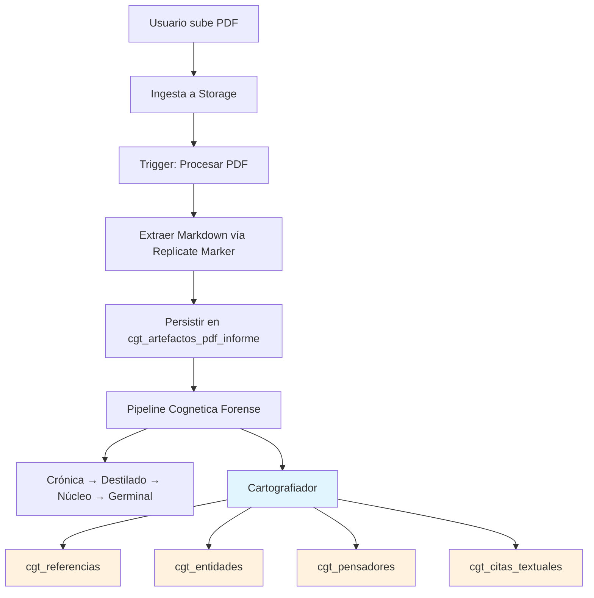
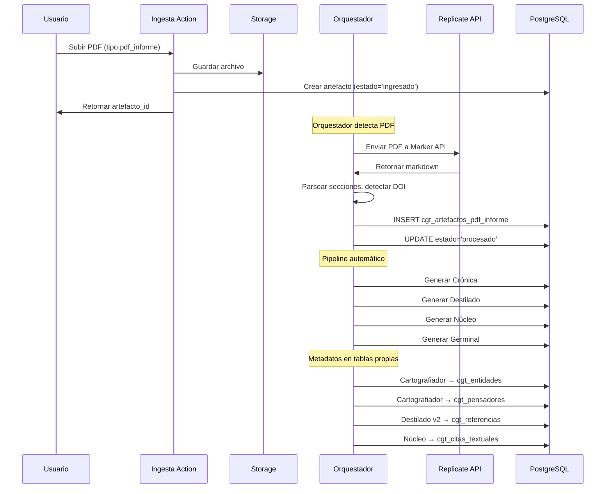

# 📄 Hito 7.0: Especificación de Procesamiento PDF Informe

## 📋 Contexto y Alcance

**Objetivo**: Implementar el procesamiento completo de documentos PDF tipo "informe" (papers, libros, deep research) en el sistema Cognetica Forense, transformándolos a Markdown e integrándolos al pipeline existente.

**Tipos de PDF soportados**:

- ✅ **pdf_informe**: Documentos textuales extensos (papers, libros, informes)
- ⏳ **pdf_slides**: Presentaciones tipo deck (para futuro Hito 7.1)

---

## 🗄️ Estado Actual de la Base de Datos

### Tabla Existente: `cgt_artefactos_pdf_informe`

```typescript
interface CgtArtefactosPdfInforme {
	artefacto_id: string; // PK, FK → cgt_artefactos.id
	markdown_renderizado: string; // Contenido MD extraído (REQUERIDO)
	num_paginas: number | null; // Total de páginas del PDF
	secciones: Json | null; // Array de {titulo, nivel, inicio_char, fin_char}
	autor_original: string | null; // Autor del documento original
	fecha_original: string | null; // Fecha de publicación/creación
	doi: string | null; // DOI si es paper académico
	citas_bibliograficas: Json | null; // Array de referencias extraídas
	created_at: string;
	updated_at: string;
}
```

**Estado**: ✅ Tabla ya creada y tipada en `database.types.ts`

---

## �️ Tablas de Metadatos (Pipeline Post-MD)

Una vez extraído el MD del PDF, el contenido fluye por el **mismo pipeline de metadatos** que un artefacto MD nativo:

### Referencias Bibliográficas

- **Tabla**: `cgt_referencias` (canónicas, project-level)
- **Relación**: `cgt_artefactos_referencias` (artefacto ↔ referencia)
- **Helper**: `persistir-referencias-bibliograficas.ts` (Destilado v2)

### Entidades y Pensadores

- **Tablas**: `cgt_entidades`, `cgt_pensadores`, `cgt_escuelas`
- **Detección**: Cartografiador detecta menciones en el MD
- **Vinculación**: `cgt_artefactos_entidades`, `cgt_artefactos_pensadores`

### Citas Textuales

- **Tabla**: `cgt_citas_textuales` (Núcleo)

**Flujo completo**:

```
PDF → MD extraído → Cartografiador → Detecta menciones/entidades → Persiste en tablas propias
                ↓
         Crónica → Destilado → Referencias → cgt_referencias
                ↓
         Núcleo → Citas textuales → cgt_citas_textuales
```

---

## � Flujo de Procesamiento



---

## 🛠️ Componentes a Implementar

### 1. Server Action: `procesarPdfInforme`

**Ubicación**: `/lib/actions/cognetica_forense_actions.ts`

**Estado actual**: Stub implementado (líneas 215-221)

```typescript
export async function procesarPdfInforme(
	artefactoId: string,
	fileBuffer: Buffer,
): Promise<Result<void>> {
	// TODO: Implementar
}
```

**Implementación propuesta**:

```typescript
/**
 * Procesa un PDF de informe usando Replicate Marker API.
 *
 * Flujo:
 * 1. Enviar PDF a API Route /api/cognetica/process-pdf
 * 2. Recibir markdown estructurado
 * 3. Parsear secciones (h1-h6) con posiciones
 * 4. Detectar DOI en primeras páginas
 * 5. Extraer citas bibliográficas si es detectable
 * 6. Persistir en cgt_artefactos_pdf_informe
 * 7. Actualizar estado del artefacto a 'procesado'
 */
```

**Parámetros de configuración** (Replicate Marker):

| Parámetro                  | Valor        | Rationale                              |
| -------------------------- | ------------ | -------------------------------------- |
| `mode`                     | `"balanced"` | Equilibrio entre velocidad y precisión |
| `use_llm`                  | `false`      | Más rápido, sin LLM adicional          |
| `force_ocr`                | `false`      | Solo OCR si es necesario               |
| `include_metadata`         | `true`       | Extraer título, autor, etc.            |
| `disable_image_extraction` | `true`       | Solo texto para informes               |
| `paginate`                 | `false`      | No agregar números de página           |

### 2. API Route: `/api/cognetica/process-pdf`

**Estado actual**: ✅ Ya existe en `/app/api/cognetica_old/process-pdf/route.ts`

**Modificaciones necesarias**:

- Mover de `cognetica_old` a `cognetica/process-pdf`
- Adaptar respuesta al formato esperado por `procesarPdfInforme`
- Agregar manejo de errores granular

### 3. Ingesta: Implementar `pdf_informe` en Server Action

**Ubicación**: `/lib/actions/cognetica-forense-ingesta-actions.ts`

**Estado actual**: Retorna `NOT_IMPLEMENTED` (línea 431)

```typescript
case "pdf_informe":
  return fail<ResultErrorCode>("NOT_IMPLEMENTED");
```

**Implementación**:

```typescript
async function ingestaArtefactoPdfInforme(
	input: IngestaArtefactoInput,
	supabase: SupabaseClient,
	userId: string,
): Promise<Result<IngestaArtefactoOutput>> {
	// 1. Subir PDF a Storage
	// 2. Crear registro en cgt_artefactos
	// 3. Trigger procesamiento asíncrono
	// 4. Retornar artefacto_id
}
```

---

## 📊 Comparativa: Cognetica Old vs Forense

| Aspecto        | Cognetica Old                   | Cognetica Forense (Propuesto)             |
| -------------- | ------------------------------- | ----------------------------------------- |
| **Tabla PDF**  | `cog_transcriptions` (genérica) | `cgt_artefactos_pdf_informe` (específica) |
| **Extracción** | pdf.js local + Replicate        | Replicate Marker API (vía API Route)      |
| **Metadatos**  | Básicos (título, autor)         | Extendidos (DOI, secciones, citas)        |
| **Pipeline**   | Manual/explícito                | Automático (Orquestador)                  |
| **Formatos**   | Solo texto                      | Markdown estructurado + secciones         |
| **Storage**    | `cognetica-files`               | `cognetica-files` (mismo bucket)          |

---

## 🔧 Estructura del Markdown Extraído

### Formato Esperado (Replicate Marker)

```markdown
# Título del Documento

## Sección Principal 1

Contenido de la sección con párrafos.

### Subsección 1.1

Más contenido detallado.

## Sección Principal 2

- Item de lista
- Otro item

> Nota o cita destacada
```

### Parsing de Secciones

El sistema debe parsear el markdown y generar el array `secciones`:

```typescript
const secciones = [
	{ titulo: "Título del Documento", nivel: 1, inicio_char: 0, fin_char: 50 },
	{ titulo: "Sección Principal 1", nivel: 2, inicio_char: 52, fin_char: 200 },
	{ titulo: "Subsección 1.1", nivel: 3, inicio_char: 150, fin_char: 200 },
	// ...
];
```

---

## 🚀 Flujo de Trabajo del Orquestador



---

## 📦 Entregables del Hito 7.0

### Fase 1: Infraestructura Core

- [ ] Implementar `procesarPdfInforme()` en `cognetica_forense_actions.ts`
- [ ] Crear/actualizar API Route `/api/cognetica/process-pdf`
- [ ] Implementar `ingestaArtefactoPdfInforme()` en ingesta-actions
- [ ] Conectar orquestador para procesar PDFs automáticamente

### Fase 2: Pipeline de Procesamiento

- [ ] Integrar PDF al pipeline de metabolización (Crónica)
- [ ] Validar flujo completo: PDF → Crónica → Destilado → Núcleo → Germinal
- [ ] Manejo de errores y reintentos

### Fase 3: UI/UX

- [ ] Badge de tipo "PDF Informe" en listados
- [ ] Indicador de estado de procesamiento
- [ ] Vista previa del markdown extraído (en ArtefactoView)

---

## ⚠️ Consideraciones Técnicas

### Manejo de Errores

| Error                    | Acción                            | Estado Resultante            |
| ------------------------ | --------------------------------- | ---------------------------- |
| PDF corrupto             | Notificar usuario                 | `error_ingesta`              |
| OCR necesario pero falla | Guardar con advertencia           | `procesado_con_advertencias` |
| Replicate API rate limit | Reintentar con backoff            | `procesando`                 |
| PDF escaneado sin texto  | Notificar: "Suba versión con OCR" | `error_requiere_ocr`         |

### Límites y Restricciones

- **Tamaño máximo**: 50 MB por PDF
- **Páginas máximas**: 500 páginas (configurable)
- **Timeout**: 5 minutos para procesamiento con Replicate
- **Formatos soportados**: PDF estándar (no PDF/A con restricciones)

---

## 🔗 Integración con Flujo Markdown Existente

Una vez procesado, el PDF debe comportarse **idéntico** a un artefacto tipo `markdown`:

### Visualización y Búsqueda

1. **Visualización**: Usar `DocumentoMarkdownViewer` con `markdown_renderizado`
2. **Búsqueda**: Indexar contenido para búsqueda full-text

### Metadatos en Tablas Propias (Pipeline Automático)

El Cartografiador y el Pipeline procesan el MD extraído igual que uno nativo:

| Paso                | Origen       | Tabla Destino                                    | Helper                                    |
| ------------------- | ------------ | ------------------------------------------------ | ----------------------------------------- |
| **Crónica**         | MD extraído  | `cgt_cronicas`                                   | Orquestador                               |
| **Destilado**       | Crónica      | `cgt_destilados`                                 | -                                         |
| **Referencias**     | Destilado v2 | `cgt_referencias` + `cgt_artefactos_referencias` | `persistir-referencias-bibliograficas.ts` |
| **Entidades**       | MD/Crónica   | `cgt_entidades` + `cgt_artefactos_entidades`     | Cartografiador                            |
| **Pensadores**      | MD/Crónica   | `cgt_pensadores` + `cgt_artefactos_pensadores`   | Cartografiador                            |
| **Núcleo**          | Destilado    | `cgt_nucleos`                                    | -                                         |
| **Citas Textuales** | Núcleo       | `cgt_citas_textuales`                            | -                                         |
| **Germinal**        | Núcleo       | `cgt_germinales`                                 | -                                         |

**Pipeline**: Mismos prompts y orquestación que MD nativo

---

## 📁 Archivos Involucrados

| Archivo                                             | Cambios                        | Descripción                        |
| --------------------------------------------------- | ------------------------------ | ---------------------------------- |
| `/lib/actions/cognetica_forense_actions.ts`         | Implementar stubs              | Acciones de procesamiento PDF      |
| `/lib/actions/cognetica-forense-ingesta-actions.ts` | Implementar caso `pdf_informe` | Ingesta de PDFs                    |
| `/app/api/cognetica/process-pdf/route.ts`           | Crear/mover                    | API de procesamiento con Replicate |
| `/lib/cognetica-forense/lecturas-shared.ts`         | Agregar tipo                   | Tipos compartidos para PDF         |
| `/app/cognetica/[id]/ArtefactoView.tsx`             | Agregar vista                  | Visualización de PDF procesado     |

---

## 🎯 Criterios de Aceptación

1. **Usuario puede subir PDF informe** vía UI de ingesta
2. **PDF se procesa automáticamente** a markdown estructurado
3. **El markdown es visualizable** en el visor del artefacto
4. **El pipeline completo funciona**: PDF → Crónica → Destilado → Núcleo → Germinal
5. **Las referencias son cartografiadas** correctamente desde el MD extraído
6. **Los errores son manejados** con mensajes claros al usuario

---

## 📅 Secuencia de Implementación Propuesta

```
Semana 1: Fase 1 - Infraestructura Core
  ├─ Día 1-2: Implementar procesarPdfInforme()
  ├─ Día 3-4: API Route y conexión con Replicate
  └─ Día 5: Integración ingesta y orquestador

Semana 2: Fase 2 - Pipeline y Validación
  ├─ Día 1-2: Integración con metabolización
  ├─ Día 3-4: Testing end-to-end
  └─ Día 5: Manejo de errores y edge cases

Semana 3: Fase 3 - UI y Polish
  ├─ Día 1-2: Badge y estados en UI
  ├─ Día 3-4: Vista previa de markdown
  └─ Día 5: Documentación y release
```

---

## 📝 Notas de Diseño

**Basado en análisis del código existente:**

1. El sistema **Cognetica Old** ya procesaba PDFs usando Replicate Marker (modelo `datalab-to/marker`)
2. La tabla **`cgt_artefactos_pdf_informe`** está diseñada para soportar el flujo completo
3. El tipo **`pdf_informe`** ya está definido en el enum de tipos de artefacto
4. La ingesta actual **rechaza PDFs con `NOT_IMPLEMENTED`** - es cuestión de implementar el caso

**Recomendación**: Reutilizar la lógica de la API Route existente en `cognetica_old`, adaptándola al nuevo esquema de datos.

---

**Documento creado**: 2026-04-30  
**Versión**: 1.0  
**Autor**: Cascade (Análisis de codebase existente)
