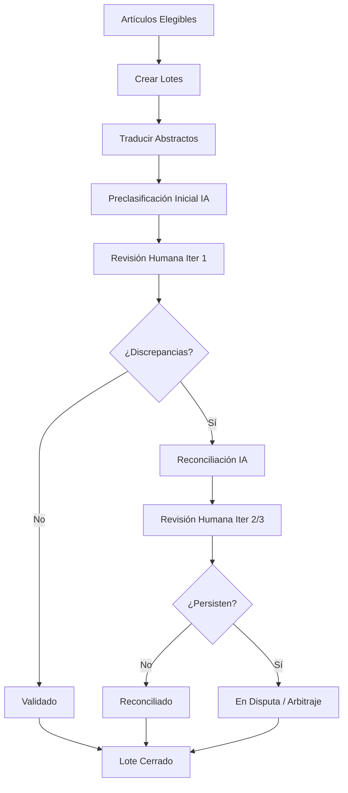
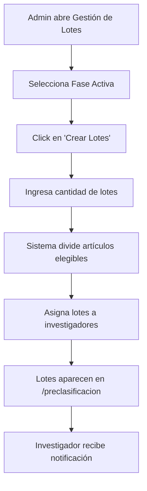
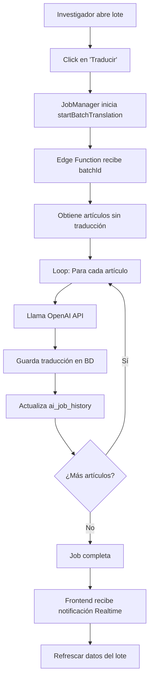
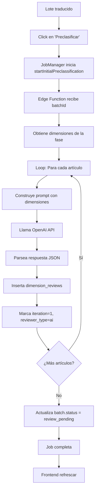
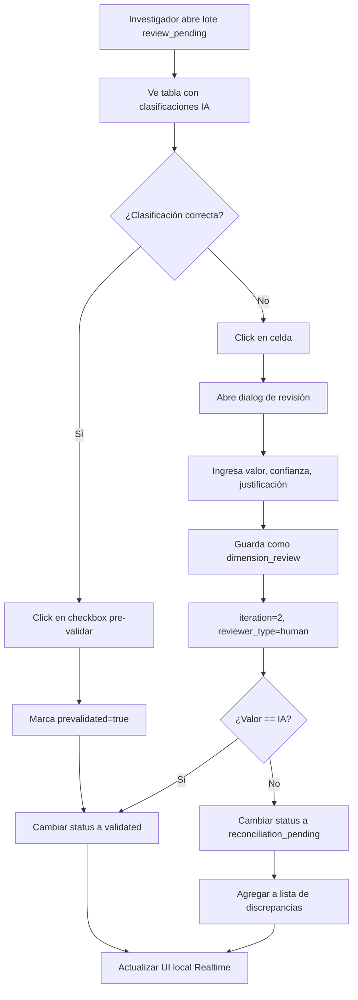
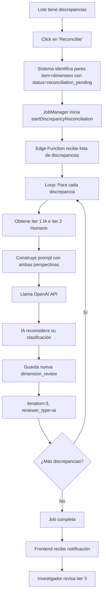
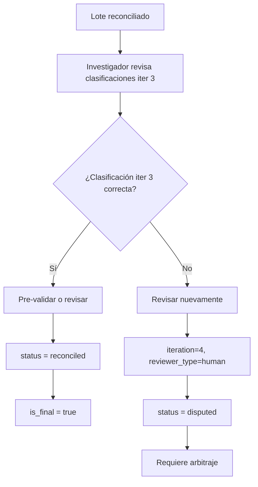
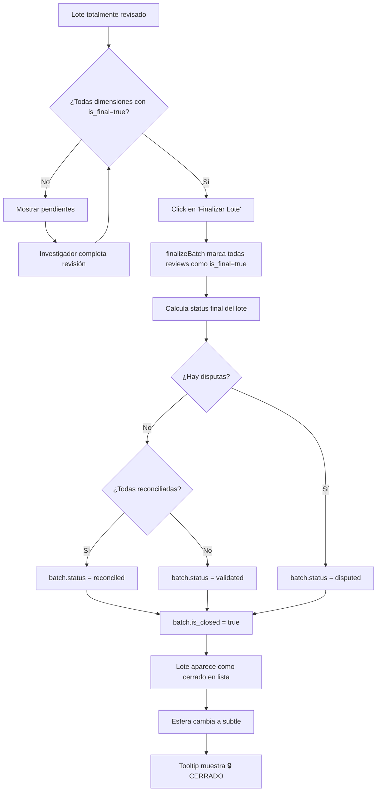

# Sistema de Preclasificación

## 📋 Tabla de Contenidos

1. [Propósito y Visión General](#propósito-y-visión-general)
2. [Arquitectura del Sistema](#arquitectura-del-sistema)
3. [Rutas y Páginas](#rutas-y-páginas)
4. [Actions y API](#actions-y-api)
5. [Base de Datos](#base-de-datos)
6. [Interacción con IA](#interacción-con-ia)
7. [Interfaz Humana y Revisión](#interfaz-humana-y-revisión)
8. [Real-time y Suscripciones](#real-time-y-suscripciones)
9. [Job Manager](#job-manager)
10. [Componentes Standard Especiales](#componentes-standard-especiales)
11. [Flujos de Trabajo](#flujos-de-trabajo)

---

## 🎯 Propósito y Visión General

### **Objetivo del Sistema**

El sistema de preclasificación de SUSTRATO.AI permite a investigadores clasificar artículos científicos según múltiples dimensiones (tipo de intervención, población objetivo, país, etc.) mediante un flujo de trabajo iterativo que combina:

- **Clasificación automática por IA** (GPT-4)
- **Revisión y validación humana**
- **Reconciliación de discrepancias** entre iteraciones
- **Seguimiento del progreso** en tiempo real

### **Flujo General**



### **Conceptos Clave**

#### **1. Fases (Phases)**
- Un proyecto tiene múltiples fases secuenciales
- Cada fase representa una etapa del proceso de revisión sistemática
- Fase 1: Diseño centrado en el usuario (DCU)
- Fase 2: Mapeo de estrategias (pendiente)

#### **2. Lotes (Batches)**
- Agrupación de artículos para revisión
- Asignados a un investigador específico
- Típicamente 15-30 artículos por lote
- Estados: `pending`, `translated`, `review_pending`, `reconciliation_pending`, `validated`, `reconciled`, `disputed`

#### **3. Items de Lote (Batch Items)**
- Representa un artículo dentro de un lote
- Hereda el status del lote
- Puede tener su propio status independiente

#### **4. Dimensiones (Dimensions)**
- Aspectos a clasificar de cada artículo
- Ejemplos: tipo_intervencion, poblacion_objetivo, pais_estudio
- Tipos: `finite` (opciones predefinidas) o `open` (texto libre)

#### **5. Revisiones (Reviews)**
- Cada clasificación de una dimensión por IA o humano
- `reviewer_type`: `'ai'` | `'human'`
- `iteration`: 1, 2, 3... (aumenta con cada revisión)
- `is_final`: indica si la revisión está aprobada
- `status`: `validated`, `reconciled`, `disputed`, etc.

---

## 🏗️ Arquitectura del Sistema

### **Stack Tecnológico**

- **Frontend:** Next.js 14 (App Router), React 18, TypeScript
- **Backend:** Supabase (PostgreSQL + Realtime + Edge Functions)
- **IA:** OpenAI GPT-4 (vía Edge Functions)
- **UI:** Sistema de Componentes Standard propietario
- **State Management:** React Hooks + Context API
- **Real-time:** Supabase Realtime (WebSockets)

### **Patrón Arquitectónico**

```
┌─────────────────────────────────────────┐
│         UI Layer (Pages)                │
│  /preclasificacion                      │
│  /preclasificacion/[batchId]            │
└──────────────┬──────────────────────────┘
               │
┌──────────────▼──────────────────────────┐
│     Standard Components Layer           │
│  StandardSphereGrid, StandardPieChart   │
│  StandardButton, StandardCard, etc.     │
└──────────────┬──────────────────────────┘
               │
┌──────────────▼──────────────────────────┐
│         Actions Layer (API)             │
│  preclassification-actions.ts           │
│  preclassification_phases_actions.ts    │
└──────────────┬──────────────────────────┘
               │
┌──────────────▼──────────────────────────┐
│         Supabase Layer                  │
│  RPC Functions, Realtime, Auth          │
└──────────────┬──────────────────────────┘
               │
┌──────────────▼──────────────────────────┐
│         Database Layer                  │
│  PostgreSQL Tables + Functions          │
└─────────────────────────────────────────┘
```

---

## 🛣️ Rutas y Páginas

### **1. `/articulos/preclasificacion` - Vista de Lista de Lotes**

**Archivo:** `/app/articulos/preclasificacion/page.tsx`

**Propósito:**
- Mostrar todos los lotes asignados al investigador actual
- Visualizar el progreso general (gráfico de pie + leyenda)
- Navegar hacia el detalle de cada lote

**Componentes Principales:**
- `StandardSphereGrid` - Grid de esferas representando cada lote
- `StandardPieChart` - Gráfico agregado de estados de todos los artículos
- `StandardCard` - Contenedores para resumen y leyenda

**Esquema de Colores:**

| Estado | Emoji | ColorScheme | Visual |
|--------|-------|-------------|--------|
| `pending` | ⏳ | `neutral` | Gris |
| `translated` | 🌐 | `secondary` | Secondary |
| `review_pending` | 🔔 | `primary` | Azul |
| `reconciliation_pending` | 🔄 | `warning` | Amarillo |
| `validated` | ✅ | `success` | Verde |
| `reconciled` | 🎯 | `primary` | Azul |
| `disputed` | ⚡ | `danger` | Rojo |

**Funcionalidades:**
- ✅ Click en esfera → navega a `/preclasificacion/[batchId]`
- ✅ Tooltip con estadísticas detalladas del lote
- ✅ Diferenciación visual: lote cerrado (`subtle`) vs abierto (`filled`)
- ✅ Indicador 🔒 para lotes completamente finalizados
- ✅ Real-time: actualización automática cuando cambian los lotes

---

### **2. `/articulos/preclasificacion/[batchId]` - Detalle de Lote**

**Archivo:** `/app/articulos/preclasificacion/[batchId]/page.tsx`

**Propósito:**
- Revisar y clasificar artículos de un lote específico
- Validar clasificaciones de IA
- Resolver discrepancias entre iteraciones
- Agregar notas a artículos

**Componentes Principales:**
- `TableLikeView` - Tabla de artículos con clasificaciones
- `NoteEditor` - Editor de notas para artículos
- `StandardButton` - Botones de acción

**Funcionalidades:**
- ✅ Vista de tabla con columnas dinámicas según dimensiones
- ✅ Pre-validación rápida (checkbox)
- ✅ Revisión completa con formulario
- ✅ Agregar/editar notas por artículo
- ✅ Exportar a CSV
- 🔄 Traducir, Preclasificar, Reconciliar, Finalizar

---

## 🔧 Actions y API

**Archivos principales:**
- `/lib/actions/preclassification-actions.ts` (2600+ líneas)
- `/lib/actions/preclassification_phases_actions.ts`

### **Funciones Principales**

#### **Lectura:**
- `getProjectBatchesForUser(projectId, userId)` - Lista de lotes con conteos
- `getBatchDetailsForReview(batchId)` - Detalle completo de un lote
- `getPreclassificationByArticleId(articleId)` - Historial de clasificaciones
- `isBatchClosed(batchId)` - Verifica si todas las dimensiones están finalizadas

#### **Escritura:**
- `submitHumanReview(payload)` - Registra revisión humana
- `updateDimensionStatus(itemId, dimensionId, status)` - Actualiza estado
- `bulkSetPrevalidatedForBatch(batchId, prevalidated)` - Pre-validación masiva

#### **Jobs Asíncronos:**
- `startBatchTranslation(batchId)` - Inicia traducción
- `startInitialPreclassification(batchId)` - Inicia clasificación IA
- `startDiscrepancyReconciliation(batchId, discrepancies)` - Reconciliación IA
- `finalizeBatch(batchId)` - Marca lote como finalizado

---

## 🗄️ Base de Datos

### **Tablas Principales**

#### **`article_batches`**
```sql
- id (uuid, PK)
- batch_number (integer)
- name (text)
- project_id (uuid, FK)
- phase_id (uuid, FK)
- assigned_to (uuid, FK → profiles)
- status (batch_preclass_status)
- started_at (timestamp)
- completed_at (timestamp)
```

#### **`article_batch_items`**
```sql
- id (uuid, PK)
- batch_id (uuid, FK → article_batches)
- article_id (uuid, FK → articles)
- status (batch_preclass_status)
- requires_adjudication (boolean)
```

#### **`dimension_reviews`**
```sql
- id (uuid, PK)
- article_batch_item_id (uuid, FK)
- dimension_id (uuid, FK → phase_dimensions)
- reviewer_type ('ai' | 'human')
- reviewer_id (uuid)
- iteration (integer)
- value (text)
- confidence (numeric)
- rationale (text)
- option_id (uuid, nullable)
- is_final (boolean)
- status (batch_preclass_status)
- created_at (timestamp)
```

#### **`phase_dimensions`**
```sql
- id (uuid, PK)
- phase_id (uuid, FK)
- name (text)
- dimension_type ('finite' | 'open')
- icon (text)
- order_index (integer)
```

#### **`dimension_options`**
```sql
- id (uuid, PK)
- dimension_id (uuid, FK)
- value (text)
- label (text)
- icon (text, nullable)
```

### **Funciones RPC Importantes**

#### **`get_user_batches_with_detailed_counts(p_user_id, p_project_id)`**
Retorna lotes con conteos agregados por estado de artículos.

**Lógica:**
```sql
SELECT 
  ab.id, ab.batch_number, ab.name, ab.status,
  jsonb_build_object(
    'pending', COUNT(*) FILTER (WHERE abi.status = 'pending'),
    'translated', COUNT(*) FILTER (WHERE abi.status = 'translated'),
    'pending_review', COUNT(*) FILTER (WHERE abi.status = 'review_pending'),
    'reconciliation_pending', COUNT(*) FILTER (WHERE abi.status = 'reconciliation_pending'),
    'validated', COUNT(*) FILTER (WHERE abi.status = 'validated'),
    'reconciled', COUNT(*) FILTER (WHERE abi.status = 'reconciled'),
    'disputed', COUNT(*) FILTER (WHERE abi.status = 'disputed')
  ) as article_counts
FROM article_batches ab
LEFT JOIN article_batch_items abi ON abi.batch_id = ab.id
WHERE ab.project_id = p_project_id AND ab.assigned_to = p_user_id
GROUP BY ab.id
ORDER BY ab.batch_number DESC;
```

---

## 🤖 Interacción con IA

### **Edge Functions de Supabase**

El sistema utiliza Edge Functions para interactuar con OpenAI GPT-4:

#### **1. `/translate-batch`**
**Propósito:** Traducir abstractos de artículos al español

**Flujo:**
1. Recibe `batchId`
2. Obtiene artículos sin traducción
3. Para cada artículo:
   - Llama a OpenAI API con prompt de traducción
   - Guarda `translated_title`, `translated_abstract`, `translation_summary`
4. Actualiza progreso en `ai_job_history`

**Prompt:**
```
Traduce el siguiente abstract científico al español.
Mantén precisión terminológica y estructura académica.

Title: {original_title}
Abstract: {original_abstract}

Retorna JSON:
{
  "title": "...",
  "abstract": "...",
  "summary": "Resumen en 2-3 oraciones"
}
```

#### **2. `/preclassify-batch`**
**Propósito:** Clasificar artículos según dimensiones configuradas

**Flujo:**
1. Recibe `batchId`
2. Obtiene dimensiones de la fase activa
3. Para cada artículo:
   - Construye prompt con dimensiones y opciones
   - Llama a OpenAI API
   - Guarda clasificaciones en `dimension_reviews` con `reviewer_type='ai'`, `iteration=1`

**Prompt:**
```
Clasifica el siguiente artículo según estas dimensiones:

Artículo:
Título: {title}
Abstract: {abstract}

Dimensiones:
1. Tipo de Intervención (DCU, Mapeo, Evaluación, Otro)
2. País del Estudio (Chile, Argentina, México, ...)
3. Población Objetivo (Adultos mayores, Jóvenes, Niños, ...)

Para cada dimensión, responde:
{
  "dimension_id": "...",
  "value": "...",
  "confidence": 0-100,
  "rationale": "Justificación basada en el texto"
}
```

#### **3. `/reconcile-discrepancies`**
**Propósito:** Re-evaluar clasificaciones donde hubo discrepancia humano-IA

**Flujo:**
1. Recibe `batchId` + lista de discrepancias
2. Para cada discrepancia:
   - Obtiene clasificación IA (iter 1) y humana (iter 2)
   - Construye prompt con ambas perspectivas
   - Llama a OpenAI API para reconciliación
   - Guarda nueva clasificación IA con `iteration=3`

**Prompt:**
```
Re-evalúa esta clasificación considerando el feedback humano:

Artículo: {title + abstract}
Dimensión: {dimension_name}

Clasificación IA (iter 1):
- Valor: {ai_value}
- Confianza: {ai_confidence}
- Justificación: {ai_rationale}

Clasificación Humana (iter 2):
- Valor: {human_value}
- Confianza: {human_confidence}
- Justificación: {human_rationale}

Reconsidera tu clasificación. ¿Cuál es correcta y por qué?
```

---

## 👤 Interfaz Humana y Revisión

### **Flujo de Revisión Humana**

#### **1. Pre-validación Rápida**
- Checkbox en cada celda de la tabla
- Marca clasificación IA como `prevalidated=true`
- No cambia `iteration`, solo indica acuerdo
- Útil para clasificaciones obviamente correctas

#### **2. Revisión Completa**
- Click en celda → abre dialog de revisión
- Formulario con:
  - **Valor:** Dropdown (dimensiones finitas) o input (abiertas)
  - **Confianza:** Slider 0-100%
  - **Justificación:** Textarea (obligatorio)
- Al guardar:
  - Inserta nueva `dimension_review` con `reviewer_type='human'`
  - `iteration` = última iteración + 1
  - Compara con clasificación IA:
    - Si coincide → `status='validated'`
    - Si difiere → `status='reconciliation_pending'`

#### **3. Manejo de Discrepancias**

**Escenario 1: Validación (coincidencia)**
```
Iter 1 (IA): DCU, confidence=95%
Iter 2 (Humano): DCU, confidence=90%
→ status='validated', is_final=true
```

**Escenario 2: Discrepancia**
```
Iter 1 (IA): DCU, confidence=95%
Iter 2 (Humano): Mapeo, confidence=85%
→ status='reconciliation_pending'
→ Trigger job de reconciliación
```

**Escenario 3: Reconciliación Exitosa**
```
Iter 3 (IA reconciliada): Mapeo, confidence=90%
Iter 4 (Humano): Mapeo, confidence=90%
→ status='reconciled', is_final=true
```

**Escenario 4: Disputa Persistente**
```
Iter 3 (IA reconciliada): DCU, confidence=80%
Iter 4 (Humano): Mapeo, confidence=85%
→ status='disputed'
→ Requiere arbitraje manual
```

---

## ⚡ Real-time y Suscripciones

### **Supabase Realtime**

El sistema usa WebSockets para actualizaciones en tiempo real:

#### **1. Cambios en Lotes (Lista)**
```typescript
const channel = supabase
  .channel('batches-changes')
  .on(
    'postgres_changes',
    { 
      event: '*', // INSERT, UPDATE, DELETE
      schema: 'public', 
      table: 'article_batches',
      filter: `project_id=eq.${projectId}`
    },
    () => { loadBatches(); }
  )
  .subscribe();
```

**Casos de uso:**
- Otro investigador finaliza un lote → se actualiza el grid
- Se crea un nuevo lote → aparece automáticamente
- Cambio de status del lote → se actualiza el color de la esfera

#### **2. Cambios en Revisiones (Detalle)**
```typescript
const channel = supabase
  .channel(`batch-${batchId}`)
  .on(
    'postgres_changes',
    { 
      event: 'INSERT', 
      schema: 'public', 
      table: 'dimension_reviews',
      filter: `article_batch_item_id=in.(${itemIds.join(',')})`
    },
    (payload) => {
      // Actualizar revisión específica en estado local
      updateLocalReview(payload.new);
    }
  )
  .subscribe();
```

**Optimización:**
- No recarga toda la tabla
- Actualiza solo la celda afectada
- Mantiene scroll position del usuario

#### **3. Progreso de Jobs**
```typescript
const channel = supabase
  .channel('job-progress')
  .on(
    'postgres_changes',
    { 
      event: 'UPDATE', 
      schema: 'public', 
      table: 'ai_job_history',
      filter: `id=eq.${jobId}`
    },
    (payload) => {
      const { status, progress_percent, error_message } = payload.new;
      updateJobProgress(jobId, { status, progress_percent, error_message });
    }
  )
  .subscribe();
```

**Estados de Job:**
- `running` → Toast con barra de progreso
- `completed` → Toast de éxito + refrescar datos
- `failed` → Toast de error + mostrar mensaje

---

## 🎛️ Job Manager

### **Contexto: JobManagerContext**

**Archivo:** `/app/contexts/JobManagerContext.tsx`

**Propósito:**
- Gestionar el ciclo de vida de jobs asíncronos
- Mostrar progreso en UI
- Manejar errores y reintentos

**API:**
```typescript
interface JobManagerContextType {
  startJob: (jobConfig: JobConfig) => Promise<void>;
  cancelJob: (jobId: string) => void;
  jobs: Record<string, JobState>;
}

interface JobConfig {
  type: 'TRANSLATION' | 'PRECLASSIFICATION' | 'RECONCILIATION';
  batchId: string;
  onComplete?: () => void;
  onError?: (error: string) => void;
}

interface JobState {
  id: string;
  type: string;
  status: 'running' | 'completed' | 'failed';
  progress_percent: number;
  error_message?: string;
}
```

**Flujo:**
1. Usuario hace click en "Traducir"
2. Componente llama `startJob({ type: 'TRANSLATION', batchId })`
3. JobManager:
   - Llama a la action correspondiente (`startBatchTranslation`)
   - Obtiene `jobId`
   - Suscribe a cambios en `ai_job_history` para ese `jobId`
   - Muestra toast con progreso
4. Cuando job completa:
   - Ejecuta `onComplete` callback
   - Remueve suscripción
   - Muestra notificación de éxito

### **PreclassificationJobHandler**

**Archivo:** `/components/jobs/PreclassificationJobHandler.tsx`

**Propósito:**
- Handler específico para jobs de preclasificación
- Maneja lógica de traducción, clasificación, reconciliación

**Funcionalidades:**
- ✅ Validación pre-job (¿artículos ya traducidos?)
- ✅ Confirmación de usuario
- ✅ Manejo de errores específicos del dominio
- ✅ Reintentos automáticos (max 3)

---

## 🎨 Componentes Standard Especiales

### **1. StandardSphereGrid**

**Archivo:** `/components/ui/StandardSphereGrid.tsx`

**Propósito:**
- Visualizar colecciones de items como esferas interactivas
- Agrupar por categorías
- Comunicar estado y progreso visualmente

**Props:**
```typescript
interface StandardSphereGridProps {
  items: SphereItemData[];
  onSphereClick?: (id: string) => void;
  selectedId?: string;
  groupBy?: boolean;
  responsive?: boolean;
}

interface SphereItemData {
  id: string;
  value: number | string; // Texto dentro de la esfera
  emoticon?: string; // Emoji en el centro
  label?: string; // Texto debajo
  colorScheme: ColorSchemeVariant;
  styleType?: 'filled' | 'subtle' | 'outline';
  keyGroup?: string; // Para agrupar
  tooltip?: string; // Tooltip con formato markdown
}
```

**Características:**
- ✅ **Agrupación automática:** Items con mismo `keyGroup` se agrupan bajo un encabezado
- ✅ **Estilos diferenciados:**
  - `filled`: Color sólido (lotes abiertos)
  - `subtle`: Fondo tenue (lotes cerrados)
  - `outline`: Solo borde (lote seleccionado)
- ✅ **Tooltips enriquecidos:** Soporte para markdown (negrita, listas, separadores)
- ✅ **Responsive:** Se adapta a diferentes tamaños de pantalla
- ✅ **Accesibilidad:** Navegación por teclado, ARIA labels

**Uso en Preclasificación:**
```typescript
const sphereData: SphereItemData[] = batches.map(batch => {
  const isClosed = batch.is_closed === true;
  return {
    id: batch.id,
    value: batch.batch_number,
    emoticon: getVisualsForStatus(batch.status).emoticon,
    colorScheme: getVisualsForStatus(batch.status).colorScheme,
    styleType: selectedSphereId === batch.id 
      ? 'outline' 
      : (isClosed ? 'subtle' : 'filled'),
    keyGroup: getOrderedGroupKey(batch.status),
    tooltip: `**Lote:** ${batch.batch_number} - **Total:** ${totalArticles}${isClosed ? ' 🔒 CERRADO' : ''}\n---\n⏳ **Pendientes:** ${counts.pending}\n✅ **Validados:** ${counts.validated}`
  };
});

<StandardSphereGrid
  items={sphereData}
  onSphereClick={handleSphereClick}
  selectedId={selectedSphereId}
  groupBy={true}
/>
```

**Filosofía de Diseño:**
El `StandardSphereGrid` sigue el principio de **"soberanía del componente"**:
- El componente NO define colores, solo los consume vía `colorScheme`
- Los tokens de color vienen del sistema de temas
- Esto permite cambiar la paleta global sin tocar el componente

---

### **2. StandardPieChart**

**Archivo:** `/components/charts/StandardPieChart.tsx`

**Propósito:**
- Visualizar distribución de datos categóricos
- Integrar con el sistema de colores Standard
- Encapsular complejidad de Nivo Charts

**Props:**
```typescript
interface StandardPieChartProps {
  data: PieChartData[];
  innerRadius?: number; // 0-1 (0 = pie, >0 = donut)
  padAngle?: number; // Espacio entre segmentos
  cornerRadius?: number;
  sortByValue?: boolean;
  enableArcLabels?: boolean;
  enableArcLinkLabels?: boolean;
  onSliceClick?: (datum: PieChartData) => void;
  height?: number;
}

interface PieChartData {
  id: string;
  label: string;
  value: number;
  emoticon?: string;
}
```

**Características:**
- ✅ **Integración con sistema de temas:** Usa `generateNivoTheme()` automáticamente
- ✅ **Mapeo automático de colores:** Lee `id` y lo mapea a `colorScheme` vía `BATCH_STATUS_TO_COLOR_SCHEME_MAP`
- ✅ **Tooltips personalizados:** Muestra emoticon + label + valor + porcentaje
- ✅ **Exportable:** Botón para exportar a SVG
- ✅ **Responsive:** Se adapta al contenedor

**Mapeo de Colores:**
```typescript
// nivo-pie-chart-tokens.ts
const BATCH_STATUS_TO_COLOR_SCHEME_MAP = {
  'PENDING': 'neutral',
  'TRANSLATED': 'secondary',
  'REVIEW_PENDING': 'primary',
  'RECONCILIATION_PENDING': 'warning',
  'VALIDATED': 'success',
  'RECONCILED': 'primary',
  'DISPUTED': 'danger',
};

export function generateNivoTheme(appColorTokens: AppColorTokens) {
  const colorMap: Record<string, string> = {};
  
  Object.entries(BATCH_STATUS_TO_COLOR_SCHEME_MAP).forEach(([key, scheme]) => {
    colorMap[key] = appColorTokens[scheme].background;
  });
  
  return { colorMap, theme: { /* ... */ } };
}
```

**Uso en Preclasificación:**
```typescript
const chartData: PieChartData[] = Object.entries(resumenPorEstado)
  .filter(([_, data]) => data.value > 0)
  .map(([key, data]) => ({
    id: key.toUpperCase(), // 'PENDING', 'VALIDATED', etc.
    label: data.label,
    value: data.value,
    emoticon: data.emoticon
  }));

<StandardPieChart
  data={chartData}
  innerRadius={0.5} // Donut chart
  padAngle={0.5}
  sortByValue={true}
  enableArcLabels={true}
  height={400}
/>
```

**Sincronización con Leyenda:**
La leyenda usa el mismo `colorMap` generado por el gráfico:
```typescript
const { colorMap } = generateNivoTheme(appColorTokens);

{Object.entries(resumenPorEstado).map(([key, data]) => (
  <div key={key}>
    <div 
      className="w-4 h-4 rounded-full"
      style={{ backgroundColor: colorMap[key.toUpperCase()] }}
    />
    <span>{data.emoticon} {data.label}</span>
    <span>({data.value})</span>
  </div>
))}
```

---

### **3. Otros Componentes Standard Clave**

#### **StandardCard**
- Contenedor con elevación y padding consistente
- Usado para "Resumen de Artículos" y "Leyenda"
- Props: `title`, `actions`, `colorScheme`, `padding`

#### **StandardButton**
- Botón con estados: `filled`, `outline`, `ghost`, `subtle`
- Props: `colorScheme`, `styleType`, `iconOnly`, `loading`, `disabled`
- Usado para "Traducir", "Preclasificar", "Reconciliar", etc.

#### **StandardSwitch**
- Toggle con label
- Usado para filtros (mostrar solo pendientes, etc.)
- Props: `checked`, `onChange`, `label`, `colorScheme`

#### **StandardTooltip**
- Tooltip con soporte para markdown
- Renderiza texto enriquecido (negrita, listas, separadores)
- Usado en esferas para mostrar detalles del lote

---

## 🔄 Flujos de Trabajo

### **Flujo 1: Crear y Asignar Lotes**



**Archivo:** `/app/articulos/preclasificacion/gestionar-lotes/page.tsx`

---

### **Flujo 2: Traducción de Abstractos**



**Duración típica:** 15-30 artículos = 2-5 minutos

---

### **Flujo 3: Clasificación Inicial por IA**



**Duración típica:** 15-30 artículos × 8 dimensiones = 5-10 minutos

---

### **Flujo 4: Revisión Humana (Iteración 1)**



---

### **Flujo 5: Reconciliación de Discrepancias (Iteración 3)**



---

### **Flujo 6: Revisión Humana Post-Reconciliación (Iteración 4)**



---

### **Flujo 7: Finalización de Lote**



---

## 📊 Indicadores de Progreso

### **A Nivel de Proyecto**
- Total de artículos preclasificados
- Total de lotes creados/asignados/completados
- Distribución por fase
- Tiempo promedio de revisión por artículo

### **A Nivel de Lote**
- Progreso de traducción (X/Y artículos)
- Progreso de clasificación inicial (X/Y artículos)
- Progreso de revisión humana (X/Y artículos)
- Estadísticas de cierre:
  - Total dimensiones: N
  - Dimensiones finalizadas: M
  - Porcentaje: M/N × 100%

### **A Nivel de Artículo**
- Estados por dimensión:
  - ⏳ Pendiente
  - 🔔 Pendiente revisión
  - 🔄 Pendiente reconciliación
  - ✅ Validado
  - 🎯 Reconciliado
  - ⚡ En disputa
- Número de iteraciones por dimensión
- Notas asociadas

---

## 🔐 Seguridad y Permisos

### **Row-Level Security (RLS)**

Las tablas principales tienen políticas RLS:

```sql
-- article_batches
CREATE POLICY "Users see only their assigned batches"
ON article_batches FOR SELECT
USING (
  assigned_to = auth.uid() 
  OR auth.uid() IN (SELECT user_id FROM user_permissions WHERE permission = 'can_manage_batches')
);

-- dimension_reviews
CREATE POLICY "Users can only review their batches"
ON dimension_reviews FOR INSERT
USING (
  EXISTS (
    SELECT 1 FROM article_batch_items abi
    JOIN article_batches ab ON ab.id = abi.batch_id
    WHERE abi.id = article_batch_item_id
      AND ab.assigned_to = auth.uid()
  )
);
```

### **Permisos de Usuario**

```typescript
const PERMISOS = {
  GESTIONAR_PRECLASIFICACION: "can_create_batches",
  GESTIONAR_DATOS_MAESTROS: "can_manage_master_data"
};
```

- **Investigador:** Puede revisar lotes asignados
- **Admin:** Puede crear/asignar lotes, ver todos los lotes
- **Super Admin:** Acceso completo, puede editar dimensiones

---

## 🐛 Manejo de Errores

### **Errores Comunes y Soluciones**

#### **Error: "Batch already translated"**
**Causa:** Se intenta traducir un lote que ya tiene traducciones
**Solución:** El sistema verifica antes y muestra confirmación

#### **Error: "No dimensions configured for phase"**
**Causa:** La fase no tiene dimensiones configuradas
**Solución:** Admin debe configurar dimensiones en Gestión de Fases

#### **Error: "AI job timeout"**
**Causa:** Edge Function tarda más de 30 segundos
**Solución:** Sistema implementa chunking (procesa en lotes de 5)

#### **Error: "Dimension review conflict"**
**Causa:** Dos usuarios intentan revisar simultáneamente
**Solución:** Último write gana + notificación Realtime al otro usuario

---

## 🚀 Optimizaciones y Performance

### **1. Carga Incremental**
- Lista de lotes se carga al inicio
- Detalle de lote se carga bajo demanda
- Revisiones se cargan solo cuando se abre el dialog

### **2. Actualización Granular**
- Realtime actualiza solo filas/celdas específicas
- No recarga toda la tabla en cada cambio

### **3. Debouncing**
- Búsqueda de artículos: 300ms debounce
- Filtros: sin debounce (cambio inmediato)

### **4. Memoización**
- `useMemo` para cálculos costosos (aggregados, ordenamiento)
- `useCallback` para funciones pasadas como props

### **5. Paginación**
- Análisis de artículos: 50 items por página
- Lista de lotes: sin paginación (típicamente <100 lotes)

---

## 📈 Métricas y Analytics

### **Eventos Trackeados**

- `batch_created` - Lote creado
- `batch_assigned` - Lote asignado a investigador
- `translation_started` - Inicio de traducción
- `translation_completed` - Traducción completada
- `preclassification_started` - Inicio de clasificación
- `preclassification_completed` - Clasificación completada
- `human_review_submitted` - Revisión humana guardada
- `batch_finalized` - Lote finalizado

### **Dashboards**
- Progreso por investigador
- Distribución de estados
- Tiempo promedio de procesamiento
- Tasa de concordancia IA-Humano

---

## 📝 Consideraciones Futuras

### **Mejoras Planificadas**

1. **Batch processing paralelo:** Procesar múltiples artículos en paralelo
2. **Cache de clasificaciones:** Reutilizar clasificaciones de artículos similares
3. **ML local:** Modelo fine-tuneado para clasificaciones recurrentes
4. **Colaboración en tiempo real:** Múltiples revisores en el mismo lote
5. **Exportación avanzada:** Excel con formato, Word para reportes
6. **Auditoría completa:** Log de todos los cambios con timestamp

### **Deuda Técnica**

- [ ] Refactorizar `preclassification-actions.ts` (muy grande)
- [ ] Extraer lógica de negocio a servicios separados
- [ ] Agregar tests unitarios para funciones críticas
- [ ] Mejorar tipado de `ClassificationReview`
- [ ] Documentar todos los Edge Functions

---

## 📚 Referencias

### **Documentación Técnica**
- [Next.js App Router](https://nextjs.org/docs/app)
- [Supabase Realtime](https://supabase.com/docs/guides/realtime)
- [OpenAI API](https://platform.openai.com/docs)
- [Nivo Charts](https://nivo.rocks)

### **Documentación Interna**
- `docs/standard-UI/` - Componentes Standard
- `docs/ecosistema-esfera.md` - Filosofía de SphereGrid
- `docs/guia-sistema-visual.md` - Sistema de colores

---

**Documento creado:** 2025-01-19  
**Última actualización:** 2025-01-19  
**Autor:** Sistema SUSTRATO.AI  
**Versión:** 1.0