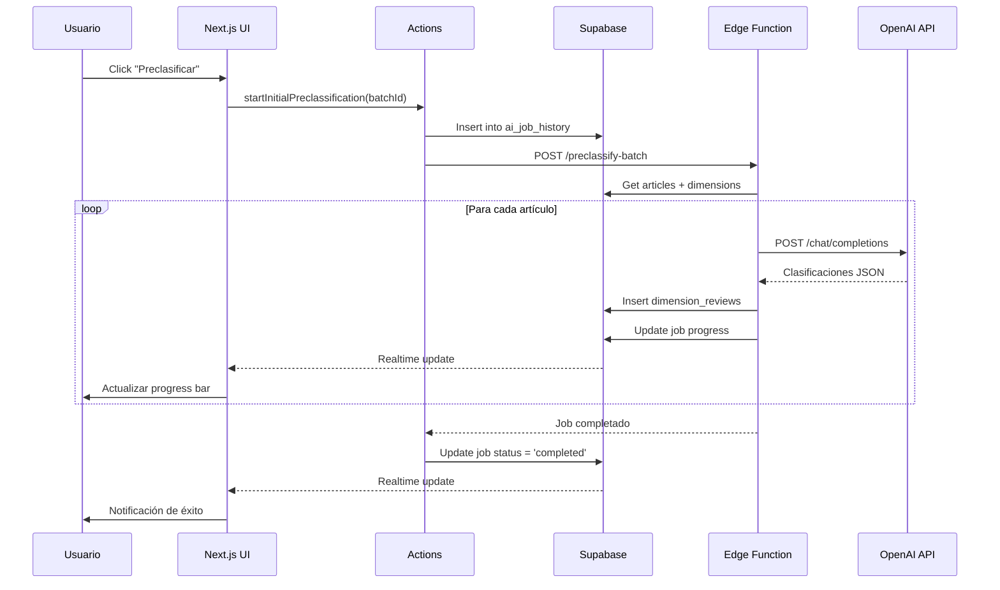

# Sección 4: Arquitectura Técnica e Implementación

## 4.1 Stack Tecnológico

### 4.1.1 Justificación de Elecciones

**Frontend: Next.js 14 + React 18 + TypeScript**
- **Next.js 14 App Router:** SSR + CSR híbrido, optimización automática
- **React 18:** Concurrent features, mejor performance
- **TypeScript:** Type safety, refactoring seguro, documentación implícita

**Backend: Supabase (PostgreSQL + Realtime + Edge Functions)**
- **PostgreSQL:** Base de datos relacional robusta, ACID compliant
- **Realtime:** WebSockets para actualizaciones en vivo
- **Edge Functions:** Serverless cerca del usuario, baja latencia
- **Row-Level Security:** Seguridad a nivel de base de datos

**IA: OpenAI GPT-4-turbo**
- Mejor modelo disponible para español (oct 2025)
- JSON mode para respuestas estructuradas
- API estable y documentada

---

## 4.2 Arquitectura de Capas

### 4.2.1 Diagrama General

```
┌──────────────────────────────────────────────────┐
│           UI Layer (Next.js Pages)               │
│  - /preclasificacion (lista)                     │
│  - /preclasificacion/[batchId] (detalle)         │
│  - /preclasificacion/metricas (dashboard)        │
└────────────────┬─────────────────────────────────┘
                 │
┌────────────────▼─────────────────────────────────┐
│     Standard Components Layer (Reusable)         │
│  - StandardSphereGrid, StandardPieChart          │
│  - StandardButton, StandardCard, StandardDialog  │
│  - Consumen tokens de diseño (colores, fuentes)  │
└────────────────┬─────────────────────────────────┘
                 │
┌────────────────▼─────────────────────────────────┐
│         Actions Layer (Server Actions)           │
│  - preclassification-actions.ts                  │
│  - Validación, transformación, lógica de negocio │
└────────────────┬─────────────────────────────────┘
                 │
┌────────────────▼─────────────────────────────────┐
│         Supabase Layer (API Client)              │
│  - RPC functions, Queries, Real-time             │
│  - Edge Functions (IA interactions)              │
└────────────────┬─────────────────────────────────┘
                 │
┌────────────────▼─────────────────────────────────┐
│         Database Layer (PostgreSQL)              │
│  - Tables, Views, Functions, Triggers            │
│  - Row-Level Security policies                   │
└──────────────────────────────────────────────────┘
```

### 4.2.2 Separación de Responsabilidades

**UI Layer:**
- Renderizado
- Manejo de estado local (React hooks)
- Eventos de usuario
- **NO contiene lógica de negocio**

**Components Layer:**
- Reutilizables y componibles
- Agnósticos a datos (reciben props)
- Consumen tokens de diseño (tema)
- Documentados (Storybook)

**Actions Layer:**
- Lógica de negocio
- Validación de datos
- Transformaciones
- Interfaz con Supabase

**Database Layer:**
- Persistencia
- Integridad referencial
- Triggers para automatización
- Seguridad (RLS)

---

## 4.3 Patrones Arquitectónicos Clave

### 4.3.1 Job Manager Pattern

**Problema:** Tareas asíncronas largas (traducción, preclasificación) deben ejecutarse sin bloquear UI.

**Solución:** Context + Edge Functions + Real-time

```typescript
// JobManagerContext.tsx
interface Job {
  id: string;
  type: 'TRANSLATION' | 'PRECLASSIFICATION' | 'RECONCILIATION';
  status: 'queued' | 'running' | 'completed' | 'failed';
  progress_percent: number;
  payload: { batchId: string };
}

const JobManagerContext = createContext<{
  jobs: Job[];
  startJob: (config: JobConfig) => Promise<void>;
  completeJob: (jobId: string) => void;
  failJob: (jobId: string, error: string) => void;
}>();

// Uso:
const { startJob } = useJobManager();
await startJob({
  type: 'PRECLASSIFICATION',
  batchId: 'xxx',
  onComplete: () => refetchData(),
});
```

**Flujo:**
1. Frontend llama `startJob()`
2. Action crea registro en `ai_job_history`
3. Edge Function ejecuta job
4. Edge Function actualiza progress cada X artículos
5. Supabase Realtime notifica frontend
6. Frontend actualiza UI (progress bar)
7. Al completar, frontend ejecuta callback

**Ventajas:**
- UI no bloqueada
- Progress en tiempo real
- Recuperación ante errores
- Histórico de jobs persistente

### 4.3.2 Optimistic Updates + Real-time Sync

**Problema:** Latencia percibida al guardar cambios.

**Solución:** Actualizar UI inmediatamente, luego sincronizar.

```typescript
// 1. Optimistic update (inmediato)
setDimensionStatus(articleId, dimId, 'approved');
updateCellColor(articleId, dimId, 'success');

// 2. Persist to DB (async)
await persistDimensionStatus(articleId, dimId, 'validated');

// 3. Real-time sync (otros usuarios ven cambio)
supabase
  .channel('batch-changes')
  .on('postgres_changes', { table: 'dimension_reviews' }, (payload) => {
    if (payload.new.article_batch_item_id === articleId) {
      updateLocalState(payload.new);
    }
  })
  .subscribe();
```

### 4.3.3 RPC Functions para Agregaciones

**Problema:** Agregaciones complejas lentas si se hacen en frontend.

**Solución:** PostgreSQL functions que calculan en BD.

```sql
-- Ejemplo: get_user_batches_with_detailed_counts
CREATE FUNCTION get_user_batches_with_detailed_counts(p_user_id UUID, p_project_id UUID)
RETURNS TABLE (...) AS $$
BEGIN
  RETURN QUERY
  SELECT 
    ab.id,
    jsonb_build_object(
      'validated', COUNT(*) FILTER (WHERE abi.status = 'validated'),
      'reconciled', COUNT(*) FILTER (WHERE abi.status = 'reconciled'),
      -- ...
    ) as article_counts
  FROM article_batches ab
  LEFT JOIN article_batch_items abi ON abi.batch_id = ab.id
  WHERE ab.project_id = p_project_id AND ab.assigned_to = p_user_id
  GROUP BY ab.id;
END;
$$ LANGUAGE plpgsql;
```

**Ventajas:**
- Performance: Cálculo en BD (más rápido)
- Consistency: Una sola fuente de verdad
- Reusabilidad: Múltiples endpoints pueden usar la misma función

---

## 4.4 Sistema de Tematización ⭐ **DIFERENCIADOR ÚNICO**

### 4.4.1 Filosofía: Componentes "Soberanos"

**Concepto clave:** Los componentes NO definen sus colores, los **orquestan**.

```typescript
// ❌ MAL: Componente define colores directamente
function StandardButton() {
  return <button style={{ backgroundColor: '#3b82f6' }}>Click</button>;
}

// ✅ BIEN: Componente consume tokens de diseño
function StandardButton({ colorScheme = 'primary' }) {
  const tokens = useThemeTokens();
  const buttonTokens = generateStandardButtonTokens(tokens.appColorTokens);
  const colors = buttonTokens[colorScheme].filled;
  
  return <button style={{ backgroundColor: colors.background }}>Click</button>;
}
```

### 4.4.2 Arquitectura de Tokens

**Nivel 1: Paleta Base (ColorToken.ts)**
```typescript
interface AppColorTokens {
  primary: ColorScheme;    // Azul (default)
  secondary: ColorScheme;  // Verde
  tertiary: ColorScheme;   // Naranja
  accent: ColorScheme;     // Púrpura (corporativo)
  success: ColorScheme;    // Verde validación
  warning: ColorScheme;    // Amarillo advertencia
  danger: ColorScheme;     // Rojo error
  neutral: ColorScheme;    // Gris neutro
}

interface ColorScheme {
  foreground: string;  // Texto
  background: string;  // Fondo
  border: string;      // Bordes
}
```

**Nivel 2: Component Tokens (Laboratorio)**
```typescript
// standard-button-tokens.ts
export function generateStandardButtonTokens(appTokens: AppColorTokens) {
  return {
    primary: {
      filled: {
        background: appTokens.primary.background,
        foreground: appTokens.primary.foreground,
        border: appTokens.primary.border,
        hover: tinycolor(appTokens.primary.background).darken(10).toString(),
        active: tinycolor(appTokens.primary.background).darken(20).toString(),
      },
      outline: {
        background: 'transparent',
        foreground: appTokens.primary.background,
        border: appTokens.primary.background,
        hover: tinycolor(appTokens.primary.background).setAlpha(0.1).toString(),
      },
      subtle: {
        background: tinycolor(appTokens.primary.background).setAlpha(0.15).toString(),
        foreground: appTokens.primary.background,
        border: 'transparent',
        hover: tinycolor(appTokens.primary.background).setAlpha(0.25).toString(),
      }
    },
    // ... secondary, tertiary, etc.
  };
}
```

**Nivel 3: Componente (Consumidor)**
```typescript
// StandardButton.tsx
export function StandardButton({ 
  colorScheme = 'primary', 
  styleType = 'filled' 
}) {
  const { appColorTokens } = useTheme();
  const buttonTokens = generateStandardButtonTokens(appColorTokens);
  const colors = buttonTokens[colorScheme][styleType];
  
  return (
    <button style={{
      backgroundColor: colors.background,
      color: colors.foreground,
      border: `1px solid ${colors.border}`,
    }}>
      {children}
    </button>
  );
}
```

### 4.4.3 Tematización por Proyecto

**Contexto del problema:** Investigadores trabajan en múltiples proyectos. En herramientas tradicionales, es fácil confundir ventanas.

**Solución de SUSTRATO:**

```typescript
// Cada proyecto tiene su configuración de tema
interface ProjectTheme {
  color_palette: 'blue' | 'green' | 'purple' | 'orange' | ...;  // 12 opciones
  font_theme: 'classic' | 'modern' | 'accessible';
}

// Al abrir proyecto, se carga su tema
const { project } = useProject();
const { setTheme } = useTheme();

useEffect(() => {
  if (project.theme) {
    setTheme(project.theme.color_palette);
  }
}, [project]);
```

**Paletas disponibles:**

1. **Monocromáticas:**
   - Azul profesional (default)
   - Verde ecológico
   - Púrpura corporativo
   - Naranja energético

2. **Contrastantes:**
   - Azul-Naranja (complementarios)
   - Verde-Magenta
   - Púrpura-Amarillo

3. **Eclécticas:**
   - Multicolor balanceado
   - Pasteles suaves
   - Alto contraste (accesibilidad)

**Fuentes disponibles:**

1. **Clásico:** Playfair Display (títulos) + Source Sans Pro (cuerpo)
2. **Moderno:** Montserrat (títulos) + Inter (cuerpo)
3. **Accesible:** Atkinson Hyperlegible (todo) - Diseñado para dislexia

### 4.4.4 Beneficios Únicos

**Para Dislexia:**
- **Diferenciación visual clara:** Proyecto A = azul, Proyecto B = verde
- **Reduce carga cognitiva:** No hay que leer título para saber dónde estás
- **Fuente especializada:** Atkinson Hyperlegible específicamente diseñada
- **Opciones acotadas:** No abruma con infinitas posibilidades (12 paletas, 3 fuentes)

**Para Productividad:**
- **Cambio de contexto rápido:** Color indica inmediatamente el proyecto
- **Personalización:** Ajustar según preferencias/estado de ánimo
- **Consistencia:** Mismo proyecto siempre tiene mismo look

**Para el Paper:**
- **Originalidad:** Ninguna herramienta académica/comercial revisada ofrece esto
- **Respaldo teórico:** Citar literatura sobre cognición visual, carga cognitiva
- **Demostrabilidad:** Screenshots de múltiples proyectos con temas distintos

---

## 4.5 Seguridad y Escalabilidad

### 4.5.1 Row-Level Security (RLS)

```sql
-- Usuarios solo ven sus propios lotes
CREATE POLICY "users_own_batches"
ON article_batches FOR SELECT
USING (assigned_to = auth.uid());

-- Solo pueden modificar revisiones de sus lotes
CREATE POLICY "users_review_own_batches"
ON dimension_reviews FOR INSERT
WITH CHECK (
  EXISTS (
    SELECT 1 FROM article_batch_items abi
    JOIN article_batches ab ON ab.id = abi.batch_id
    WHERE abi.id = article_batch_item_id
      AND ab.assigned_to = auth.uid()
  )
);
```

### 4.5.2 Edge Functions para IA

```typescript
// supabase/functions/preclassify-batch/index.ts
serve(async (req) => {
  const { batchId } = await req.json();
  
  // Chunking para evitar timeout
  const CHUNK_SIZE = 5;
  const articles = await getArticles(batchId);
  
  for (let i = 0; i < articles.length; i += CHUNK_SIZE) {
    const chunk = articles.slice(i, i + CHUNK_SIZE);
    await Promise.all(chunk.map(article => 
      classifyArticle(article)
    ));
    
    // Update progress
    await updateJobProgress(jobId, (i / articles.length) * 100);
  }
  
  return new Response(JSON.stringify({ success: true }));
});
```

### 4.5.3 Rate Limiting

```typescript
// Protección contra abuso de API
const rateLimiter = rateLimit({
  interval: 60 * 1000, // 1 minuto
  uniqueTokenPerInterval: 500,
});

export async function startInitialPreclassification(batchId: string) {
  try {
    await rateLimiter.check(10); // Max 10 requests/min
    // ... ejecutar job
  } catch {
    throw new Error('Rate limit exceeded');
  }
}
```

---

## 4.6 Optimizaciones de Performance

### 4.6.1 Carga Incremental
- Lista de lotes: Carga completa (típicamente <100 lotes)
- Detalle de lote: Solo artículos del lote actual
- Revisiones: Lazy loading en modal

### 4.6.2 Memoización
```typescript
// Evitar re-cálculos costosos
const sortedArticles = useMemo(() => 
  articles.sort((a, b) => a.batch_number - b.batch_number),
  [articles]
);

const aggregatedStats = useMemo(() => 
  calculateAggregations(reviews),
  [reviews]
);
```

### 4.6.3 Debouncing
```typescript
// Búsqueda de artículos
const debouncedSearch = useMemo(
  () => debounce((query: string) => performSearch(query), 300),
  []
);
```

---

## 4.7 Diagrama de Flujo Técnico Completo



---

## Referencias para esta Sección

- Kleppmann, M. (2017). *Designing data-intensive applications*. O'Reilly Media.
- Fowler, M. (2002). *Patterns of enterprise application architecture*. Addison-Wesley.
- Nielsen, J. (1993). *Usability engineering*. Morgan Kaufmann.
- Rello, L., & Baeza-Yates, R. (2013). Good fonts for dyslexia. *Proceedings of ASSETS*, 14.
- Material Design. (2024). *Design tokens*. https://m3.material.io/foundations/design-tokens

---

**Próximo paso:** Integrar todas las secciones y preparar primera versión completa del paper.
