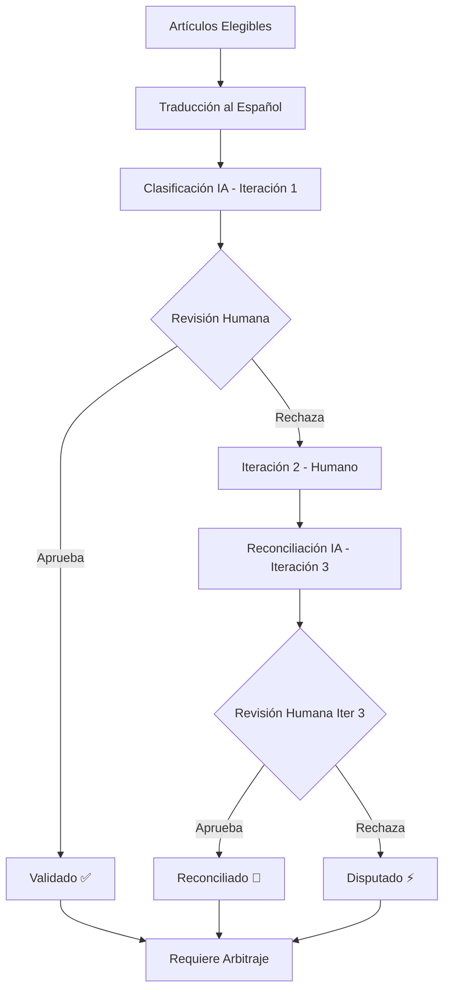

# Sección 3: Metodología - Diseño del Sistema de Preclasificación

## 3.1 Filosofía de Diseño

### 3.1.1 Principios Rectores

El diseño de SUSTRATO.AI se basa en cinco principios fundamentales:

**1. Transparencia Radical**
- Cada decisión de IA debe ser visible y explicable
- Justificaciones textuales obligatorias
- Métricas de confianza explícitas
- Historial completo de iteraciones

**2. Soberanía Humana**
- IA sugiere, humano decide
- Reversibilidad total hasta finalizar lote
- Aprobación explícita requerida
- Control granular (por dimensión y artículo)

**3. Iteración Documentada**
- Cada revisión registrada con timestamp
- Distinción clara entre iteraciones
- Trazabilidad completa para auditorías
- Imposibilidad de pérdida de información

**4. Diseño Centrado en el Usuario**
- Co-diseño con investigadores
- Feedback continuo durante desarrollo
- Adaptación a flujos reales de trabajo
- Personalización visual (tematización)

**5. Eficiencia sin Sacrificar Rigor**
- Reducción de trabajo repetitivo
- Mantención de estándares académicos
- Pre-validación rápida para casos claros
- Revisión profunda para casos complejos

---

## 3.2 Flujo de Trabajo Iterativo

### 3.2.1 Diagrama General



### 3.2.2 Fase 0: Preparación (Pre-procesamiento)

**Entrada:**
- Artículos elegibles (post-screening de título/abstract)
- Configuración de dimensiones (finitas o abiertas)
- Opciones predefinidas para dimensiones finitas

**Proceso:**
1. Creación de lotes (15-30 artículos por investigador)
2. Traducción automática de abstracts (GPT-4)
   - Preserva terminología técnica
   - Genera resumen ejecutivo (2-3 oraciones)
3. Validación de calidad de traducción
   - Detección de errores comunes
   - Flag para revisión manual si es necesario

**Salida:**
- Lotes traducidos, listos para preclasificación

---

### 3.2.3 Iteración 1: Clasificación Inicial por IA

**Entrada:**
- Abstract traducido (título + cuerpo)
- Dimensiones configuradas
- Opciones válidas por dimensión

**Proceso:**
1. **Construcción de prompt estructurado:**
   ```
   Clasifica el siguiente artículo según estas dimensiones:
   
   Artículo:
   Título: [título traducido]
   Abstract: [abstract traducido]
   
   Dimensiones:
   1. Tipo de Intervención (DCU, Mapeo, Evaluación, Otros)
   2. País (Chile, Argentina, México, ..., Otros)
   3. Población Objetivo (Adultos mayores, Jóvenes, ...)
   
   Para cada dimensión, responde en JSON:
   {
     "dimension_name": "...",
     "value": "...",
     "confidence": "alta|media|baja",
     "rationale": "Justificación basada en el texto (en español)"
   }
   ```

2. **Llamada a GPT-4-turbo vía Edge Function**
   - Temperature: 0.3 (balance creatividad/consistencia)
   - Max tokens: 2000
   - System prompt: Instrucciones de experto en revisiones sistemáticas

3. **Parseo y validación de respuesta:**
   - Validación de estructura JSON
   - Verificación de dimensiones conocidas
   - Validación de valores según tipo:
     - **Finitas:** Valor debe estar en opciones o "Otros: [especificación]"
     - **Abiertas:** Texto libre aceptado
   - Mapeo de confianza: alta=3, media=2, baja=1

4. **Registro en base de datos:**
   ```typescript
   dimension_review {
     article_batch_item_id: string,
     dimension_id: string,
     reviewer_type: 'ai',
     iteration: 1,
     value: string,
     confidence: number,
     rationale: string,
     status: 'review_pending',
     is_final: false
   }
   ```

**Salida:**
- Clasificaciones IA almacenadas
- Lote cambia a status `review_pending`
- Notificación al investigador

**Tiempo estimado:** 5-10 minutos para 15-30 artículos × 8 dimensiones

---

### 3.2.4 Iteración 2: Revisión Humana Inicial

**Entrada:**
- Clasificaciones IA (iteración 1)
- Interfaz de revisión con tabla multi-dimensional

**Proceso:**

**Opción A: Pre-validación Rápida (1-2 segundos/artículo)**
- Investigador ve clasificación IA en celda
- Si está claramente correcta: Click en checkbox ✅
- Sistema marca como `status='validated'`, `is_final=true`
- Color cambia a verde (success)

**Opción B: Revisión Completa (30-60 segundos/artículo)**
- Click en celda → Abre dialog de revisión
- Formulario:
  - **Valor:** Dropdown (finitas) o Input (abiertas)
  - **Confianza:** Slider 0-100%
  - **Justificación:** Textarea (obligatorio)
- Al guardar:
  ```typescript
  dimension_review {
    article_batch_item_id: string,
    dimension_id: string,
    reviewer_type: 'human',
    iteration: 2,
    value: string, // puede diferir de IA
    confidence: number,
    rationale: string,
    status: comparar_con_ia(),
    is_final: false
  }
  ```

**Lógica de comparación:**
```typescript
function comparar_con_ia(ai_value, human_value) {
  if (ai_value === human_value) {
    return 'validated'; // Coincidencia
  } else {
    return 'reconciliation_pending'; // Discrepancia
  }
}
```

**Salida:**
- Dimensiones validadas: Color verde, `is_final=true`
- Dimensiones con discrepancia: Color amarillo, esperan reconciliación
- Métricas de concordancia IA-humano registradas

**Tiempo estimado:** 3-5 minutos/artículo (promedio 2-3 dimensiones modificadas)

---

### 3.2.5 Iteración 3: Reconciliación por IA

**Entrada:**
- Pares (artículo, dimensión) con `status='reconciliation_pending'`
- Clasificación IA original (iter 1)
- Clasificación humana (iter 2)

**Proceso:**

1. **Construcción de prompt de reconciliación:**
   ```
   Re-evalúa esta clasificación considerando el feedback humano:
   
   Artículo: [título + abstract]
   Dimensión: [nombre]
   
   Tu clasificación inicial (Iteración 1):
   - Valor: [ai_value]
   - Confianza: [ai_confidence]
   - Justificación: [ai_rationale]
   
   Clasificación del investigador humano (Iteración 2):
   - Valor: [human_value]
   - Confianza: [human_confidence]
   - Justificación: [human_rationale]
   
   Preguntas:
   1. ¿El investigador tiene razón? ¿Por qué?
   2. Reconsidera tu clasificación. ¿Mantienes tu respuesta o cambias?
   3. Proporciona una justificación mejorada que considere ambas perspectivas.
   
   Responde en JSON:
   {
     "value": "...",
     "confidence": "alta|media|baja",
     "rationale": "Justificación que reconoce el feedback humano",
     "agrees_with_human": true|false
   }
   ```

2. **Llamada a GPT-4 con contexto enriquecido**
   - Temperature: 0.2 (más conservadora)
   - Instrucción explícita de considerar expertise humano

3. **Registro de iteración 3:**
   ```typescript
   dimension_review {
     reviewer_type: 'ai',
     iteration: 3,
     value: string,
     confidence: number,
     rationale: string,
     status: 'reconciliation_pending', // Espera decisión humana
     is_final: false
   }
   ```

**Salida:**
- Nueva clasificación IA que considera feedback humano
- Color cambia a púrpura (accent) - "Esperando tu decisión"
- Investigador debe aprobar o rechazar

**Tiempo estimado:** 2-4 minutos para procesar todas las discrepancias de un lote

---

### 3.2.6 Iteración 4: Decisión Final Humana

**Entrada:**
- Clasificaciones IA reconciliadas (iter 3)
- Estado: `reconciliation_pending`

**Proceso:**

**Opción A: Aprobar Reconciliación**
- Investigador revisa nueva clasificación IA
- Si ahora está de acuerdo: Click en "Aprobar"
- Sistema actualiza:
  ```typescript
  status: 'reconciled',
  is_final: true,
  color: 'primary' (azul)
  ```

**Opción B: Rechazar Reconciliación (Arbitraje)**
- Si la IA persiste en error: Click en "Arbitraje"
- Sistema actualiza:
  ```typescript
  status: 'disputed',
  is_final: true,
  color: 'danger' (rojo)
  ```
- Se marca como "Requiere discusión en equipo"

**Salida:**
- Dimensión finalizada (ya sea reconciliada o disputada)
- Métricas de tasa de reconciliación exitosa

---

### 3.2.7 Finalización de Lote

**Condiciones para finalizar:**
✅ Todas las dimensiones de todos los artículos deben tener `is_final=true`

**Estados finales válidos:**
- `validated` (verde): Aprobado en iter 1
- `reconciled` (azul): Aprobado en iter 3
- `disputed` (rojo): Rechazado en iter 3, requiere arbitraje

**Proceso de finalización:**
1. Investigador presiona "Finalizar Lote"
2. Sistema valida que no hay dimensiones pendientes
3. Si hay pendientes: Muestra lista de qué falta
4. Si todo OK:
   - Marca lote como `is_closed=true`
   - Genera estadísticas de cierre
   - Calcula status final del lote según distribución
5. Lote queda bloqueado (no modificable)

**Visualización:**
- Esfera cambia de `filled` (sólida) a `subtle` (transparente)
- Tooltip muestra "🔒 CERRADO"
- Botones de acción desaparecen

---

## 3.3 Diseño de Prompts

### 3.3.1 Estrategia General

**Principios:**
- **Especificidad:** Instrucciones claras, no ambiguas
- **Contexto:** Rol de experto en revisiones sistemáticas
- **Formato:** JSON estructurado para parseo robusto
- **Idioma:** Justificaciones en español (idioma del usuario)
- **Flexibilidad controlada:** Permitir "Otros" cuando aplica

### 3.3.2 Prompt de Clasificación Inicial

**System prompt:**
```
Eres un experto en revisiones sistemáticas en ciencias sociales.
Tu tarea es clasificar artículos científicos según dimensiones específicas.
Debes ser preciso, justificar tus respuestas y admitir incertidumbre cuando aplique.
```

**User prompt (estructura):**
```
Clasifica el siguiente artículo:

Título: {title}
Abstract: {abstract}

Dimensiones a clasificar:
{for each dimension:
  - Nombre: {name}
  - Tipo: {finite|open}
  - Opciones válidas: {options} [solo si finite]
  - Instrucción específica
}

INSTRUCCIONES:
1. Para dimensiones finitas: DEBES escoger uno de los valores listados.
   {if tiene_opcion_otros:
     - Si ninguna opción aplica exactamente, usa "Otros: [breve descripción]"
   }
2. Para dimensiones abiertas: Responde libremente en 1-2 frases.
3. Confidence: Evalúa tu certeza (alta, media, baja).
4. Rationale: Justifica tu elección citando partes específicas del abstract.

Formato de respuesta (JSON):
{
  "classifications": [
    {
      "dimension_name": "...",
      "value": "...",
      "confidence": "alta|media|baja",
      "rationale": "..."
    }
  ]
}
```

### 3.3.3 Prompt de Reconciliación

**System prompt:**
```
Eres un experto en revisiones sistemáticas que debe reconciliar discrepancias
entre tu clasificación inicial y la de un investigador humano experto.
Debes considerar el feedback humano seriamente y ajustar tu respuesta si es válido.
```

**User prompt (estructura):**
```
Re-evalúa tu clasificación considerando feedback de experto:

Artículo: {title} - {abstract}
Dimensión: {dimension_name}

Tu clasificación (Iteración 1):
- Valor: {ai_value}
- Confidence: {ai_confidence}
- Rationale: {ai_rationale}

Clasificación del investigador (Iteración 2):
- Valor: {human_value}
- Confidence: {human_confidence}
- Rationale: {human_rationale}

ANÁLISIS REQUERIDO:
1. ¿Qué evidencia del abstract apoya cada clasificación?
2. ¿El investigador vio algo que tú no consideraste?
3. ¿Tu clasificación tiene errores o malinterpretaciones?
4. Reconsidera: ¿Mantienes tu respuesta o cambias?

Formato de respuesta (JSON):
{
  "value": "...",
  "confidence": "alta|media|baja",
  "rationale": "Justificación que reconoce el feedback del investigador",
  "agrees_with_human": true|false,
  "reasoning": "Por qué mantienes o cambias tu respuesta"
}
```

### 3.3.4 Estrategias Anti-Alucinación

1. **Anclaje al texto:** "Cita fragmentos específicos del abstract"
2. **Admisión de incertidumbre:** "Si no estás seguro, usa confidence='baja'"
3. **Restricción de vocabulario:** Valores finitos explícitos
4. **Validación post-respuesta:** Parseo estricto con errores explícitos

---

## 3.4 Modelo de Datos

### 3.4.1 Entidades Principales

**`article_batches`**
- Agrupación de 15-30 artículos
- Asignados a investigador específico
- Status: pending → translated → review_pending → validated/reconciled/disputed

**`article_batch_items`**
- Relación artículo-lote
- Hereda status del batch o tiene status independiente

**`dimension_reviews`**
- **Granularidad:** Una review por (artículo, dimensión, iteración)
- **Campos clave:**
  - `reviewer_type`: 'ai' | 'human'
  - `iteration`: 1, 2, 3
  - `is_final`: Indica aprobación del investigador
  - `status`: Estado actual de la clasificación
  - `value`, `confidence`, `rationale`

### 3.4.2 Gestión de Iteraciones

**Regla fundamental:** Solo existe una review con `is_final=true` por (artículo, dimensión)

**Escenarios:**

1. **Validación directa (iter 1):**
   ```
   Iter 1 (IA): value=X, is_final=false → Humano aprueba
   Iter 1 (IA): value=X, is_final=true, status='validated'
   ```

2. **Discrepancia → Reconciliación exitosa:**
   ```
   Iter 1 (IA): value=X, is_final=false
   Iter 2 (Humano): value=Y, is_final=false
   Iter 3 (IA): value=Y, is_final=false → Humano aprueba
   Iter 3 (IA): value=Y, is_final=true, status='reconciled'
   ```

3. **Disputa persistente:**
   ```
   Iter 1 (IA): value=X, is_final=false
   Iter 2 (Humano): value=Y, is_final=false
   Iter 3 (IA): value=X, is_final=false → Humano rechaza
   Iter 2 (Humano): value=Y, is_final=true, status='disputed'
   ```

---

## 3.5 Interfaz de Usuario

### 3.5.1 Vista de Lista de Lotes

**Componente:** `StandardSphereGrid`
- Cada lote = Esfera circular
- Color según status predominante
- Tamaño proporcional al número de artículos
- Agrupación por estado
- Tooltip con estadísticas detalladas

**Interacción:**
- Click → Navega al detalle del lote
- Hover → Muestra estadísticas
- Diferenciación visual: Lote cerrado (sutil) vs abierto (sólido)

### 3.5.2 Vista de Detalle de Lote

**Componente:** `TableLikeView`
- Tabla con artículos en filas
- Dimensiones en columnas
- Celdas coloreadas según estado
- Click en celda → Dialog de revisión

**Colores por estado:**
- ⏳ Gris (neutral): Sin revisar
- ✅ Verde (success): Validado iter 1
- 🔄 Amarillo (warning): Discrepancia iter 2
- 🟣 Púrpura (accent): Esperando decisión iter 3
- 🎯 Azul (primary): Reconciliado iter 3
- ⚡ Rojo (danger): Disputado iter 3

### 3.5.3 Dialog de Revisión

**Campos:**
- **Clasificación IA:** (readonly, con icono distintivo)
- **Tu clasificación:** Dropdown/Input
- **Confianza:** Slider visual
- **Justificación:** Textarea expandible
- **Botones:** "Aprobar" | "Modificar y Guardar" | "Cancelar"

**Validaciones:**
- Justificación mínimo 10 caracteres
- Confianza requerida
- Valor debe ser válido según tipo de dimensión

---

## 3.6 Métricas del Sistema

### 3.6.1 Métricas de Eficiencia

- **Tiempo de revisión promedio:** Por artículo, por dimensión
- **Tasa de pre-validación:** % de clasificaciones aprobadas sin modificar
- **Reducción de tiempo:** vs revisión 100% manual

### 3.6.2 Métricas de Calidad

- **Concordancia IA-Humano (iter 1):** % de coincidencias
- **Tasa de reconciliación exitosa (iter 3):** % de discrepancias resueltas
- **Tasa de disputa persistente:** % que llega a arbitraje
- **Distribución de confianza IA:** % alta/media/baja

### 3.6.3 Métricas de Usabilidad

- **System Usability Scale (SUS):** Cuestionario estándar
- **NASA Task Load Index (TLX):** Carga cognitiva
- **Tiempo de onboarding:** Hasta primera revisión completa
- **Errores de usuario:** Frecuencia y tipos

---

## Referencias para esta Sección

- Wohlin, C. (2014). Guidelines for snowballing in systematic literature studies. *Proceedings of EASE*, 1-10.
- Kitchenham, B., & Charters, S. (2007). Guidelines for performing systematic literature reviews. *Technical report*, Ver. 2.3 EBSE Technical Report. EBSE.
- Norman, D. (2013). *The design of everyday things: Revised and expanded edition*. Basic books.
- Shneiderman, B., et al. (2016). *Designing the user interface: strategies for effective human-computer interaction*. Pearson.

---

**Próximo paso:** Sección 4 - Arquitectura Técnica con énfasis en tematización.
